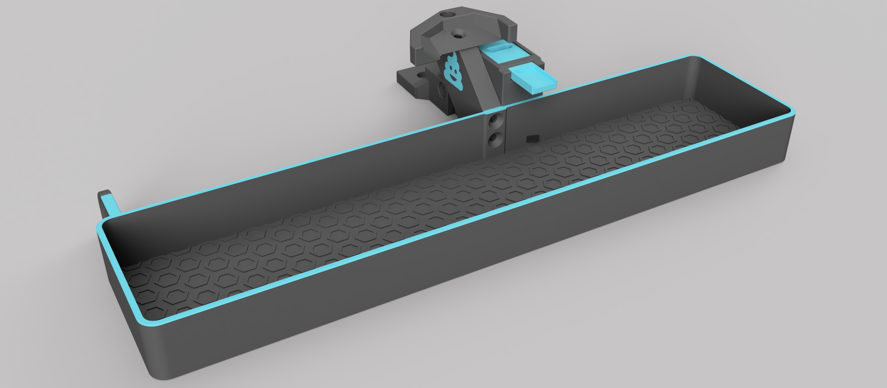

#### Page Sections:
- [EREC](#---erec-filament-cutter)
- [Blobifer](#---blobifier)
- [DC eSpooler](#---dc-espooler)
- [Eject Buttons](#---eject-buttons)

This directory contains possible addons for your MMU setup that have support shipped with Happy Hare

 

##    EREC Filament Cutter
An addon used to control filament cutting at the MMU rather than the toolhead

### Compatibility
**MMU:** ERCFv2 
**Printer:** _Any_

### Github
https://github.com/kevinakasam/ERCF_Filament_Cutter

### Config
1. Add `[include mmu/addons/mmu_erec_cutter.cfg]` to your `printer.cfg`
1. Edit `mmu_erec_cutter.cfg` and `mmu_erec_cutter_hw.cfg` to work with your setup
1. In `mmu_macro_vars.cfg` set `variable_user_post_unload_extension : "EREC_CUTTER_ACTION"`

 

##    Blobifier
An addon used to create purge blobs instead of using a wipe tower

### Compatibility
**MMU:** _Any_ 
**Printer:** Voron v2, others in the works

### Github
https://github.com/Dendrowen/Blobifier

### Config
1. Add `[include mmu/addons/blobifier.cfg]` to your `printer.cfg`
1. Edit `blobifier.cfg` and `blobifier_hw.cfg` to work with your setup
1. Set `variable_user_post_load_extension : "BLOBIFIER"` in `mmu_macro_vars.cfg`
1. Optionally set `variable_user_post_form_tip_extension : "BLOBIFIER_PARK"` in `mmu_macro_vars.cfg` to park the nozzle on the tray during a swap. Note that it is always recommended that you at least z-hop on toolchange so that the toolhead is immediately lifted off the print. Read [Toolchange Movement](Toolchange-Movement) for more details.

 

##    DC eSpooler

An addon used to control a DC motor based eSpooler that is active when the MMU is unloaded

### Compatibility
**MMU:** _Any_ 
**Printer:** _Any_

### Github
n/a

### Config
1. Add `[include mmu/addons/dc_espooler.cfg]` to your `printer.cfg`
1. Set `espooler_start_macro: MMU_ESPOOLER_START` in `mmu_parameters.cfg` to start eSpooler movement
1. Set `espooler_stopt_macro: MMU_ESPOOLER_STOP` in `mmu_parameters.cfg` to stop eSspooler movement
1. Update the `mmu/addon/dc_espooler_hw.cfg` for your configuration.

 

##    Eject Buttons

If the MMU is equipped with a per-gate eject button (like QuattroBox) this addon is used for control

### Compatibility
**MMU:** _Any_ (if buttons fitted) 
**Printer:** _Any_

### Github
n/a

### Config
1. Add `[include mmu/addons/mmu_eject_buttons.cfg]` to your `printer.cfg`
1. Ensure the eject button pins are defined:
  1. Add `EJECT_BUTTON_x` aliases to `mmu.cfg` or define pins directly in `mmu_eject_buttons_hw.cfg`

 

> [!IMPORTANT] 
> For all add-on extensions, ensure that you always use the "cfg" files from Happy Hare and not those sourced elsewhere so you have the most recent changes and fixes.
