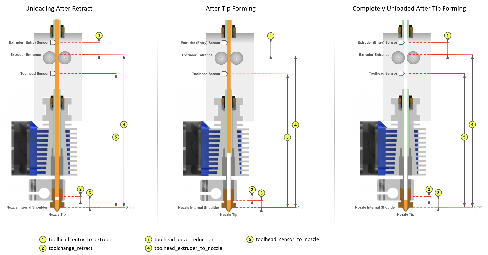
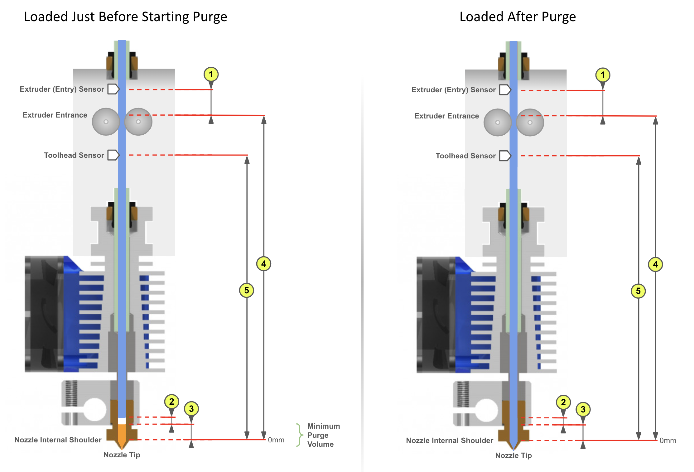

This discussion assumes that you have initial setup complete and are now ready to tune the quality of your prints. Although some of the information contained here is useful early in your journey it will make a lot more sense once you have some experience with default or "borrowed" toolhead parameters. Then this will guide you to optimizing a few critical parameters for quality prints.

Specifically in this guide you will learn how to correctly set the following parameters:
> toolhead\_extruder\_to\_nozzle
> toolhead\_sensor\_to\_nozzle
> toolhead\_entry\_to\_extruder
> toolhead\_ooze\_reduction

And use z-hop and retraction settings to eliminate blobs and stringing during color changes in your prints:
> z\_hop\_height\_toolchange
> z\_hop\_ramp
> toolchange\_retract
> toolchange\_retract\_speed

<br>

##    Correct Meaning of Key Dimensions

First it is important to understand that while sensors like a toolhead sensor can help with extruder loading and unloading, the process relies on precise movement distances. These "dimensions" often interact with each other so it is also important that they be set according to their meaning. Doing so will give detministic toolchanges rather than a "these settings seem to work" scenario.

When the extruder is loaded, Happy Hare will move the filament a precise distance from either the extruder gear or the toolhead sensor to the end of the nozzle. This distance is set with `toolhead_extruder_to_nozzle` and/or `toolhead_sensor_to_nozzle` and represents the CAD measured distance in a perfectly clean extruder/nozzle. The reality is that once the extruder is "dirty" this distance changes. I.e. some filament is inevitably left behind in the extruder/nozzle shortening this distance. The amount of filament remaining seems to vary greatly from a couple of mm to as much as 15mm in some HF hotends!

To account for this, Happy Hare defines `toolhead_extruder_to_nozzle` and `toolhead_sensor_to_nozzle` as theoretical and thus should be able to be pulled form CAD drawings or other users. It uses `toolhead_ooze_reduction` to represent how much to reduce the loading move by for the new filament to butt up against the old without accidently oozing.

In practice it has been hard to determine these values other than through experimentation and even then it is hard to determine for example, whether to increase `toolhead_ooze_reduction` or reduce `toolhead_sensor_to_nozzle`.

Let's run through the important steps in a toolchange (for both tip forming and tip cutting cases) and relate to these parameters:

### Tip Forming

#Click on images to see the detail)

<p align="center"><a href="https://github.com/moggieuk/Happy-Hare/wiki/Blobing-and-Stringing/Unloading_Tip_Forming.png"></a></p>
<p align="center"><a href="https://github.com/moggieuk/Happy-Hare/wiki/Blobing-and_Stringing/Loading_Tip_Forming.png"></a></p>

### Toolhead Tip Cutting

<p align="center"><a href="https://github.com/moggieuk/Happy-Hare/wiki/Blobing-and_Stringing/Unloading_Tip_Cutting.png"></a></p>
<p align="center"><a href="https://github.com/moggieuk/Happy-Hare/wiki/Blobing-and_Stringing/Loading_Tip_Cutting.png"></a></p>

<br>

##    Calibrating Toolhead

Now Happy Hare can help with a new `MMU_CALIBRATE_TOOLHEAD` command. The process is to start with a clean extruder/nozzle. To do this you need to perform a cold pull where you warm up the extruder, purge some filament, then cool. At the right temperature you manually pull the filament out with a bit of force pulling all the old residue and carbon deposits. This is something that many of you already know how to do, but for those that need help you can run the supplied `MMU_COLD_PULL` macro and follow directions. This is documented later in this guide.

### With a CLEAN toolhead

Reattach bowden to toolhead, and prepare the MMU: select the gate you wish to use but ensure the filament is not loaded. Then run:

> MMU\_CALIBRATE\_TOOLHEAD CLEAN=1

This will perform some probing with a cold extruder and report back on the critical toolhead parameters. For example:

```
MMU_CALIBRATE_TOOLHEAD CLEAN=1
Note:
toolhead_extruder_to_nozzle, toolhead_sensor_to_nozzle (and toolhead_entry_to_extruder) are calibrated with a CLEAN extruder and the 'CLEAN=1' flag
toolhead_ooze_reduction (and toolhead_entry_to_extruder) are calibrated with a normal dirty extruder but without a cut filament tip
Desired gate should be selected but the filament unloaded

Modifying MMU gear stepper run current to 40% for collision detection
Run Current: 0.21A Hold Current: 0.09A
Restoring MMU gear stepper run current to 100% configured
Run Current: 0.49A Hold Current: 0.09A
Measuring clean toolhead dimensions after cold pull...
Measured toolhead_sensor_to_nozzle: 59.1
Measured toolhead_extruder_to_nozzle: 67.6
Measured toolhead_entry_to_extruder: 7.9
-----------------------------------
Calibration Results (clean nozzle):
> toolhead_extruder_to_nozzle: 67.6 (currently: 70.0)
> toolhead_sensor_to_nozzle: 59.1 (currently: 62.0)
> toolhead_entry_to_extruder: 7.9 (currently: 8.0)
-----------------------------------
New toolhead calibration active until restart. Update mmu_parameters.cfg to persist settings
```

Assuming you didn't run with the `SAVE=0` option this will temporarily correct your toolhead parameters.

> [!NOTE]  
> You must remember these and manually update `mmu_parameters.cfg` for them to persist across a restart


Then load and unload a filament:

> MMU\_LOAD
> MMU\_EJECT

This must be done with tip forming and not tip cutting, or just retract filament out of extruder

> MMU\_CALIBRATE\_TOOLHEAD

Here is an example below. Note which parameters are set with each pass.

```
MMU_CALIBRATE_TOOLHEAD
...blah blah blah...
-----------------------------------
Calibration Results (dirty nozzle):
> toolhead_ooze_reduction: 3.0 (currently: 3.4)
-----------------------------------
New calibrated ooze reduction active until restart. Update mmu_parameters.cfg to persist
```

### With a normal DIRTY toolhead

This must be done with tip forming and not tip cutting, or just retract filament out of extruder

> MMU\_CALIBRATE\_TOOLHEAD

Here is an example below. Note which parameters are set with each pass.

```
MMU_CALIBRATE_TOOLHEAD
...blah blah blah...
-----------------------------------
Calibration Results (dirty nozzle):
> toolhead_ooze_reduction: 3.0 (currently: 3.4)
-----------------------------------
New calibrated ooze reduction active until restart. Update mmu_parameters.cfg to persist
