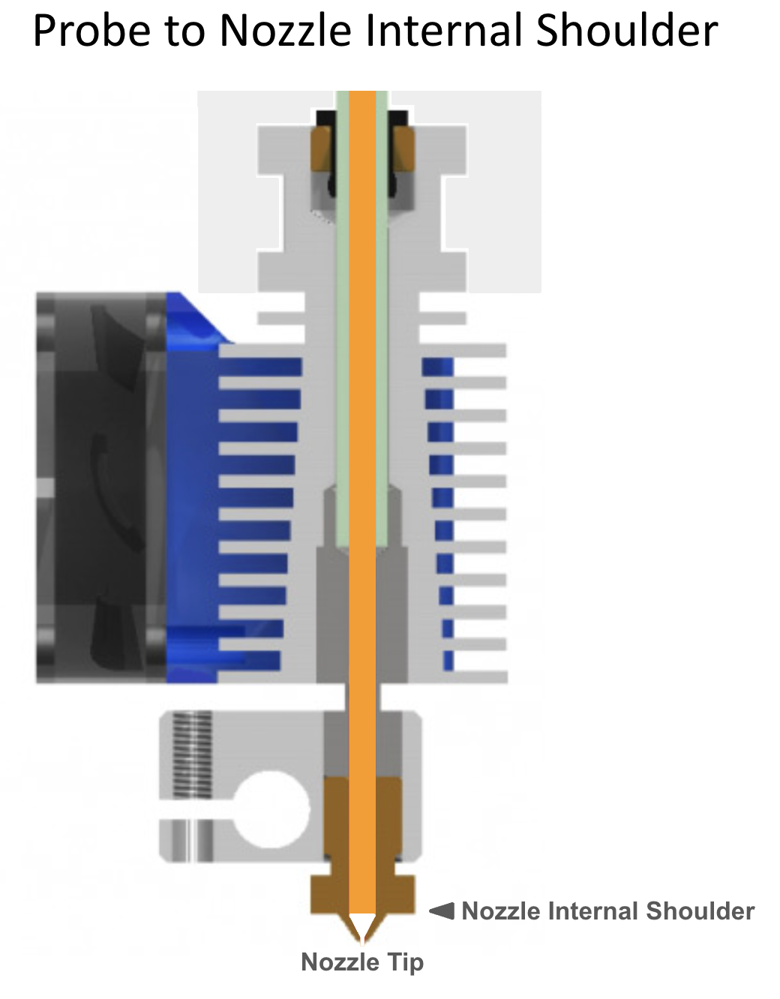
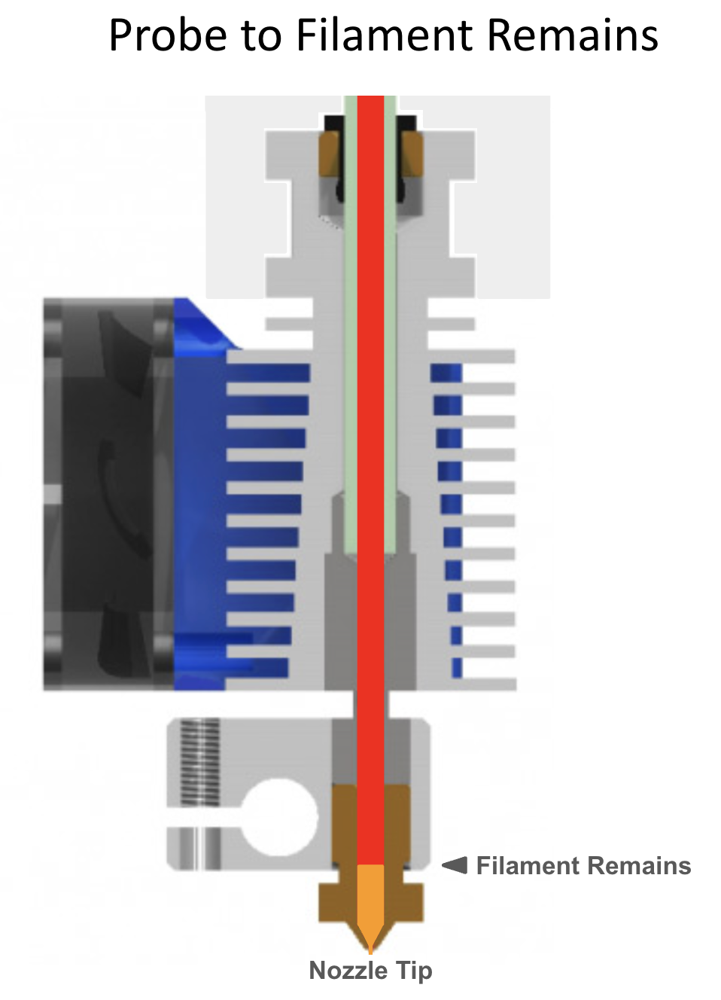
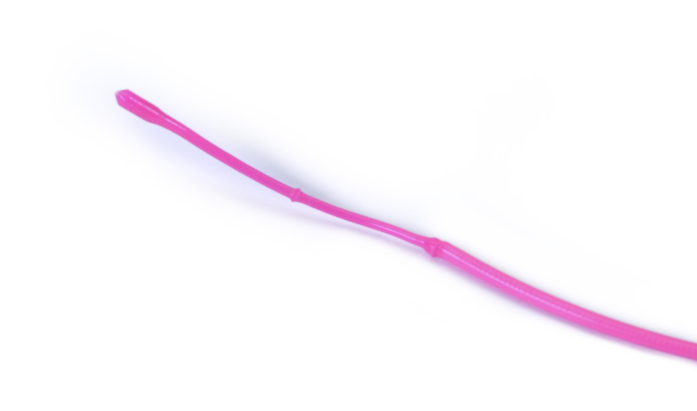
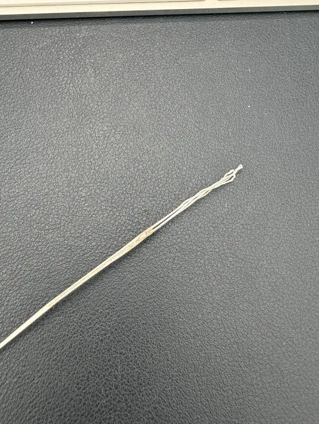

This discussion assumes that you have initial setup complete and are now ready to tune the quality of your prints. Although some of the information contained here is useful early in your journey it will make a lot more sense once you have some experience with default or "borrowed" toolhead parameters. Then this will guide you to optimizing a few critical parameters for quality prints.

Specifically in this guide you will learn how to correctly set the following parameters (`mmu/base/mmu_parameters.cfg`):
- `toolhead_extruder_to_nozzle`
- `toolhead_sensor_to_nozzle`
- `toolhead_entry_to_extruder`
- `toolhead_ooze_reduction`

Use z-hop and retraction settings to eliminate blobs and stringing during color changes in your prints:
- `z_hop_height_toolchange`
- `z_hop_ramp`
- `z_hop_speed`
- `toolchange_retract` & `toolchange_retract_speed`

Set key tip cutting macro variables (`mmu/base/mmu_macros_vars.cfg`):
- `variable_blade_pos`
- `variable_retract_length`

<br>

##    Correct Meaning of Key Dimensions

First it is important to understand that while sensors like a toolhead sensor can help with extruder loading and unloading, the process relies on precise movement distances. These "dimensions" often interact with each other so it is also important that they be set according to their meaning. Doing so will give deterministic toolchanges rather than a "these settings seem to work" scenario.

When the extruder is loaded, Happy Hare will move the filament a precise distance from either the extruder gear or the toolhead sensor to the end of the nozzle. This distance is set with `toolhead_extruder_to_nozzle` and/or `toolhead_sensor_to_nozzle` and represents the CAD measured distance in a perfectly clean extruder/nozzle. The reality is that once the extruder is "dirty" this distance changes. I.e. some filament is inevitably left behind in the extruder/nozzle shortening this distance. The amount of filament remaining seems to vary greatly from a couple of mm to as much as 15mm in some HF hotends!

To account for this, Happy Hare defines `toolhead_extruder_to_nozzle` and `toolhead_sensor_to_nozzle` as theoretical and thus should be able to be pulled form CAD drawings or other users. It uses `toolhead_ooze_reduction` to represent how much to reduce the loading move by for the new filament to butt up against the old without accidently oozing.

In practice it has been hard to determine these values other than through experimentation and even then it is hard to determine for example, whether to increase `toolhead_ooze_reduction` or reduce `toolhead_sensor_to_nozzle`.

Let's run through the important steps in a toolchange (for both tip forming and tip cutting cases) and relate to these parameters:

### With Tip Forming

Transitioning from an orange filament to a blue _(Click on images to see the detail)_:

<p align="center"><a href="https://github.com/moggieuk/Happy-Hare/wiki/Blobing-and-Stringing/Unloading_Tip_Forming.png"></a></p>
<p align="center"><a href="https://github.com/moggieuk/Happy-Hare/wiki/Blobing-and-Stringing/Loading_Tip_Forming.png"></a></p>

<br>

### With Toolhead Tip Cutting

With toolhead tip cutting the procedure is a little more complex and introduces two additional macro variables (defined in `mmu_macro_vars.cfg` that configure the tip cutting logic):

<p align="center"><a href="https://github.com/moggieuk/Happy-Hare/wiki/Blobing-and-Stringing/Unloading_Tip_Cutting.png"></a></p>
<p align="center"><a href="https://github.com/moggieuk/Happy-Hare/wiki/Blobing-and-Stringing/Loading_Tip_Cutting.png"></a></p>

Note that the cut piece of filament remaining and the residual filament are automatically accounted for by Happy Hare so long as you have configured the parameters exactly as defined in this illustration.

<br>

> [!IMPORTANT]  
> 1. The really important reference point is the internal nozzle "shoulder". This is considered the 0mm reference point for most parameters. For CHT nozzle this will be further away from the tip than regular nozzles.
> 2. You can see how the `toolhead_XXX_to_nozzle` settings and `toolhead_ooze_reduction` are related, so while you can tune the former and ignore latter, it is recommended you use them correctly so that Happy Hare is able to optimize print quality and correctly control purge volumes.
> 3. `toolhead_ooze_reduction` is dependent on your extruder and nozzle. High flow systems generally have a much higher value (more residual filament stuck in extruder) than regular ones.

<br>

##    Calibrating Toolhead

Ok, now you know what the correct meaning of the dimensions are the next question is how to discover them for your setup. For everything other than `toolhead_ooze_reduction` it is possible to use accurate CAD models to measure them (remember to use the internal shoulder in the nozzle). If you have a toolhead sensor there is now an automated way to measure! If not, then you can refer back to this wiki where we will collate verified measurements for common toolhead combinations and once you have those set experiment to discover the correct `toolhead_ooze_reduction` setting.

You have a toolhead sensor...

Now Happy Hare can help with a new `MMU_CALIBRATE_TOOLHEAD` command. The complete process is to start with a CLEAN extruder/nozzle. To do this you need to perform a cold pull where you warm up the extruder, purge some filament, then cool. At the right temperature you manually pull the filament out with a bit of force pulling all the old residue and carbon deposits. This is something that most of you probably already know how to do, but for those that need help you can run the supplied `MMU_COLD_PULL` macro and follow directions. This is documented [later in this page](#---cleaning-extruder-with-a-cold-pull).

### Step 1: With a CLEAN toolhead (after cold pull)

Reattach bowden to toolhead, and prepare the MMU: select the gate you wish to use but ensure filament is available but don't try to load the extruder. Then run:

> MMU\_CALIBRATE\_TOOLHEAD CLEAN=1

This will perform some probing with a cold extruder and report back on the critical toolhead parameters. For example:

```
MMU_CALIBRATE_TOOLHEAD CLEAN=1
Note:
toolhead_extruder_to_nozzle, toolhead_sensor_to_nozzle (and toolhead_entry_to_extruder) are calibrated with a CLEAN extruder and the 'CLEAN=1' flag
toolhead_ooze_reduction (and toolhead_entry_to_extruder) are calibrated with a normal dirty extruder but without a cut filament tip
Desired gate should be selected but the filament unloaded

Modifying MMU gear stepper run current to 40% for collision detection
Run Current: 0.21A Hold Current: 0.09A
Restoring MMU gear stepper run current to 100% configured
Run Current: 0.49A Hold Current: 0.09A
Measuring clean toolhead dimensions after cold pull...
Measured toolhead_sensor_to_nozzle: 62.1
Measured toolhead_extruder_to_nozzle: 70.6
Measured toolhead_entry_to_extruder: 7.9
-----------------------------------
Calibration Results (clean nozzle):
> toolhead_extruder_to_nozzle: 70.6 (currently: 70.0)
> toolhead_sensor_to_nozzle: 62.1 (currently: 62.0)
> toolhead_entry_to_extruder: 7.9 (currently: 8.5)
-----------------------------------
New toolhead calibration active until restart. Update mmu_parameters.cfg to persist settings
```

Assuming you didn't run with the `SAVE=0` option this will temporarily correct your toolhead parameters.

> [!TIP]  
> 1. You must remember these and manually update `mmu_parameters.cfg` for them to persist across a restart, but do that later.
> 2. If you want to run again before dirtying the extruder you can to validate your results. Add `SAVE=0` to skip updating parameters.

Referring back to the earlier ilustrations, because the extruder was empty we were able to establish the position of the internal nozzle shoulder as well as magially, some other settings:

<p align="center"><a href="https://github.com/moggieuk/Happy-Hare/wiki/Blobing-and-Stringing/Probe_Nozzle_Shoulder.png"></a></p>

### Step 2: Now DIRTY the extruder:

Next heat up you extruder, and load and unload a filament:

> MMU\_LOAD

_be sure to manually extrude some filament..._

> MMU\_EJECT

This MUST be done with tip forming and not tip cutting or alternatively, after extruding some filament, manually retract the filament out of the extruder and then park the filament in the MMU gate.

### Step 3: Calibrate with DIRTY extruder

> MMU\_CALIBRATE\_TOOLHEAD

Here is an example below. Note which parameters are set with each pass.

```
MMU_CALIBRATE_TOOLHEAD
...blah blah blah...
-----------------------------------
Calibration Results (dirty nozzle):
> toolhead_ooze_reduction: 3.0 (currently: 3.4)
-----------------------------------
New calibrated ooze reduction active until restart. Update mmu_parameters.cfg to persist
```

Again referring back to the earlier ilustrations, although the calibration reports measurements, these would likely be shorter because of the filament residue that is always left behind in the extruder. The difference between the clean reading and the dirty one is what `toolhead_ooze_reduction` compensates for:

<p align="center"><a href="https://github.com/moggieuk/Happy-Hare/wiki/Blobing-and-Stringing/Probe_Filament_Remains.png"></a></p>

> [!TIP]  
> 1. You can run a dirty calibration as often as you like and to see if it differs with different filament types, changes you make to your tip forming macro, etc.
> 2. If you are curious you can also use it as a trick way to measure the "filament\_remaining" after tip cutting. Just remember to use the `SAVE=0` option because you DON'T want to `toolhead_ooze_reduction` to include the cut piece of filament!

<br>

With the toolhead now properly configured you should experience better basic loading and uploading with reduction of blobbing and thus stringing. However there is more... 

<br>

##    Toolhead Retraction

TODO

<br>

##    Z-Hop and Ramping

TODO

<br>

##    Cleaning Extruder with a "Cold-Pull"

The cold pull method of cleaning your extruder should be in your bag of printer maintance tricks already. Generally it is a great way to clean carbon deposits that build up over time and can result in under extrusion. We are using it here to clear to prepare for accurate toolhead dimension measurements.

### General Procedure
1. Detact bowden from toolhead
2. Load approximately 25mm of filament into the extruder at normal temperature
3. Extrude at least 10mm of filament
4. Turn of extruder heat and wait for extruder to cool to correct temperature
5. At this point, pull the filament quite firmly out of the extruder
6. Inspect the tip to see if it has been successful

### Using MMU\_COLD\_PULL macro
To help with the process Happy Hare includes a special macro that will guide you through the process. To run:
1. Detact bowden from toolhead
2. Load approximately 25mm of filament into the extruder at normal temperature
3. Run `MMU_COLD_PULL` optionally with the `COLD_TEMP=xxx` argument to better suite your material (default is 70°C) and/or `HOT_TEMP=xxx` for extruding temp (default to 255°C)
4. Be ready to pull at the right time .. you will be given a little warning

> MMU\_COLD\_PULL

```yml
Heating hotend
Cleaning nozzle tip
Cooling hotend
Get ready to pull...
Pull now!!!
Cold pull is successful if you can see the shape of the nozzle at the filament end
```

**How do you know if the cold pull was successful?** The pulled end of the filament should like like one of the pictures below. You need to be able to see the impression of the nozzle to be sure. On regular nozzles it should look similar to the image on the left, while with CHT nozzles similar to the image on the right. Note that the author of that picture (@igiannakas) should be commended for an excellent result because CHT nozzles require the pull at exactly the right temperature and a bit of luck!

<p align="center"> </p>

It may take a few pulls to get suitable results. Remember to extrude 10mm or so of filament between pull attempts.

> [!TIP]  
> Some materials are better than others for cleaning with nylon often being found to be the best. PLA is also quite good. PTEG and ABS can be used but often stretch rather than pulling with sufficient force. The cool pulling temperature will be different with each material type so you may need to experiment.
