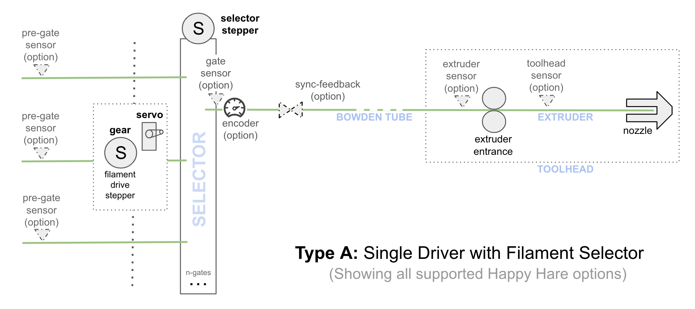
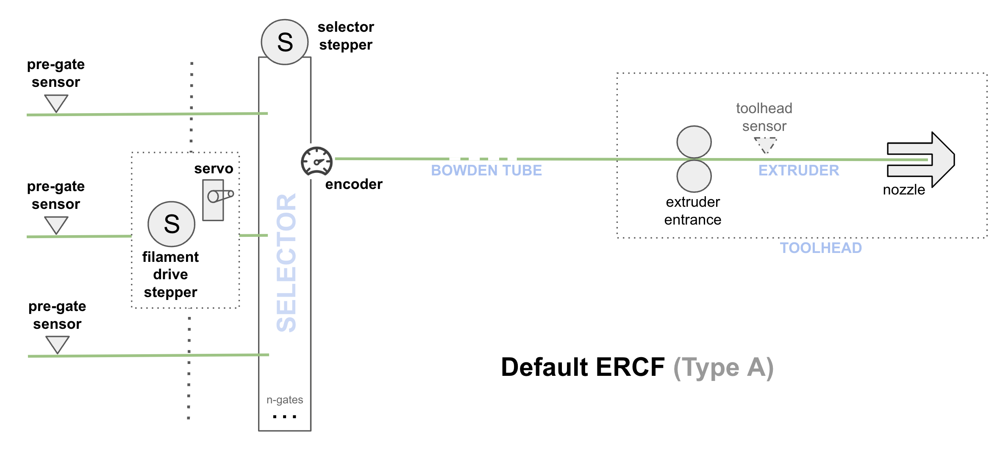
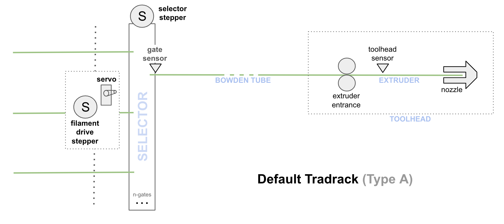
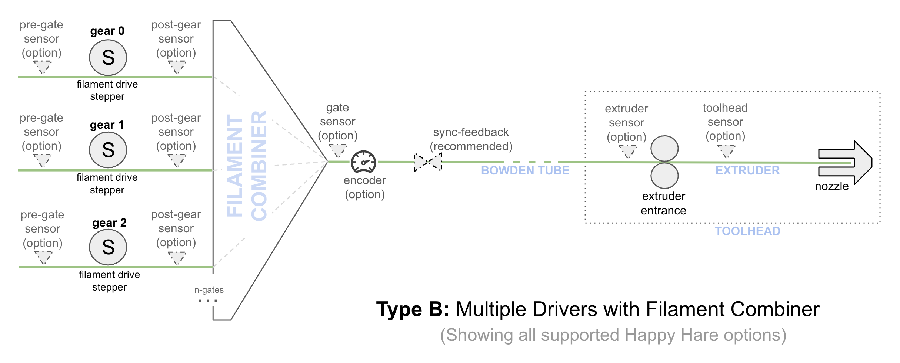
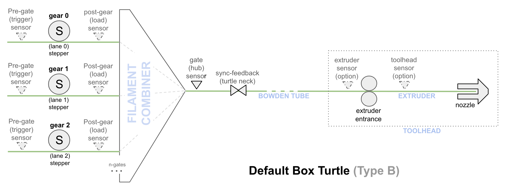
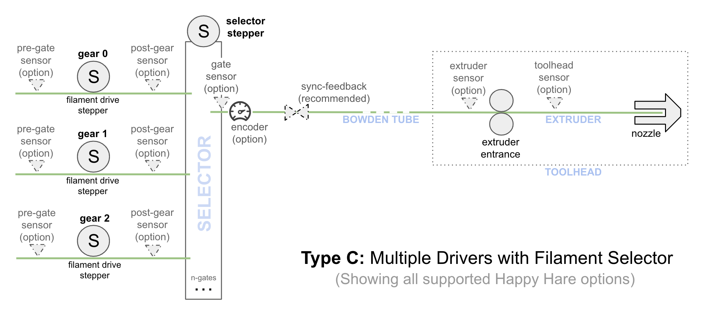
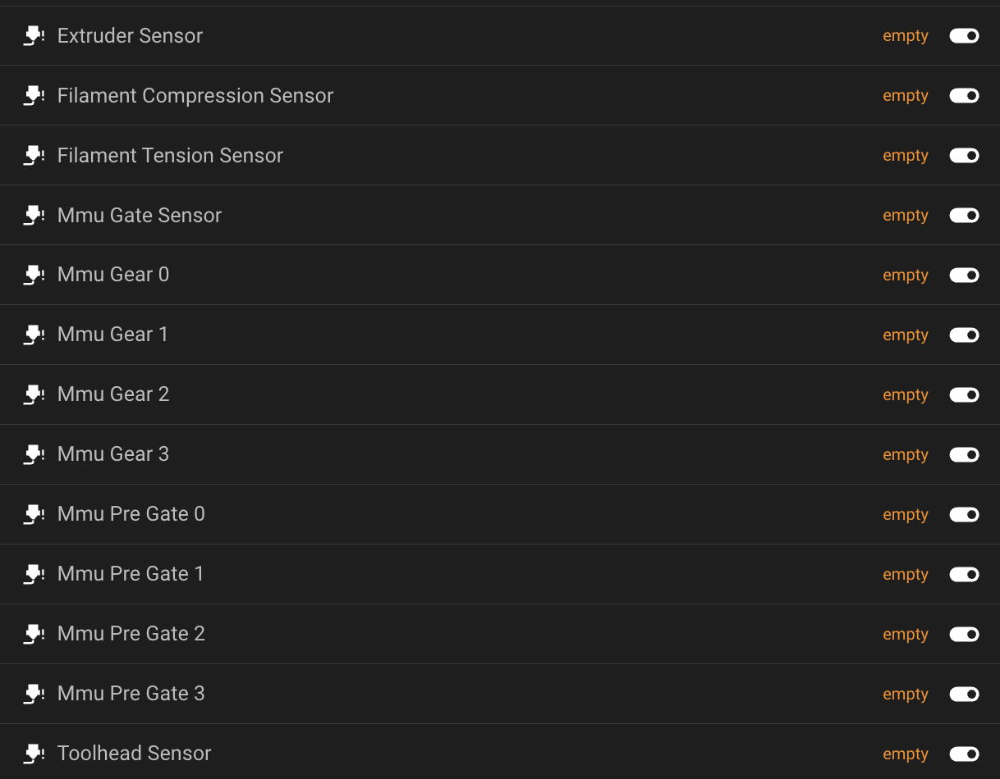
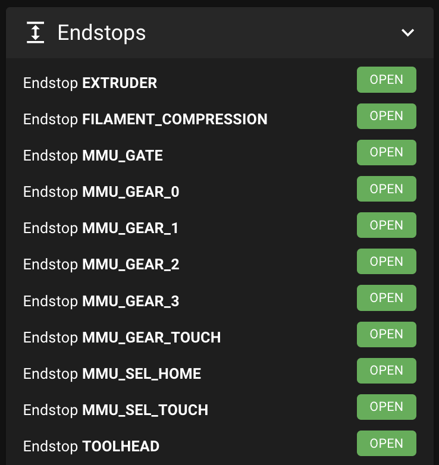
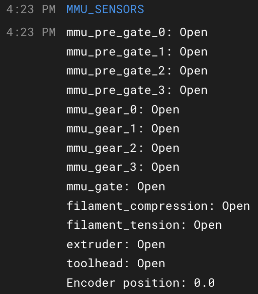

#### Page Sections:
- [Naming Conventions](#---mmu-naming-conventions)
- [MMU Design Categories](#---type-a)
  - [Type A](#---type-a) - Single Driver with Selector
  - [Type B](#---type-b) - Multiple Drivers with Filament Combiner
  - [Type C](#---type-c) - Multiple Drivers with Selector
- [Supported Sensors](#---supported-sensors)
  - [My Ideal MMU](#---ideal-design)

 

So what is an MMU and what features distinguish it's type and how does Happy Hare support all the different types?...

 

##    MMU Naming Conventions

#### MMU
Referring to "Multi-Material Unit", the term first coined by Prusa Research, this is used to refer collectively to the entire extension to a 3D printer for the purpose of changing filaments on a single extruder system. Other terms are also in use including `AFC` Automatic Filament Changer, `AMS` Automatic Material System or even `VVD` (BTT Versatility, Vibrance, Delivered). Well, maybe that last one won't stick as a generic name!

#### Filament Buffer
Many MMU designs employ a method to catch and manage the loose filament that has been pulled off the spool when it is unloaded from the MMU so it can be reloaded again (often at higher speed). This can take the form of a slot for loop catchment or coiling wheel, or even a passive spool rewinding device originally popularized and perfected by Filamentalist. This device is its many forms is called a Filament Buffer by Happy Hare after Prusa's origin of the name.

Some MMU designs employ an active rewinding mechanism with additional electronics and additional motors to control it and as such don't have or need filament buffers.

**Note:** a confusing trend is to call the sensor device that detects compression and tension in the filament (for gear/extruder stepper syncing and endstop detection purposes) a "buffer".  Whilst many of these designs do extend the bowden length to contain around 10mm of additional filament there is no reason their design has to. Their purpose is not to buffer filament but rather detect compression and tension in the filament passing through the bowden tube. Thus Happy Hare refers to these devices in their many forms as "sync-feedback sensors" even if their design can add 10mm of variability (aka "buffer") to the bowden length.

#### Sync-Feedback (aka "buffer")
Sensor that detects compression and tension in the filament (for gear/extruder stepper syncing and endstop detection purposes)

#### Gate
Sometimes referred to as a "Lane", this represents where the end of the filament sits in the MMU when it is unloaded from the printer. In Happy Hare it represents the physical filament position on a 0-based numbering system.

#### Gear Stepper
Sometimes referred to as the "Filament Driver Stepper" this is the stepper or steppers that are used to drive the filament in the MMU. Often once the filament is picked up by the extruder it will be synced with the extruder to double the driving force and overcome friction introduced by the MMU.

#### Selector
Every MMU needs the ability to select a particular filament and that is the purpose of the Selector. Some designs (loosely grouped as "type-A" designs) that often employ a single gear stepper have a mechanical selection mechanism. This mechansim is often built with one or more steppers for movement (both linear and rotary) as well as optional use of a servo for engagement purposes.

Other designs ("type-B") use individual gear steppers and thus don't have a selector mechanic -- their "selector" is virtual. They trade off the complexity of the selector with the cost of additional gear steppers and a practical limit to the number of gates.

For completeness a third type ("type-C") is defined that have both individual gear steppers and a physical selector mechanism. There aren't examples of this type yet but such a design is possible and may offer a more convenient way to combine the benefits of individual gear steppers without the limitation on number of gates.

#### Combiner / Splitter
Used interchangeably this term refers to a device on type-B MMU's that multiplexes several bowdens into one which feeds the toolhead. Technically `Combiner`is a more accurate term because many (commonly 4) filament paths are combined into one, but `Splitter` has seen wider adoption even though it isn't really splitting the path.

 &nbsp;

Basic MMU types supported by Happy Hare:

##    Type-A

This is the most common type of MMU used today. The advantage is that it allows for a large number of gates (available filaments) at a low cost because it leverages only two steppers and a servo to complete the selection process. Examples of this design include Voron ERCF and Annex Tradrack.

**PROS:** Very cost effective for large number of gates, easy bypass functionality, scalable 
**NEUTRAL:** Requires high-quality build 
**CONS:** Requires higher degree of tuning/troubleshooting

### Examples:
  

Many of the sensors in this design are optional, each providing additional capabilities and benefits, but generally any design needs a way to establish a "homing point" near to the gate (for parking filament) and another near or in the extruder (for verification and accurate loading to the nozzle).

Gate parking sensor options include: `gate` sensor, and/or `encoder`

Extruder parking sensor options include: `toolhead` sensor and/or `extruder` sensor, and/or `sync-feedback compression` sensor and/or `encoder`

 

##    Type-B

This type has been popularized by Bambu Labs and their AMS system although new open-source alternatives like Box Turtle, 3MS, Angry Beaver are very similar. Each gate has a dedicated stepper for loading and unloading and it leverages a filament "combiner/splitted" rather than a selector in the Type-A design.  The advantage is in efficiency. The disadvantage is that it is generally limited to a small number of gates.

> [!NOTE]  
> _Technically these units can be cascaded to provide a greater number of gates but the control logic both firmware and electronics quickly become complex and costly_

**PROS:** Easily build, less tuning 
**NEUTRAL:** Complexity increases with >4 gates 
**CONS:** More costly build and generally limited to 4 gates per unit, harder bypass functionality

Despite the lack of cost effectiveness, multiple type-B MMU's can be combined by routing the output of each into an additional "combiner/splitter". Happy Hare will ensure that different units are not used at the same time and thus competing for the additional combiner that routes filament to the toolhead.

### Examples:

 

##    Type-C

The type is more theoretical at this point - I'm not aware of any designs that take this approach.  It would eliminate the gate limitations of a filament "combiner" to allow for large gate arrays and thus simplify the controlling logic. It still suffers from the need for a large number of stepper motors and control electronics.

**PROS:** Less tuning, no limit to gates, easy bypass functionality 
**NEUTRAL:** Moderate build complexity 
**CONS:** More costly build

 

##    Supported Sensors

  | Sensor | Description |
  | ------ | ----------- |
  | Pre-Gate Sensor &nbsp; `mmu_pre_gate_X` | Located at the filament entry to the MMU. &nbsp; **Primary Functions:** 1. Filament autoload - If the MMU is idle and a filament is inserted and triggers a pre-gate sensor, the selector will move to that gate and preload the filament and correctly park in the gate 2. Filament detection - Regardless of whether the MMU is busy or not the insertion or removal of the filament will update the `gate_status` in the gate-map (and adjust status LEDs if fitted) thus retaining knowledge of the availability in that particular gate &nbsp; **Secondary Function:** 3. Runout detection - If "EndlessSpool" is enabled, this sensor can also act as a early runout sensor and automatically unload, map tool to an alternative gate, re-load and continue printing. This is a highly reliable from of continuous printing because the potentially kinked end of the filament is kept out of the MMU mechanisms |
  | Post-Gear Sensor &nbsp; `mmu_post_gear_X` | This sensor sits after the MMU gear stepper on each of the gates. Only pertinent to type-B designs. &nbsp; **Primary Functions:** 1. Acts as a per-gate homing point instead of using a shared `gate` sensor 2. Used as a pre-loading homing (stop) point. Technically on type-B MMU designs this would allow preloading of filament in a gate even if filament is fully loaded in another. _(However as of v3.0.2 this is not yet implemented)_ &nbsp; **Secondary Function:** 3. Runout detection |
  | Gate Sensor &nbsp; `mmu_gate` | This is a filament switch fitted on the exit of the MMU. It is "shared" in that it is located after the aggregation point for type-B designs and thus every filament can activate. &nbsp; **Primary Functions:** 1. Gate homing point - For exact location of all filaments close to the MMU after they have been selected and are being driven by the filament drive or gear stepper. &nbsp; **Secondary Functions:** 2. Runout detection - The gate sensor can trigger filament runout logic and thus initiate the "EndlessSpool" feature which allows continuous printing from an alternative set of spools which are automatically mapped to the original tool number. |
  | Encoder &nbsp; `mmu_encoder` | The encoder measures filament movement and provides feedback to Happy Hare primarily for validation purposes.  However for homing it is an alternative to, but can also be combined with, the Gate Sensor and used to establish a reference point at the MMU.  This reference point is used in the subsequent bowden move when loading or as a point from which to measure the parking position in the gate when unloading. Similar to the Gate Sensor, the encoder can trigger filament runout logic and thus initiate the "EndlessSpool" feature which allows continuous printing form an alternative set of spools which are automatically mapped to the original tool number.  However it has additional functionality in that it can detect a "clog" condition and automatically pause the print and notify you.  The encoder is visible through the printer object `printer['mmu_encoder mmu_encoder']` &nbsp; **Primary Functions:** 1. Move validation 2. Clog detection - Detects lack of expected filament movement 3. Gate homing - Reference point for parking filament in the MMU gate &nbsp; **Secondary Functions:** 4. Runout detection &nbsp; Note that the ERCF design exclusively uses an encoder for both homing and validation. For the Tradrack design it is optional because a Gate Sensor provides the reference homing point and if added the encoder can provide more reliability and error recovery. |
  | Sync-Feedback Sensors &nbsp; `filament_compression` `filament_tension` | These one or two optional sensors (Happy Hare can support either or both) are fitted into a device often called a "buffer" and detect filament compression (MMU pushing filament faster than the extruder is pulling) or filament tension (extruder is pulling faster than MMU is pushing). &nbsp; **Primary Functions:** 1. Stepper synchronization - Allows synchronization of the gear stepper on the MMU and the extruder on the printer. This allows the MMU to contribute to feeding filament without interfering with the extruder operation and causing print artifacts. 2. Extruder endstop - The **filament_compression** sensor can be used to detect the filament hitting the extruder entry and thus be used as an accurate homing point close to the extruder. 3. Bowden calibration - The **filament_compression** sensor can also be used to easily automate the calibration of bowden length by detecting the entrance to the extruder. &nbsp; **Secondary Functions:** 4. Other theoretical uses like runout detection are possible but depend on the sensor unit design specifics (e.g. is centrally sprung). Currently Happy Hare does not support other uses. &nbsp; Note: Happy Hare also supports proportional feedback sensor types. See doc for details. |
  | Extruder Entry Sensor `extruder` | This optional filament sensor sits right before the extruder entrance and can be used in several ways: &nbsp; 1. It can provide an accurate homing point at the end of the long bowden move prior to loading the extruder. Although it is outside of the extruder gears (and thus not as accurate as a toolhead sensor for this purpose) it is still a well defined point 2. In Happy Hare "bypass" mode it can be used to trigger automatic filament loading of just the extruder 3. when unloading the extruder it is used to reliably "reverse" home to ensure the filament is clear of the extruder before any fast bowden unload 4. Can be used as an (emergency) runout sensor 5. it provides extra feedback that the filament is right at the extruder entrance when trying to recover the state e.g. after restart |
  | Toolhead Sensor &nbsp; `toolhead` | This optional sensor sits after the extruder entrance but before the start of the hotend. It is **probably the most useful of all sensors** for these reasons: &nbsp; 1. It is the only unobtrusive and reliable way to determine whether filament is loaded in the extruder which aids reliability, especially on startup-up state restoration. It also can validate correctly setup tip-forming movement, and early warning of a stuck filament before excessive grinding occurs, etc. 2. The other really valuable use is as the most accurate homing endstop close to the nozzle. Happy Hare is based on precision loading and although it is fully supported not to have the sensor, having it means that you know the exact filament position after the inherently problematic transition through the extruder gears. 3. The final use case with Happy Hare is in the calibration of the toolhead. It allows for automated determination of key dimensions of the extruder but also properties such as residual filament left behind after a filament change. The latter allows for the exact control of purge volumes. |
  | "Virtual" Sensors &nbsp; `mmu_gear_touch` `collision` `mmu_ext_touch` | Not shown in the diagram there are several "virtual sensors" that are implemented by Happy Hare: &nbsp; 1. If TMC stallguard is available and configured Happy Hare can sense the filament hitting the extruder entrance. This therefore acts as an extruder homing point. Endstop is named **mmu_gear_touch**. 2. If an encoder is available, Happy Hare can sense the lack of movement as another way to sense hitting the extruder entrance, again acting as a reference homing point. Endstop is named **collision**. 3. If TMC stallguard is configured on the extruder stepper **(yes, that's possible with Happy Hare)**, then an endstop named **mmu_ext_touch** is also available for advanced/experimental detection of collision with the nozzle! |
  | Selector Sensors &nbsp; `mmu_sel_home` `mmu_sel_touch` | For completeness, endstops are created on the selector. Typically there are two that are relevant (although you can add your own): &nbsp; 1. The selector homing endstop is called **mmu_sel_home**. This is most typically a physical switch. 2. If TMC stallguard is configured an additional **mmu_sel_touch** is available. &nbsp;&nbsp;- If configured in place of the default physical endstop this can be used for homing. &nbsp;&nbsp;- The other important use is in selector movement and detecting blocked gates with subsequent automatic recovery. &nbsp;&nbsp;- Finally this is useful in detecting the limit of selector travel during setup and calibration. |

 

Complete set of default Happy Hare endstops and filament sensors: 
  

 

##    Ideal Design?

I've often been asked what would be the ultimate MMU design... Actually I've never been asked but I'm going to share with you anyway! :-)

I think the ultimate design has not been built yet. It think it will be a "type-C" design:
- Powerful stepper for each filament gear likely direct drive or low gearing so that the filament can be driven at high speed
- Very simple linear selector with small <10mm movement for each gate to allow for an arbitary number of gates (no servo)
- Integrated `sync-feedback sensor` (with both cpmpression and tension feedback) built into the selector
- `gate sensor` built into the selector (maybe part of the sync-feedback design)
- `passive` filament buffer/rewinder system for simplicity
  - Shared rfid / QR-code reader used when loading spool (no need for one per gate)
  - Spool enclosure air fed from heated printer chamber
- `pre-gate` sensors on each gate for automated loading
- Bypass gate without gear stepper for the "+1" spool and traditional manual usage
- Toolhead designed for MMU printing for easy unclogging with integrated `toolhead sensor` and filament cutter (disclaimer: I know of a great design is comming very soon)
  - ideally an `extruder sensor` but only important for use with bypass gate
- Indicator LEDs on each gate with +1 LED for status
- No post-gear sensors, no encoder, no combiner/splitter, no active dc-rewinder, no servo

Such a design would blend the inherent benefits of a type-B design without given up the ability to have a large number of gates and eliminates some of the proven hurdles of current designs: selector servos, filament slippage when not active, encoder malfunctions, dc-motor rewinder control complexity, one way bearing malfunction, etc., 

If my setup I'd use blobifer instead of purge/wipe tower with dynamically controlled purge volumes. All filament useage would be synced with spoolman and I'd have pre-print explanation of potential issues like insufficent filament.

When such an MMU is built, Happy Hare is already ready to support it!
