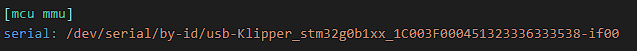
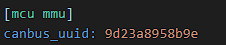

Let's go ahead and start with walking through `mmu.cfg`. This file contains the mmu control board device location and aliases for control board pins. If you did the interactive install with one of the supported boards, this should be mostly configured for you.

If you have a custom setup, enter your pins here. Don't add pin modifiers such as `!` or `^` here. Just the pin name.

 

##    MCU Device Location

This is where you're going to place your device location. If you have a usb connected MMU control board like the EZBRD, you'll enter something like:  

It's important to include `/dev/serial/by-id/` because Klipper and Linux need the full path name to make the connection. One way to find this info is with the new Mainsail `DEVICES` button. It's in the top right of the screen when editing a config file.

Otherwise, you'll need to ssh into the rpi and do a `ls /dev/serial/by-id/` to find your serial device (usually connected to the rpi with a USB cable). This is very similar to how you connected your main MCU to klipper in `printer.cfg`.  

If you use CANBUS, then you'll enter your CANBUS UUID in the same location, but the line will look something like this:  

We're not going to go into retrieving the UUID, but [Esoterical has a good guide](https://canbus.esoterical.online/) if you need help. The Mainsail button will try to find the CANBUS UUID, but it doesn't work if Klipper is already flashed to it.

That's pretty much it for setting up the MMU control board. Simple, right? (Ok, I know just copying and pasting is simple and getting the correct stuff to copy and paste is the hard part. I feel for you. If you need help, I would suggest hitting up discord and asking in the `Klipper` channel.

---

