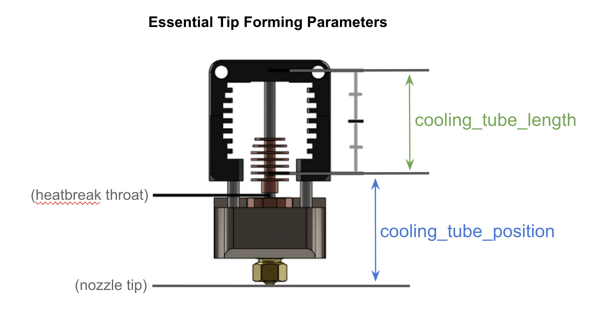
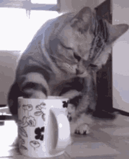

#### Page Sections:
- [save\_variables](#---save_variables)
- [\_MMU\_SOFTWARE\_VARS](#---_mmu_software_vars)
- [\_MMU\_STATE\_VARS](#---_mmu_state_vars)
- [\_MMU\_LED\_VARS](#---_mmu-led_vars)
- [\_MMU\_SEQUENCE\_VARS](#---_mmu_sequence_vars)
- [\_MMU\_CUT\_TIP\_VARS](#---_mmu_cut_tip_vars)
- [\_MMU\_FORM\_TIP\_VARS](#---_mmu_form_tip_vars)
- [\_MMU\_CLIENT\_VARS](#---_mmu_client_vars)
- [Time Saving Tip](#time-saving-tip)

This is where you'll likely spend most of your time tuning the MMU. The bulk of what the MMU does is controlled here. So, grab a cup of coffee, get ready, and let's dive in!

<br>

##    save\_variables

`filename: /home/pi/printer_data/config/mmu/mmu_vars.cfg`
This is where Happy Hare saves all the variables and status information (remember, it's a state machine) for the operation of the MMU. You'll likely keep the default unless you have a super modified klipper install, in which case you probably have that all figured out anyway.

<br>

##    \_MMU\_SOFTWARE\_VARS

This section controls the behavior of the start up and finalization of a print through Happy Hare. In the [Slicer Setup](Slicer-Setup) page, the operation and setup of the proper macro calls are explained in great detail. Since setting up the slicer is outside the scope of this document, be sure to read up there and get a good understanding of things before you edit this section.

`variable_user_pre_initialize_extension`  This is called by `_MMU_START_SETUP` assuming you use the recommended Happy Hare start macros. You can use this extension to do a conditional home, set the printer LED status, or to put the printer into a certain state at the initiation of the print.

`variable_octoprint_compat`  allows Happy Hare to communicate via the Octoprint mechanism. Usually `True`.

`variable_home_mmu` tells Happy Hare if you want to include a homing move at the beginning of your print. Most likely `True` unless you call a homing move in your `START_PRINT` macro, in which case, set it to `False` to avoid unnecessary homing moves.
 
`variable_check_gates`  when set to `True` tells Happy Hare to check each gate used in the print for filament. This is helpful to make sure everything is ready. If you're certain you can print and you've loaded everything correctly, you can save a few seconds at the beginning of the print by turning it off. However, it's not a huge time savings and probably better to just leave on. Plus, it's pretty cool to watch. Usually `True`.

`variable_load_initial_tool`  set to `True` will automatically load the first tool in the print before the print starts. If your Slicer doesn't explicitly call the first tool, it will error if set to `False` because the tool isn't loaded. If the first tool is already loaded, then it just happily skips the load sequence. So, there's no drawback to leaving it on. Usually `True`.

`variable_automap_strategy` This is an advanced feature to automatically set up tool to gate map when starting print. It is complex and fully explained in [Tool and Gate Maps](Tool-and-Gate-Maps.md#---automatic-tool-to-gate-ttg-mapping). Leave it at "none" until you are an expert user :-)

`variable_eject_tool` tells Happy Hare whether or not to eject the filament back to the buffer at the end of the print. If set to `False` the filament will remain loaded. This one is up to your preference. Usually `True`.

`variable_reset_ttg` tells Happy Hare whether to reset the tool to gate map at the end of the print. Typically, the tool to gate map is not changed unless you switch filament colors or change the endless spool settings. Leaving this one `False` will save you from having to redo the tool to gate map on every print.  See [Gate Map](Tool-and-Gate-Maps#---gate-map) for explaination on how to map the gates. Usually `False`.

`variable_dump_stats` Tells Happy hare to display a popup on KlipperScreen and output in the console of the stats at the end of the print. It will look something like this:
<p align="center"></p>

That last part, `Record: 56` is good for bragging rights on Discord. Beware though, at the time of this writing, people are saying 1100+ swaps without issue! Amazing!

For more detailed info [Statistics and Consumption Counters](Statistics-and-Consumption-Counters).

<br>

##    \_MMU\_STATE\_VARS

This section allows you to extend the functionality of Happy Hare with custom commands made after an action is performed, the state of the MMU has changed, or the gate map has changed. A good explaination of what all this means can be found on the [Macro Customization](Macro-Customization) page.

`variable_user_action_changed_extension` runs a command or macro after Happy Hare executes an action.

`variable_user_print_state_changed_extension ` runs a command or macro after Happy Hare changes the MMU state.

`variable_user_gate_map_changed_extension` runs a command or macro after the gate status is changed.

As an example, if you have the [Klipper LED Effect module](https://github.com/julianschill/klipper-led_effect) installed and a custom status created that flashes all the LEDs in the printer three times, you could make the printer flash the lights after every action by Happy Hare by:
`variable_user_action_changed_extension: STATUS_FLASH3`
(Don't do this unless you want anyone watching to have a siezure though. Just saying.)

<br>

##    \_MMU\_LED\_VARS

This section controls the MMU LEDs. This does not affect any of the printer LEDs controlled by the Klipper LED Effect module](https://github.com/julianschill/klipper-led_effect)

`variable_led_enable` allows Happy Hare to use the MMU leds. `True` if you have LEDs on the MMU.

`variable_default_exit_effect` sets the status of the MMU exit LEDs. Choose between:  
- `off` Turns exit LEDs off.
- `gate_status` Sets the exit LEDs based on the status of the gate. Orange for no filament, Green for filament at the gate.
- `filament_color` sets the LED color to the color of the filament in the gate map.
- `slicer_color` sets the LED color to the color the slicer passed in to Klipper. (This can be different than the gate map color, especialy if your filament color in the slicer isn't set correctly, or you haven't mapped your gates.)

`variable_default_entry_effect` sets the entry LEDs similar to above.

`variable_default_status_effect`  defines the default status of the LEDs when not affected by other events. Similar options to above.

`variable_white_light` defines the RGB color for white.

`variable_black_light` defines the color used for black filament.

`variable_empty_light` defines the color used for an empty gate.

<br>

##    \_MMU\_SEQUENCE\_VARS

These control the movement of the toolhead during a tool change.  
If `enable_park` is `False` all movement during a tool change is disabled during a print except when handling a filament runout where `enable_runout_park` controls parking. This allows for parking the toolhead only for filament runout handling or excludes parking the toolhead due to filament runout.  
Parking the tool head when not printing is controlled by `enable_standalone_park`.  
If parking is enabled, `restore_xy_pos` allows toolhead x,y position restoration to be deferred to the slicer, which results in less dwell time on the print. (CAUTION: Z-height will <ins>always</ins> be restored.)

`variable_enable_park` enables tool head parking during a print, but does not control filament runout parking.

`variable_enable_park_runout` enables tool head parking during a filament runout. Does not control other in-print parking. This is useful to keep nozzle ooze off your print when a filament runout occurs.

`variable_enable_park_standalone` allows Happy Hare to handle tool head parking when not in a print. For example, parking the tool head while the nozzle is heating.

`variable_restore_xy_pos` determines where to position the tool head AFTER a tool change.

`variable_park_xy` X and Y coordinates to place the tool head DURING a tool change.

`variable_park_z_hop` additional Z hop when performing a tool change. This works in or out of a print.

`variable_travel_speed` tells Happy Hare how fast to move in and out of the tool head parking position.

`variable_lift_speed` tells Happy Hare how fast to move Z during a Z hop.

`variable_auto_home` tells Happy Hare to automatically home, if necessary. This only homes the X and Y axes so the sequence macros can park the toolhead. It's called, if necessary, at toolhead load or unload.

`variable_park_after_form_tip` set to `True` delays moving the tool head to the park position. Use this for tip cutting to allow Happy Hare to move to the filament cutting position (if you have filament cutting enabled) before parking. Otherwise, Happy Hare sends the tool head directly to the parking position and makes extra movements on filament cutting. Recommended to be `True` if cutting filament tips, or `False` if forming filament tips.

`variable_timelapse` if `True` Happy Hare will trigger a snapshot from a camera after a tool change successfully loads.

The following are similar to `_MMU_STATE_VARS` and allow user customization based on Happy Hare tool loading and unloading events.

`variable_user_pre_unload_extension` runs a command or macro after Happy Hare executes pre-unload logic.

`variable_user_post_unload_extension` runs a command or macro after Happy Hare executes post-unload logic.

`variable_user_pre_load_extension` runs a command or macro after Happy Hare executes pre-load logic.

`variable_user_post_load_extension` runs a command or macro after Happy Hare executes post-load logic. This would be a good place to add a nozzle brushing macro, but, just be sure the tool head doesn't crash into the print when running.  
I.e. `variable_user_post_load_extension: CLEAN_NOZZLE`

<br>

##    \_MMU\_CUT\_TIP\_VARS

These are all the variables which control the tip cutting procedure. There's quite a few, but most of them are pretty self-explanatory.

`variable_restore_position` When set to `True` the toolhead will return to the initial position it was at before the cut tip procedure started. This is typically at the purge location. If turned off, it will move to the next position after completing the tip cut.  
With this left to true, the toolhead will move something like:  
Print > Purge Position > Filament Cut Position > Purge Position > Park position > Swap filament > Purge position > Purge > Print  

With it disabled the sequence will look like:  
Print > Purge Position > Filament Cut Position > Park position > Swap filament > Purge position > Purge > Print  
 
`variable_blade_pos` This is the distance from the internal nozzle tip to the filament cutting blade. Happy Hare uses this to determine how much filament is left in the hot end after the cutting procedure. This distance can be measured in CAD, [retrieved from the list Happy Hare has](Happy-Hare-Parameters#---toolhead-loading--unloading), or measured directly.  

To measure directly, it is suggested to install a new, never used, nozzle in your hot end. Then, with  the hot end cold, insert filament until it bottoms out on the inside of the nozzle. Lightly depress the filament cutting arm (enough to mark the filament, don't cut it completely) then take the piece of filament out and measure the distance from the tip of the filament to the mark left by the blade. That will get you very close to the correct result. 

`variable_retract_length` This is how far Happy Hare will retract the filament before cutting the tip off. This should be as close to the blade position as possible, while still giving a clean cut tip. Generally, about 5mm less than `variable_blade_pos` is a good starting point. This will have an impact on how much filament needs to be purged after a swap. If it is set to just trim the very tip of the filament off, then the purge will only need to clear a minimal amount of filament. Mostly what's left in the melt pool at the nozzle. If it is set conservatively, there will be more filament left to purge out after a swap. Therefore, it's worth taking some time to tune this parameter for efficient filament use.  

`variable_simple_tip_forming` This enables Happy Hare to perform some simple cooling moves before cutting the filament tip. If you have trouble with the filament tip sticking in the hot end after a cut, you can enable this to help.  

`variable_pin_loc_xy` This is the X and Y coordinate of the depressor pin for your tip cutting device.  The cutter arm just touches the depressor pin at this location.  

`variable_pin_park_x_dist` This position is set as a safety buffer so the toolhead will move to this location before cutting instead of directly to the depressor pin. It makes sure the tool head approaches the depressor from the correct direction. The recommended distance is about 5mm.  

`variable_pin_loc_x_compressed` This is the position where the blade is fully depressed and the filament is cut. Set this one carefully. Setting it incorrectly will either lead to filament not being fully cut or causing excessive force on the filament depressor pin.  

`variable_rip_length` and `variable_rip_speed` are the distance and speed to move the toolhead away from the depressor to ensure the cutter arm doesn't get stuck. A short and quick move is best here. Recommend something like 1mm at 5mm/s.  

`variable_pushback_length` After cutting the filament, Happy Hare will push the tip back into the hot end by this distance. The goal is to get the remnant tip back close to the melt pool so it stays semi liquid and doesn't clog the hot end. Set too high, this will cause oozing. Set too low, it can cause clogging. Usually about 1mm less than `variable_retract_length` is a good starting point.  

`variable_pushback_dwell_time` is how long Happy Hare pauses before it pulls the filament back out for the swap.  

The following are speeds related settings for tip cutting. If the cut speed is too fast, the steppers can lose steps and cause print problems such as layer shifts. If not fast enough, you'll add a lot of time to the filament swap.
Here's the basic algorithm for filament cutting:
 - First make a fast move to build momentum put the blade in initial contact with the filament.
- Make a slow move pushing the blade through the filament.  

`variable_travel_speed` The speed at which the toolhead moves to `variable_pin_loc_xy` + the offset `variable_pin_park_x_dist`. This is a proto-rapid move.  

`variable_cut_fast_move_speed` This is the speed at which the toolhead traverses the `variable_pin_loc_xy` distance from the position determined by `variable_pin_park_x_dist`.

`variable_cut_slow_move_speed` This determines the speed between `variable_pin_loc_xy` and `variable_pin_loc_x_compressed`. It is the slow speed with which the filament is cut.  

`variable_evacuate_speed` is the fast speed which the toolhead "rips" away from the depressor pin allowing the cutting arm to "snap" back into place.  

`variable_cut_dwell_time` is how long the toolhead stays in the `variable_pin_loc_x_compressed` position.  

`variable_cut_fast_move_fraction` is how much of the rip movement is done at `variable_cut_fast_move_speed` vs. `variable_cut_slow_move_speed` upon ripping away from the depressor pin.  

`variable_extruder_move_speed` is how fast Happy Hare makes extruder movements during filament cutting.  

`variable_safe_margin_xy` is a "box" around the depressor pin which the toolhead will make slower moves. Setting this to the size of your toolhead plus a couple millimeters is good. This is a comma separated tuple. (For example: 30,30) 

`variable_gantry_servo_enabled` tells Happy Hare whether your depressor pin has a servo which moves the pin out of the way while printing. If it is a fixed pin, set to `False`.  

`variable_gantry_servo_down_angle` is the down, or in use, position of the depressor pin servo.  

`variable_gantry_servo_up_angle` is the retracted position of the depressor pin servo.

<br>

##    \_MMU\_FORM\_TIP\_VARS

These are all the parameters which control Happy Hare's implementation of tip forming. Most of these are similar to the parameters which most slicers use for tip forming. Indeed, it is up to you to determine whether to use Happy Hare or the slicer for tip forming. However, Happy Hare is set up to be convenient and more centralized than using slicer settings.  

`variable_ramming_volume` is the amount of filament in mm^3 which is rammed into the nozzle to cool the melt pool enough to form a tip.  

`variable_ramming_volume_standalone` is the same as above, but for filament swaps not in a print.  

`variable_toolchange_temp` is the temperature Happy Hare will set the nozzle to for a filament swap. Use zero (0) to indicate no change.  

`variable_toolchange_fan_assist` allows Happy Hare to turn on the part cooling fan to help speed nozzle cooling if `variable_toolchange_temp` is lower than printing temp.  

`variable_toolchange_fan_speed` is how much fan Happy Hare should use to help cool the nozzle. This is a percentage parameter. So using `50` indicates 50% or half speed.  

`variable_unloading_speed_start` is the speed of the initial fast move for the tip forming procedure.  

`variable_unloading_speed` is the speed after `variable_unloading_speed_start` which Happy Hare uses to move the filament into the cooling zone.  

`variable_cooling_tube_position` This is the start position of the cooling tube. Recommended values are:  
DragonST: 35  
DragonHF: 30  
Mosquito: 30  
Revo: 35  
RapidoHF: 43  

`variable_cooling_tube_length` is the length of the cooling tube. Recommended values are:  
DragonST: 15  
DragonHF: 10  
Mosquito: 20  
Revo: 10  
RapidoHF: 22  

<p align="center"></p>


`variable_initial_cooling_speed`is the initial slow movement (mm/s) to solidify the tip and cool the string if formed.  

`variable_final_cooling_speed` is the fast movement (mm/s) speed for tip forming.  If too fast, the tip will deform while ejecting. If too slow there will be long strings and no separation from the melt pool, leaving a string with a blob on the end of the string.  

`variable_cooling_moves` is the number of back-and-forth cooling moves to make. 2-4 cooling moves is a good place to start.  

`variable_use_skinnydip` enables "skinny dip" movement. Skinny dip pushes the sting on the end of the filament tip back in the melt pool quickly and for a short time to melt the string off the tip. So, if you see lots of stringing on your formed tips, this may be an option.  

`variable_skinnydip_distance` is the distance to reinsert filament into hotend starting from end of cooling tube. Not enough and there will still be strings, too much and you'll pick up blobs on the end of your filament tip from the melt pool.  

`variable_dip_insertion_speed` is a medium to slow insertion speed, just long enough to melt the fine hairs, too slow will pull up molten filament.  

`variable_dip_extraction_speed` should be around 2x Insertion speed to prevents forming new hairs.  

`variable_melt_zone_pause` how long to pause in the melt zone during a skinny dip move.  

`variable_cooling_zone_pause` is how long to pause in the cooling tube after a skinny dip move.  

`variable_use_fast_skinnydip` tells Happy Hare to skip changing nozzle temperature during skinny dip moves.  

`variable_parking_distance` is the parking position of the filament at the end of tip forming. Setting this to zero (0) will leave the filament wherever it ends up after tip forming.  

`variable_extruder_eject_speed` is the speed used to move the filament to  `variable_parking_distance`.

<br>

##    \_MMU\_CLIENT\_VARS

These are variables used in general print and MMU moves.  

`variable_retract` is the distance for retracts and un-retracts on pause. Important to note that this is NOT performed during a print or MMU error because Happy Hare will manage the retraction in that case.  This is useful for regular pauses during a print or if the MMU is disabled.

`variable_retract_speed` the speed of the above retraction movement.  

`variable_unretract_speed` is the speed Happy Hare will unretract.  

`variable_user_pause_extension` is any command or code you want executed after a base pause. For instance, you may want to change the status of the printer LEDs through the Klipper Led Effect add on, in which case you'd have something like `variable_user_pause_extension: status_pause`  

`variable_user_resume_extension` any command or code you want executed before a base resume. Following the above, you could set the leds to the printing status, `variable_user_resume_extension: status_printing` 

`variable_user_cancel_extension` any command or code you want executed before a base cancel. This could be useful if you want something to happen after canceling a print.

The following are alias macros for tool change (filament swap) commands:  

```
[gcode_macro T0]
gcode: MMU_CHANGE_TOOL TOOL=0
[gcode_macro T1]
gcode: MMU_CHANGE_TOOL TOOL=1
[gcode_macro T2]
gcode: MMU_CHANGE_TOOL TOOL=2
[gcode_macro T3]
gcode: MMU_CHANGE_TOOL TOOL=3
[gcode_macro T4]
gcode: MMU_CHANGE_TOOL TOOL=4
[gcode_macro T5]
gcode: MMU_CHANGE_TOOL TOOL=5
[gcode_macro T6]
gcode: MMU_CHANGE_TOOL TOOL=6
[gcode_macro T7]
gcode: MMU_CHANGE_TOOL TOOL=7
```  

<br>

## Time Saving Tip

> [!TIP]  
> It's worth noting, and a very useful feature, that all the macro configuration variables (in `mmu_macro_vars.cfg`) can be modified at runtime without restarting Klipper using the standard klipper variable setting command `SET_GCODE_VARIABLE`. For example, if you have Blobifier purging macro configured as a post load extension you can disable it with (making sure to pick the correct macro name and get value quoting correct):
> ```yml
> SET_GCODE_VARIABLE MACRO=_MMU_SEQUENCE_VARS VARIABLE=user_post_load_extension VALUE="''"
> ```
>
> This ability is a real time saver when experimenting.  Remember that you must manually update `mmu_macro_vars.cfg` to make changes persistent accross klipper restarts.

<br>

---

That about sums it up. That's a lot to take in, so take your time and drink lots of coffee. You'll get there in time!

<p align="center"></p>
