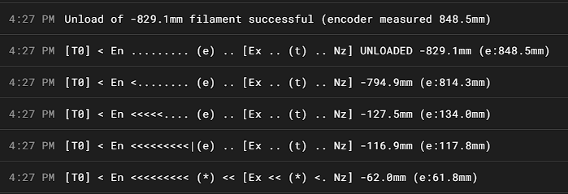
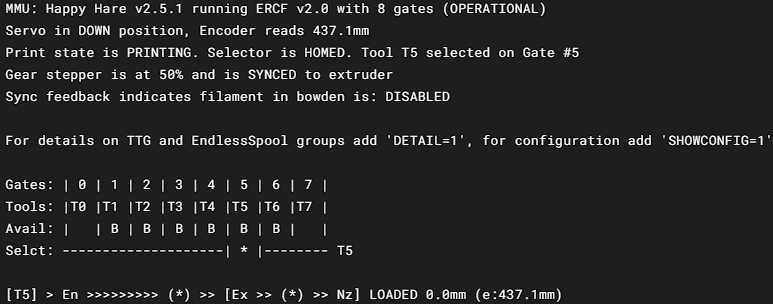
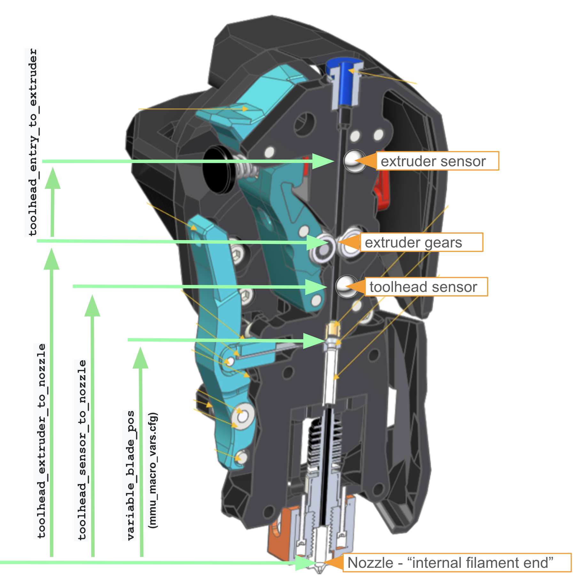
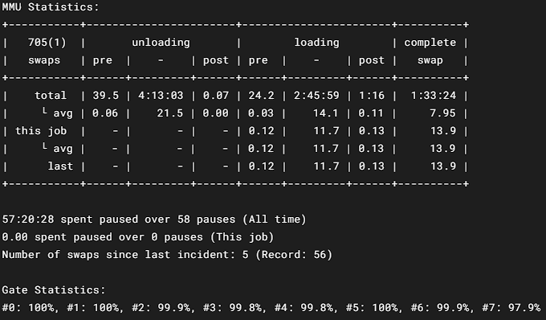

#### Page Sections:
- [MMU Vendor, Type and Size](#---mmu-vendor-type-and-size)
- [Hardware Limits](#---hardware-limits)
- [Servo Configuration](#---selector-servo)
- [Logging](#---logging)
- [Speeds and Accelaration](#---speeds-and-accelaration)
- [Gate Loading and Unloading](#---gate-loading-and-unloading)
- [Bowden Loading and Unloading](#---bowden-loading-and-unloading)
- [Extruder Homing](#---extruder-homing)
- [Toolhead Loading and Unloading](#---toolhead-loading-and-unloading)
- [Tip Forming and Cutting](#---tip-forming-and-cutting)
- [Gear/Extruder Synchronization](#---gearextruder-synchronization)
- [Filament Management Options](#---filament-management-options)
- [State Persistence aka Turn on Behavior](#---state-persistence-aka-turn-on-behavior)
- [Statistics Formatting](#---statistics-formatting-cosmetic)
- [Miscellaneous](#---miscellaneous)
- [Macro Naming](#---macro-naming)
- [Statically defined "reset" defaults](#---statically-defined-reset-defaults)
- ["Other" MMU CAD Dimensions](#---other-mmu-cad-dimensions)

This file contains the Happy Hare main configuration parameters for the Klipper module. Here is where we'll setup and adjust the hardware configuration of your particular MMU, the various parameters that control the hardware and lots of other neat stuff. Let's dig in.

Just a note that macro configuration is discussed in [Configuring mmu_macro_vars.cfg](Configuring-mmu_macro_vars.cfg).

> [!Note]  
> Most of these settings will be set up when running the Happy Hare install script (`./install.sh -i`). Most likely, you'll just need to tweak these settings.

<br>

##    MMU Vendor, Type and Size

`happy_hare_version` just helps the developers keep track of which version you're using and provides some error checking.  

The vendor and version config are important to define the capabilities of the MMU and basic CAD dimensions. These can all be overridden with the `cad` parameters detailed in the documentation but the vendor setting saves time.  

The following is a basic description of the main types of MMU supported by Happy Hare.
- ERCF
-- 1.1 original ERCF design. For the various mods typically in use, add "s" suffix for Sprigy, "b" for Binky, "t" for Triple-Decky. For example, "1.1sb" for v1.1 with Springy mod and Binky encoder.
-- 2.0 denotes the new community ERCFv2.
- Tradrack
-- 1.0 add "e" if an encoder is fitted.
- Prusa
-- Coming soon (use Other for now).
- Other
-- Generic setup that will require further customization of 'cad' parameters. See the [CAD Dimensions](#---other-mmu-cad-dimensions) section for more help.

`mmu_vendor` This is where you'll put your MMU vendor. ERCF, Tradrack, Other.  

`mmu_version` This is the version of your MMU. I.e. 2.0 for ERCF 2.0, or 1.0 for Tradrack 1.0.  

`mmu_num_gates` This is where you tell Happy Hare how many gates are in your MMU.  

<br>

##    Hardware limits

 This section defines the physical limits of your MMU. These settings are respected regardless of individual speed settings configured later on in the config file.

`gear_max_velocity` This sets the maximum speed the MMU will feed filament. The `gear` is what engages with the filament to make it move, and the `gear stepper` is what powers it. Thus, setting this to 300 will ensure your MMU doesn't ever try to push faster than 300mm/s.  

`gear_max_accel` This is the never exceed acceleration for the gear motor. Setting this too high can lead to the gear stepper losing steps and causing the filament to get stuck halfway in the bowden tube. Be careful here.  

`selector_max_velocity` This is the never exceed speed of the selector cart. Since this doesn't have to move very far, a reasonable speed is good. It doesn't have to be lightning fast.  

`selector_max_accel` This is never exceed acceleration of the selector cart. It's ok to set this at a reasonable level as well. Usually about 2-3 times the selector maximum velocity.

<br>

##    Selector Servo

This sets the angle of the servo in three named positions.
 - up   = tool is selected, and filament is allowed to freely move through gate.
 - down = to grip filament.
 - move = ready the servo for selector movement (optional - defaults to up).  

For Happy Hare V2.4 and on, these positions are only for initial setup. They are replaced with calibrated servo positions in `mmu_vars.cfg`

*Note that leaving the servo active when down can stress the electronics and is not recommended. Trust me. You'll let the magic smoke out of your servo or control board.*

`servo_up_angle` This sets the servo position in the up position. This is sometimes used to release the filament trap so the filament can move smoothly through the filament block. Of course, if your MMU synchronizes the gear movement with the extruder, the up position is rarely used. However, if your extruder does all the work of pulling the filament during a print, you'll want to make sure this is set properly.

`servo_down_angle` This is the position which engages the filament drive gears. This position should be set well. You don't want to overshoot, or the servo will bounce back after engaging. You also don't want to undershoot, or the gears won't fully engage. The goal is to make the servo move into position perfectly, then the arm stays there when the servo command ends.

`servo_move_angle` This is the position used to clear the servo arm out of the way and allow the selector to move freely.

`servo_duration` This is the duration of PWM burst sent to servo which automatically turns off after the timer expires. Setting `servo_active_down` set to 1 (*don't, seriously, just don't*) will essentially set this value to infinity.

`servo_dwell` This is the minimum time allowed for the servo to complete a movement before Happy Hare can move the servo again. It gives the servo time to get where it's going before being told to move somewhere else. Half a second or so is fine here.

`servo_active_down` __NO!__ Don't use this unless you have a __very__ robust servo and servo power supply. We're talking high end RC servos and a separate PSU. A $20 servo and buck converter won't suffice. Plus, if the servo positions are set up well, and the MMU is built and designed well, it's usually not necessary.

`servo_buzz_gear_on_down` This wiggles the gear motor to help the gears engage while the servo is moving into the down position. It keeps the gears from being aligned toot to tooth and stalling the servo. Usually, 3-5 wiggles are enough. You can do more though. If wiggles are your thing. No judgement.

<br>

##    Logging

This controls how much information Happy Hare saves in the logs. Most likely, if you ask for help, one of the team will ask for a log file. Here, you can control what goes into the console log (`log_level)` and log file (`log_file_level`).
`log_level` and `log_file_level` can be set to one of the following.
- 0 = essential
- 1 = info
- 2 = debug
- 3 = trace
- 4 = stepper moves  

Generally, you can keep console logging to a minimal while still sending debug output to the mmu.log file. Increasing the console log level is only really useful during initial setup to save having to constantly open the log file.

`log_level` sets the amount of information sent to the console.
`log_file_level` sets the amount of information saved in the log file. This can also be set to -1 to disable log file completely.

`log_statistics` set to `1` will log statistics to the console on every tool change. Set to `0` will disable output to the console, but still records to the log file.

`log_visual` set to `1` will output a visual representation of the filament progress during a tool change to the console.
<p align=center></p>  

`log_startup_status` set to `1` will log tool to gate status on startup.
- 1 = summary (default)
- 2 = full
- 0 = disable

<br>

##    Speeds and Accelaration

Here is where you'll define the MMU movement speeds, accelerations, and distances. Similar to adjusting the speeds and acceleration in your printer, these will dramatically affect the way your MMU performs.

Let's discuss the differences between the MMU and the printer. The MMU has very long moves compared to the printer. Loading a bowden tube takes single moves in several hundred millimeters if not more than a meter. The typical print move is less than a milimeter. This basically boils down to missing a step on a print move usually is imperceptible or a very mild layer shift. One step in a typical printer move is about 0.2mm. If the printer stalls for one step, you likely won't hear it and only see the result as a minor layer issue. If you've heard a printer stall, it rattles like a diesel engine. This results in large layer shifts because the printer looses steps on several dozen moves, resulting in the bap-bap-bap-bap sound. Now, on the MMU, where one move is very long in comparison, if it looses steps, the sound is more like a high pitched whistle while the motor armature can't synch up with the pulsing magnetic field. Usually this looks like the motor starting to move, then stopping and whistling during the main part of the move, then trying to "catch up" as the controller decelerates the pulses. So, if you hear that long whistle move, that's the MMU gear stepper loosing steps on a single move. Time to adjust your speeds and accelerations.

Long moves are generally faster than small moves and are used for the bulk of bowden movements. There are two fast  load speeds depending on whether MMU thinks it is pulling from the buffer or from the spool. This can be determined by `MMU_STATUS` and checking for `B` or `S` in the gate output adjacent to the `Avail:` label. `B` denoting that Happy Hare thinks the filament is buffered, and `S` denoting that Happy Hare thinks the buffer is used up and pulling from the spool, through the buffer:

<p align=center></p>

Lower speeds and accelerations are helpful when pulling from the spool because more force is required to overcome friction. Lower speeds and accelerations prevent losing steps. 100mm/s should be relatively quiet with a NEMA14 motor, but slower is quieter.

A word of caution. Typically, an encoder cannot handle much more speed than 350mm/s and remain reliable. If your MMU is working well, it's ok to push the speeds and accelerations higher, but keep in mind, too fast will cause issues as well.

#### Gear speeds and accelerations

`gear_from_buffer_speed` is the normal loading speed. This is used when `B` is in `MMU_STATUS` output for the gate. Normal speeds are around 100-200mm/s, but on a well tuned MMU higher speeds are possible. Just keep in mind the upper limit.

`gear_from_buffer_accel` acceleration when loading from the buffer. This can be higher as long as the stepper doesn't stall. Usually about 400mm/s^2.

`gear_from_spool_speed` should be set somewhat, if not drastically, lower than your `gear_from_buffer_speed`. This is used when Happy Hare thinks the buffer is pulled tight and the filament has to come from the spool. There's likely a lot more drag here, along with the inertia of spinning up the weight of the spool. Therefore, you'll want to pull slowly here. Typically 50-80mm/s.

`gear_from_spool_accel` is the acceleration when pulling from the spool. This can be set pretty low because it takes time to overcome the rotational inertia of a full spool. Typically 80mm/s^2 or lower.

`gear_short_move_speed` is the speed the gear stepper will move for "short" moves, which are like those when retracting out of the extruder. These are typically mid-range speeds. Something like 80mm/s is a good starting point.

`gear_short_move_accel` acceleration for short gear moves. Typically, this doesn't have to yank on a heavy spool and is a buffered move, so it can be set higher. Generally in the range of 500mm/s^2.

`gear_short_move_threshold` is the upper limit of a short move. Anything under this length is considered a short move. About 50-70mm is a good starting point.

`gear_homing_speed` is the speed used for homing moves of the gear stepper. I.E. finding the extruder gears when using collision homing, or finding the extruder switch if available.

The following are the Happy Hare controlled extruder moves. When gear to extruder sync is enabled, they will also affect the gear stepper.

`extruder_load_speed`: is the loading move speed inside extruder from the homing position to the melt zone. Typically about 20mm/s.

`extruder_unload_speed`: unload move speed inside the extruder.  The initial move from the melt zone is 50% of this speed. Generally about 15mm/s.

`extruder_sync_load_speed` speed of synchronized extruder load moves. About 20mm/s.

`extruder_sync_unload_speed` speed of synchronized extruder unload moves, also about 20mm/s.

`extruder_homing_speed` speed of extruder only homing moves when the gear stepper isn't asked to help. One example is from the extruder gears to the toolhead sensor.

#### Selector speeds and accelerations.

Acceleration is defined by physical MMU limits set above and passed to selector stepper driver, so they're not set here.

`selector_move_speed` is the selector speed when not homing or using touch. This is highly dependent on how smooth your selector moves. It can be as fast as you like if the MMU can operate at those speeds. However, the move is typically short for an MMU move, so slower speeds won't waste a lot of time and will increase reliability substantially. This is typically in the 200mm/s range.

`selector_homing_speed` is the  initial selector homing move speed when not using touch sensing. This should be low enough to get reliable homing position. About 60mm/s is a good starting point.

`selector_touch_speed` is the speed of all touch selector moves if stallguard is configured.

Selector touch (stallguard) allows touch movement which can detect a blocked filament path and try to recover automatically. It is difficult to set up correctly.

`selector_touch_enable` 1=enabled, 0=disabled

<br>

##    Gate Loading and Unloading

These settings control loading and unloading filament at the gate. The primary options are an end stop switch at the gate (TradRack) or an encoder (ERCF).  You can have a gate sensor for loading and parking and still use the encoder for other move verification.  
The `encoder` method, due to the nature of its operation will overshoot a little. This is not a problem in practice because the overshoot will simply be compensated for in the subsequent fast bowden move.
 
`gate_homing_endstop` is the gate end stop name. Possible names are:
- `encoder` detects filament position using movement of the encoder. This forces the use of the encoder for filament parking.
- `mmu_gate` detects filament using a gate end stop.

`gate_homing_max` is the maximum distance moved to home to the gate. 70mm is default.

`gate_unload_buffer` reduces the fast unload by this distance so the filament doesn't overshoot when parking. 50mm is default.

`gate_load_retries` is the number of times MMU will attempt to grab the filament on initial load (max 5).

`gate_parking_distance` is the filament parking position in the gate, i.e.  the distance back from gate end stop or encoder.

`gate_endstop_to_encoder`is the distance between gate end stop and encoder. Only active if both are fitted. This number is positive if the end stop is after the encoder.

`gate_autoload` only applied if you have pre-gate sensors installed, this allow the autoload feature to be explicitly disabled. This is useful if the pregate sensor it placed a long way from the gear. In these cases the `MMU_PRELOAD` command can be manually called to achieve the same results.

<br>

##    Bowden Loading and Unloading

In addition to different bowden loading speeds for buffer and non-buffered filament, detecting missed steps caused by "jerking" on a heavy spool is possible. If bowden correction is enabled the driver with "believe" the encoder reading and make correction moves bringing the filament within the `bowden_allowable_load_delta` of the end bowden position. This does require a reliable encoder and is not recommended for very high speed loading, >350mm/s.

`bowden_apply_correction`: 1=enable, 0=disabled. Encoder required.

`bowden_allowable_load_delta` How close the correction moves will attempt to get to target. Encoder required. 20mm is default.

`bowden_pre_unload_test` This test verifies the filament is free of the extruder before fast bowden movement to reduce possibility of grinding filament. 1 to check for bowden movement before full pull (slower), 0 don't check (faster). Requires Encoder.

`bowden_pre_unload_error_tolerance`ADVANCED: If pre-unload test is enabled, this controls the detection of a successful bowden pre-unload test and represents the fraction of allowable mismatch between actual movement and that seen by encoder. Setting to 50% tolerance usually works well. Increasing will make test more tolerant. Value of 100% essentially disables error detection.

<br>

##    Extruder Homing

Happy Hare needs a reference "homing point" close to the extruder to accurately complete loading the toolhead. This homing operation takes place after the fast bowden load and should leave the filament just shy of the homing point. If using a toolhead sensor, initial extruder homing is unnecessary (but can be forced) because homing occurs inside the extruder for optimum accuracy.

In addition to an entry sensor just before the extruder gears, it is possible for Happy Hare to "feel" for the extruder gear entry by colliding with it. Because this method is not completely deterministic, you might have to find the sweet spot for your setup by adjusting TMC current reduction. Also, touch (stallguard) sensing is possible to configure, but unfortunately doesn't work well with some external MCUs. Reduced current during collision detection can also prevent unnecessary filament griding.

`extruder_homing_max`: is the maximum distance to move the filament after the  homing point reference to home the filament to the extruder sensor or gears.

`extruder_homing_endstop` sets the extruder end stop in use. Possible names:
- `collision` detects the collision with the extruder gear by monitoring encoder movement (Requires encoder).
- `mmu_gear_touch` uses touch detection when the gear stepper hits the extruder (Requires stallguard).
- `extruder` uses the "filament entry" end stop configured.
- `none` doesn't attempt to home. Only possible if lacking all sensor options (not recommended).  

Note: `extruder_homing_endstop` will be ignored if a toolhead sensor is available unless `extruder_force_homing: 1`

`extruder_collision_homing_current`percentage of gear stepper current (10%-100%) used when homing to extruder using collision detection (100 to disable).

`extruder_force_homing` In the absence of a toolhead sensor Happy Hare will automatically default to extruder entrance detection regardless of this setting, however if you have a toolhead sensor you can still force the additional (unnecessary) step of initially homing to extruder entrance then home to the toolhead sensor. 1=enable, 0=disable.

<br>

##    Toolhead Loading and Unloading

It is possible to define highly customized loading and unloading sequences, however, unless you have a specialized setup it is probably easier to opt for the built-in toolhead loading and unloading sequence which already offers a high degree of customization. If you need even more control then edit the `_MMU_LOAD_SEQUENCE` and `_MMU_UNLOAD_SEQUENCE` macros in `mmu_sequence.cfg` - but be careful!

An MMU must have a known point at the end of the bowden from which it can precisely load the extruder. Generally this will either be the extruder extrance (which is controlled with settings above) or by homing to toolhead sensor. If you have toolhead sensor it is past the extruder gear and the driver needs to know the max distance (from end of bowden move) to attempt homing

toolhead_homing_max: 40			# Maximum distance to advance in order to attempt to home to defined homing endstop

> [!IMPORTANT]  
> UPDATE: Since v2.6.0 there is now automation to help set up these dimensions. Maybe worth reading [Blobbing and Stringing](Blobbing-and-Stringing) now at least to understand the measurements better

> [!NOTE]  
> These next three settings are based on the physical dimensions of your toolhead. Once a homing position is determined, Happy Hare needs to know the final move distance to the nozzle. This is accomplished by the following variables and the extruder and toolhead switches, if present. There is **ONLY ONE** correct value for **YOUR SETUP**. If you have issues with oozing, use `toolhead_ooze_reduction` to control excessive oozing on load. Don't tweak the measurements in the following variables. They are directly tied to the physical distances in your toolhead. See [Happy Hare Parameter Overview](Happy-Hare-Parameters#---toolhead-loading--unloading) for a table of proposed values for common configurations. If you end up using something that isn't in the table, please create a pull request with your working numbers so others may benefit from your knowledge.

<p align="center"></p>

These are usually measured in CAD, which is the easiest route. The internal nozzle tip is the best place to measure from, based on several users' experience. The internal nozzle tip is the bottom of the internal "cone" just before the final nozzle opening. Other measurement places are intuitive.

However, they can be measured directly. To measure directly, use a piece of filament about three times the length of your toolhead filament path. Do this with a new, unused nozzle (Sorry Revo owners, I know that's $40) with the nozzle cold. Each variable will have a description of how to obtain the measurement.

Measure by running the filament piece into the extruder gears and just start the filament into the gears. The goal is to get the filament centered in the gears. Make a sharpie mark at the top of your toolhead (the ECAS fitting, or wherever is convenient and reproducible). Then, push the filament until it bottoms out in the nozzle. Make another sharpie mark. Pull the filament out and measure the distance between the two. This is your `toolhead_extruder_to_nozzle` distance.

`toolhead_extruder_to_nozzle`:  Measured distance from extruder gears (entrance) to nozzle.  
Measure by running the filament piece into the extruder gears and just start the filament into the gears. The goal is to get the filament centered in the gears. Make a sharpie mark at the top of your toolhead (the ECAS fitting, or wherever is convenient and reproducible). Then, push the filament until it bottoms out in the nozzle. Make another sharpie mark. Pull the filament out and measure the distance between the two. This is your `toolhead_extruder_to_nozzle` distance.

`toolhead_sensor_to_nozzle` Measured distance from toolhead sensor (below the extruder gears) to nozzle. Ignored if not fitted.
Measure by inserting the filament until the switch triggers. The easiest way to monitor the switch is through Happy Hare's version of KlipperScreen. The "extrude" menu has the switch status for extruder and toolhead sensors on that screen. When the switch just trips, make the first mark. Push the filament through until it bottoms out in the nozzle. Make your second mark. Measure the distance between marks. This is your `toolhead_sensor_to_nozzle` distance.

`toolhead_entry_to_extruder` Measured distance from extruder "entry" sensor to extruder gears. Ignored if not fitted.  
Measure by inserting the filament until the entry sensor triggers. Make your first mark. Then push the filament in until it touches the extruder gears. Make your second mark. Measure this distance and add about a millimeter to account for the filament not being exactly centered on the gears. This distance is your `toolhead_entry_to_extruder` distance.

##### Toolhead loading and unloading tuning
`toolhead_ooze_reduction` is a tuning setting that should start at 0. It represents how much Happy Hare reduces the extruder loading distance to prevent excessive ooze. It is important to tune this parameter and **NOT** the dimensions above which are shared by unloading logic. If you experience blobs on your purge tower, increase this value a millimeter or so at a time. If you experience gaps, decrease this value a millimeter or so at a time. If you're already at 0 and still get gaps, then perhaps `toolhead_extruder_to_nozzle` is a bit short. Ideally, you want Happy Hare to load the extruder just to the point filament will not ooze for a few seconds. During a print, the tool will move to the purge location in a couple seconds. So, the toolhead needs to not ooze for that time. However, if you do a stand alone tool load and wait a minute or so and get oozing after 30 seconds, that's probably OK.

`toolhead_ooze_reduction` Reduction in extruder loading length to fine tune ooze. (default: 0mm)

`toolhead_unload_safety_margin` Distance added to the extruder unload movement to ensure filament is free of extruder. This adds some degree of tolerance to slightly incorrect configuration or extruder slippage. However, don't use as an excuse for incorrect toolhead settings.

`toolhead_post_load_tighten` If enabled and not synchronizing gear and extruder this will add a move that will tighten the filament after a load. Without this option you may experience a "false" clog detection immediately after the tool change if you have a long bowden and/or large internal diameter because of the initial slack in the filament. Disable if you don't have this problem and want to save a second or two on loading times and extra servo movement.

`toolhead_move_error_tolerance` ADVANCED: Controls the detection of successful extruder load and unload movement. Also represents the fraction of allowable mismatch between actual extruder movement and that seen by encoder. Setting to 100% tolerance effectively turns off checking. Some designs of extruder have a short move distance that may not be picked up by encoder and cause false errors. This allows masking of those errors. However, the error often indicates that your extruder load speed is too high, or the friction is too high on the filament.  In that case masking the error is not a good idea. Try reducing friction and lowering speed first!

<br>

##    Tip Forming and Cutting

 Tip forming or tip cutting responsibility is *typically* split between the slicer while printing and a standalone macro while not printing. However, it gets to be quite a chore keeping track of two different tuning setups for what basically amounts to the same thing. Therefore, it's recommended to set `force_form_tip_standalone: 1`.
This will always do the standalone sequence, even during a print.  It saves from tuning in two separate locations and trying to keep both sets of parameters current with each other. So, unless you're a 12th level ERCF Wizard (why are you here then?), you'll be far better off just letting Happy Hare handle the tip forming or cutting routines. You'll also want to remove all tip forming settings in your slicer as shown here.
 
 When Happy Hare is asked to form a tip, it will run one of the two macros below, depending on your configuration:
- `_MMU_FORM_TIP` default tip forming similar to popular slicers like Superslicer and Prusaslicer
- `_MMU_CUT_TIP` for Filametrix (ERCFv2) style toolhead filament cutting system

Additional notes:
- Often it is useful to increase the extruder current for the rapid movement to ensure high torque and no skipped steps during tip forming or cutting moves, since they are pretty fast for an extruder.
- If opting for slicer tip forming, you must configure where the slicer leaves the filament in the extruder using `slicer_tip_park_pos` since there is no way for Happy Hare to determine this automatically. This setting can be ignored if all tip forming is performed by Happy Hare.

`force_form_tip_standalone` tells Happy Hare to do all the tip forming or cutting. **YOU MUST TURN OFF ALL SLICER TIP FORMING!** Seriously, turn everything off. Ramming is something you'll likely have to set the *time* to zero for each and every filament. For a thorough tutorial on teaching your slicer that Happy Hare is, indeed, the boss of it, see this [document](Toolchange-Movement).

`form_tip_macro` tells Happy Hare whether to use the `_MMU_CUT_TIP` or `_MMU_FORM_TIP` process. Set based on your hardware config. If you have the ERF, Filametrix, or something similar, opt for `_MMU_CUT_TIP`.

`extruder_form_tip_current` increases extruder current during tip forming moves. Usually setting this to 100% works well.

`slicer_tip_park_pos` tells Happy Hare where the end of the filament is when done with forming or cutting *if you use the slicer*. (Eww...)

<br>

##    Gear/Extruder Synchronization

he following variables control extruder and gear stepper synchronization. If your MMU is equipped with TMC drivers, the current of the gear and extruder motors can be controlled to optimize performance. This can be useful to control gear stepper temperature when printing with synchronized motor It's usually not necessary to use full current for the gear stepper during printing. Happy Hare lets you reduce the current when printing but keep it at 100% during loading and unloading moves. The benefit is that you can use the gear stepper to "assist" the extruder to overcome long distances from the spool to the MMU. Another benefit, is that you can increase your gear stepper current more than normal during loading and unloading moves to make it faster and more reliable.  Since loading and unloading don't take a lot of time, the gear stepper won't build up a lot of heat if you run it at (for example) 125% of rated current during a load or unload move. Then, when printing, Happy Hare backs the current down and the gear stepper stays nice and cool. Best of both worlds huh? **If you do exceed your stepper's rated current for loading and unloading, keep a close eye on the stepper temperature during the first several load and unload cycles.** Once they get too hot, the lose most of their power and never get it back. So, be careful with that. 

`sync_to_extruder` tells Happy Hare to synchronize the gear stepper to the extruder. 1=sync, 0=don't sync. NSYNC=some weird boy band or something.

`sync_gear_current` This is the amount of current to use when the gear stepper is synched to the extruder during a print. Keep in mind that it is based on the current set in `run_current` of the gear stepper section of `mmu_hardware.cfg`. So, if you have a 1.2A capable motor, but run it at 1.5A, and set this to 0.5, you'll get 0.75A of current...**not** 0.6A.

`sync_form_tip` tells Happy hare to synchronize the motors during tip forming or cutting. 

Optionally, a "compression and expansion" sensor can be used. These are placed in the bowden path from MMU to extruder and sense how much the filament is compressed or extended. In theory, this ensures the two motors are kept in sync as viewed by the filament. The signal feedback state can be binary supplied by one or two switches, i.e.: -1 (expanded) and 1 (compressed) or proportional between -1.0 and 1.0. A popular example is the [Annex Engineering Belay](https://github.com/Annex-Engineering/Belay). Using a filament condition sensor requires configuring it in [mmu_sensors] settings.

`sync_feedback_enable` 0 = Turn off (even with fitted sensor), 1 = Turn on when printing.

`sync_multiplier_high` tells Happy Hare the maximum factor to apply to gear stepper `rotation_distance`.

`sync_multipler_low`tells Happy Hare the minimum factor to apply during printing. Usually ±5% is good for these.

<br>

##    Filament Management Options

This section deals with the various filament handling and management options.
- Clog detection is available when encoder is fitted and it can detect when filament is not moving and pause the print.
- EndlessSpool feature allows detection of runout on one spool and the automatic mapping of tool to an alternative gate (spool). Set to '1', this feature requires clog detection or gate sensor or pre-gate sensors. EndlessSpool functionality can optionally be extended to attempt to load an empty gate with `endless_spool_on_load`.
- Spoolman support will use the SpoolId configured with the gate to load filament details and color from spoolman.

`enable_clog_detection` tells Happy Hare to enable clog detection and what type to use. 0 = disable, 1 = static length clog detection, 2 = automatic length clog detection.

`enable_endless_spool` tells Happy Hare to use endless spool logic. If enabled (set to 1) Happy Hare will try to determine when the filament has run out, usually with a pre-gate sensor. When it detects a runout, it unloads the remaining filament, selects the next one in line, and loads it, then continues printing. Be warned though, that your buffer solution must be able to handle the free end of the filament (the end of the spool) when ejected. If your buffer doesn't have solid walls, it's possible for the filament to get jammed in adjacent lanes and cause issues with the print later on. So, be careful with endless spool until you're confident in its operation.

`endless_spool_on_load` tells Happy Hare to look for the next spool if there is no filament in the current tool. For instance, if you forgot to replenish the original spool after a print and start another, there is no filament in the original gate. So, if enabled, Happy Hare will move to the next gate marked for endless spool and load it. 0 = don't apply endless spool on load, 1 = run endless spool if gate is empty.

`endless_spool_final_eject` is the extra unload distance Happy Hare will push the filament on runout to prevent accidentally reloading the small amount of leftover filament.

`endless_spool_eject_gate` normally endless spool will unload the filament remains into the current gate (`-1`), however it is possible to designate a specific gate (which of course but be kept unloaded) as the "waste gate". If this is configured only runout sensors after the gate will operational and filament will be unloaded only into the waste gate. This is useful if you have a very compact rotary style buffer where unloading of filament can run into the neighboring gate.

`spoolman_support` Controls the level of Spoolman integration: `off` = disable spoolman support, `push` = enable spoolman with gate attributes like color being read from spoolman and gate associated pushed for visualization, `pull` = enable spoolman but pull sync mmu gate map from spoolman db. This is a complex option, so be sure to read [Spoolman Support](Spoolman-Support) for more details, but here is a quick summary table:

  | spoolman_support | Activate/Deactive Spool? | Fetch filament attributes from spoolman | Filament gate assignment shown in spoolman db? | Filament gate assignment pulled from spoolman |
  | ---- | --- | --- | --- | --- |
  | off  | no  | no  | no  | no  |
  | push | yes | yes | yes | no  |
  | pull | yes | yes | yes | yes |

`pending_spool_id_timeout` Seconds after which this pending spool_id (set with rfid) is voided.

`endless_spool_groups` Default Endless Spool groups, discussed later on.

`t_macro_color` Controls the way the filament color is displayed in Mainsail and Fluidd. See [Mainsail/Fluidd Integration](Mainsail-Fluidd-Integration)

<br>

##    State Persistence aka Turn on Behavior

Happy Hare can auto-initialize the MMU based on the previous persisted state. Each of 5 levels retrieves additional state information requiring progressively less initial setup. Higher levels assume that you don't touch MMU while it is offline, and it can come back to life exactly where it left off!  If you do touch it or get confused, simply issue an appropriate reset command (E.g. `MMU_RESET`) to return the MMU state back to defaults. Enabling `startup_status` is recommended if you use persisted state at level 2 and above. The levels are:
- 0 = start fresh every time except calibration data (the former default behavior)
- 1 = restore persisted endless spool groups
- 2 = additionally restore persisted tool-to-gate mapping
- 3 = additionally restore persisted gate status (filament availability, material and color, spoolID) (default)
- 4 = additionally restore persisted tool, gate and filament position! (Recommended when MMU is working well)

`persistence_level` is chosen per the above list. If you go for 3 or 4, make sure your MMU is working well.

<br>

##    Statistics Formatting (Cosmetic)

These parameters determine how data is shown in the console. This table shows a lot of data, and probably more than you'd want to see. Below you can enable/disable options to your needs.
<p align=center></p>

This output only formats when using Python 3.

`console_stat_columns` is a comma separated list of:
- pre_unload
- unload
- post_unload
- pre_load
- load
- post_load
- total

`console_stat_rows` is a comma separated list of rows. The list order determines the display order. Options are:
- total
- total_average
- job
- job_average
- last

`console_gate_stat` selects the type of display for the state of the gates and how they're performing:
- string     - poor, good, perfect, etc..
- percentage - rate of success
- emoticon   - fun sad to happy faces (python3 only)

`console_always_output_full` selects whether or not to show the full table. 1 = Show full table, 0 = Only show totals out of print

<br>

##    Blob and Stringing Control

`z_hop_height_toolchange` tells Happy Hare how high to move the extruder for a tool change. This is **only during printing** and does not affect stand alone tool changes.

`z_hop_height_error` the z hop height Happy Hare moves the extruder on a pause or error to avoid making a blob on the print **only during printing**.

`z_hop_speed` the speed of z hop moves initiated by Happy Hare.

`z_hop_ramp` if the toolhead is configured to z\_hop above then this is the horizonal distance that will be travelled during the hop. The direction is automatic and the move can can help break strings. Note that you should increase `z_hop_speed` to your travel speed if using this option.

`toolchange_retract` immediately before the z\_hop and immediately after the reciprical restoration of z-height this amount of retraction or un-retraction will be applied. When loading the extruder, the filament will be loaded just short of the nozzle so this distance can be employed to prevent blobs by immediately depressuring the nozzle when pausing or repressuring at the point of resuming print.

`toolchange_retract_speed` to speed of the retract movement in mm/s. Usually you want this as fast as your extruder can handle. The default is 20mm/s.

`toolchange_unretract_speed` to speed of the un-retract movement in mm/s. Defaults to the retract speed.

<br>

##    Miscellaneous

The following variables are configurable based on your needs, but rarely need messing with.
`extruder` the toolhead extruder which corelates with the MMU. This will be the name given in Klipper's `printer.cfg` "Extruder" section. Typically, it's just called `extruder`.

`timeout_pause` is the idle time out in seconds used when in MMU pause state. If you aren't planning on being right in front of your printer during a 27-hour print, you'll probably want to set this pretty high in case you want to sleep or eat or take care of other biological functions. Typically, 72000 (20 hours) is a good number.

`disable_heater` is the delay in seconds when Happy Hare turns off the hotend after a pause is initiated. 600 seconds is a good starting number. Don't set it too high because you don't want to make charcoal out of your filament.

`default_extruder_temp` is the baseline temperature for performing swaps and forming tips outside of a print. You'll want this slightly higer than Klipper's `min_extrude_temp` to prevent pauses based on the extruder not being hot enough.

`extruder_temp_variance`gives Happy Hare some tolerance when waiting for extruder temperature.  The number set is the ± variance in degrees. I.e. 2 will allow ±2. This allows Happy Hare to kick into action when the extruder is close, but not fully settled on it's target temperature.

`auto_calibrate_gates` Allows Happy Hare to read the encoder and extruder information to automatically calibrate gates. Since gate 0 is the "gold standard" by which other gates are adjusted, it doesn't work for gate 0. 1 = calibrated automatically on first load, 0 = disabled.

`strict_filament_recovery` If enabled with an MMU with toolhead sensor, this set to true (1) will use filament position recovery if the filament becomes trapped in the space after extruder but before sensor.

`filament_recovery_on_pause` tells Happy Hare to try and figure out where the filament is when a pause occurs. 1 = Run a quick check to determine current filament position on pause/error, 0 = disable.

`retry_tool_change_on_error` tells Happy Hare to automatically retry a failed tool change if enabled (1). If enabled Happy Hare will perform the equivalent of `MMU_RECOVER` + `Tx` (where x is the tool number) commands which usually is all that is necessary to recover. Enabling this can mask problems with your MMU that might need sorted out before enabling.

`print_start_detection` allows Happy Hare to automatically detect start and end of print and call `_MMU_START_PRINT` and `_MMU_END_PRINT`. Disable (0) if you want to include in your own macros.

`show_error_dialog` allows Happy Hare to use the (relatively new) capability to show popup windows in Mainsail and KlipperScreen. 1 = show pop-up dialog in addition to console message, 0 = show error in console.

`encoder_move_validation` allows Happy Hare to use encoder information to validate gear moves, ensuring they are within the given tolerances. 1 = validate move distances are within given tolerance (slower but more safe), 0 = disable validation for many moves (eliminates slight pause between moves but less safe).

`gcode_load_sequence` is VERY ADVANCED and should not be messed with unless you know what you're doing. 1=enabled, 0=internal logic (default).

`gcode_unload_sequence` is also VERY ADVANCED. 1=enabled, 0=internal logic (default).

<br>

##    Macro Naming

> [!WARNING]  
> Only set these if you are comfortable with writing your own klipper macros

`pause_macro` defines what macro to call when an MMU error occurs. The error must put the printer in paused state. Other macros are detailed in `mmu_sequence.cfg`

`pause_macro`is the macro or command to call when Happy Hare pauses the print. Typically `PAUSE`.

`action_changed_macro` is the macro or command called when the printer action changes (printer.mmu.action changes) Default is `_MMU_ACTION_CHANGED`.

`print_state_changed_macro` is the macro or command called when the print state (printer.mmu.print_state) changes. Default is `_MMU_PRINT_STATE_CHANGED`.

`pre_unload_macro` is the macro or command called just before the unload sequence. Default is `_MMU_PRE_UNLOAD`.

`post_form_tip_macro` is the macro or command called just after foring or cutting the tip. Default is `_MMU_POST_FORM_TIP`.

`post_unload_macro` is the macro or command called after completion of an unload sequence. Default is `_MMU_POST_UNLOAD`.

`pre_load_macro` is the macro or command called just prior to the loading sequence. Default is `_MMU_PRE_LOAD`.

`post_load_macro` is the macro or command called after the loading sequence completes. Default is `_MMU_POST_LOAD`.

`unload_sequence_macro` is a **VERY ADVANCED** option to call an an alternate unload sequence based on `gcode_unload_sequence`. Default is `_MMU_UNLOAD_SEQUENCE`

`load_sequence_macro` similar to above. **VERY ADVANCED**. Default is `_MMU_LOAD_SEQUENCE`.

<br>

##    Statically defined "reset" defaults

> [!WARNING]  
> Advanced Parameters<br>
> More than likely you'll leave everything from here on out commented out in your config. They are usually set in other places using calibration commands like `MMU_GATE_MAP`, `MMU_TTG_MAP`, `MMU_ENDLESS_SPOOL`, etc. We'll not get too deep here as it isn't really necessary for a first configuration and startup. However, if you want to delve into this more, look at the [Command Reference](Command-Reference).

#### Examples...
##### Setting default MMU Gate Map:
```yml
# Gate:               #0      #1      #2      #3      #4      #5      #6      #7      #8
gate_material:        PLA,    ABS,    ABS,    ABS+,   PLA,    PLA,    PETG,   TPU,    ABS
gate_color:           red,    black,  yellow, green,  blue,   indigo, ffffff, grey,   black
gate_spool_id:        3,      2,      1,      4,      5,      6,      7,      -1,     9
gate_status:          1,      0,      1,      2,      2,     -1,     -1,      0,      1
gate_speed_override:  100,    100,    100,    100,    100,    100,    100,    50,     100
```

##### Defining EndlessSpool Groups:
```yml
endless_spool_groups: 0,      1,      2,      1,      0,      0,      3,      4,      1
```
  
##### Setting default Tool to Gate Map:
```yml
# Tool:               T0      T1      T2      T3      T4      T5      T6      T7      T8
tool_to_gate_map:     0,      1,      2,      3,      4,      5,      6,      7,      8
```

<br>

##    "Other" MMU CAD Dimensions

Normally all these settings are set internally based on your choice of 'mmu_vendor' and 'mmu_version', but they can be overridden by uncommenting and defining here. If you have selected a vendor of "Other" you must set these else you will get arbitary ERCFv1.1 defaults.

`cad_gate0_pos` is the approximate distance from end stop to the first gate. Used for rough calibration only and is overwritten during the gate position calibration process.

`cad_gate_width` is the width of each gate. Likely measured with a caliper or from CAD. Enter the millimeter width of the gates you're using.

`cad_bypass_offset` this is the distance from limit of travel (selector completely to the end opposite the homing endstop) back to the bypass position.

`cad_last_gate_offset` is the distance from limit of travel back to last gate.

`cad_selector_tolerance` is the allowed extra selector movement.

`encoder_default_resolution`is the approximate resolution in millimeters of a single encoder "count".  This is not used for measurement and is overwritten in the encoder calibration process.

<br>

---

Whew. That was a lot. Like...A LOT. So much to learn here. Don't worry, the more you use the MMU, the mor familiar with these parameters and how they interact with each other you'll become.

<p align="center"></p>
