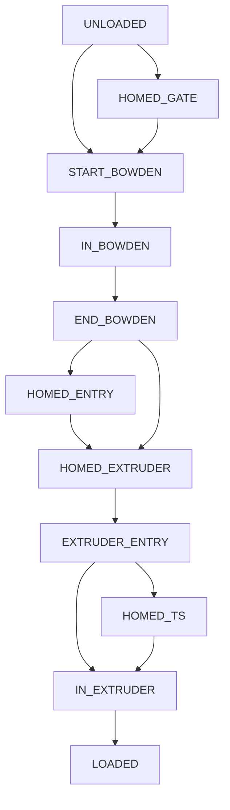

Happy Hare provides built in functionality for filament loading and unloading customized through `mmu_parameters.cfg`. In advanced circumstances and to support esoteric MMU designs it is possible to override the default behavior with user-supplied macros. By default these macros are not called, however, if `gcode_load_sequence: 1` or `gcode_unload_sequence: 1` are enabled they will be.  The two default macros in `mmu_sequence.cfg` (copied here) will/should provide exactly the same logic as the internal logic using a set of provided "modular" loading/unloading functions. They are a good starting point to copy for your own experiments.

- [Macro Based Sequences](Custom-Load-Unload-Sequences#---_mmu_load_sequence--_mmu_unload_sequence)
- [Available Macro "step" Functions](Custom-Load-Unload-Sequences#---internal-step-macro-reference)

<br>

##    _MMU_LOAD_SEQUENCE & _MMU_UNLOAD_SEQUENCE
**Defined in `mmu_sequence.cfg`**

> [!WARNING]  
> This is EXPERIMENTAL functionality and as such is subject to change (with only a mild apology :-)

`mmu_sequence.cfg` contains futher examples for alternative MMU setups, but before experimenting it is essential to understand the state machine for filament position.  These states are as follows and the loading/unloading sequence must be capable of completing the load/unload sequence for any starting state.



In additon to these states the macros are passed some additional information and hints about the context.  An important one is `FILAMENT_POS` which represents the position of the filament in mm either from "point 0" in the gate (load direction) or from the nozzle (unload direction).  Here are the default macros with additional information:


```yml
###########################################################################
# ADVANCED: User modifable loading and unloading sequences
#
# By default Happy Hare will call internal logic to handle loading and unloading
# sequences. To enable the calling of user defined sequences you must add the
# following to your mmu_parameters.cfg
#
# gcode_load_sequence: 1	# Gcode loading sequence 1=enabled, 0=internal logic (default)
# gcode_unload_sequence: 1	# Gcode unloading sequence, 1=enabled, 0=internal logic (default)
#
# This reference example load sequence mimicks the internal ones exactly. It uses the
# high level "modular" movements that are all controlled by parameters defined in
# mmu_parameters.cfg and automatically keep the internal filament position state up-to-date.
# Switching to these macros should not change behavior and can serve as a starting point for
# your customizations
#
# State Machine:
# If you experiment beyond the basic example shown here you will need to understand
# the possible states for filament position.  This is the same state that is exposed
# as the `printer.mmu.filament_pos` printer variable. This internal state must be
# kept up-to-date and will need to be set directly as you progress through your
# custom move sequence.  At this time the state machine is non-extensible.
#
#        FILAMENT_POS_UNKNOWN = -1
#  L  ^  FILAMENT_POS_UNLOADED = 0
#  O  |  FILAMENT_POS_HOMED_GATE = 1     # If gate sensor fitted
#  A  |  FILAMENT_POS_START_BOWDEN = 2
#  D  |  FILAMENT_POS_IN_BOWDEN = 3
#        FILAMENT_POS_END_BOWDEN = 4
#  |  U  FILAMENT_POS_HOMED_ENTRY = 5    # If extruder (entry) sensor fitted
#  |  N  FILAMENT_POS_HOMED_EXTRUDER = 6
#  |  L  FILAMENT_POS_PAST_EXTRUDER = 7
#  |  O  FILAMENT_POS_HOMED_TS = 8       # If toolhead sensor fitted
#  |  A  FILAMENT_POS_IN_EXTRUDER = 9    # AKA Filament is past the Toolhead Sensor
#  v  D  FILAMENT_POS_LOADED = 10        # AKA Filament is homed to the nozzle
#
# Final notes:
# 1) You need to respect the context being passed into the macro such as the
#    desired 'length' to move because this can be called for test loading
# 2) The unload macro can be called with the filament in any position (states)
#    You are required to handle any starting point. The default reference
#    serves as a good guide
#
[gcode_macro _MMU_LOAD_SEQUENCE]
description: Called when MMU is asked to load filament
gcode:
    
    
    
    
    
    

    
        _MMU_STEP_LOAD_TOOLHEAD EXTRUDER_ONLY=1

                            # FILAMENT_POS_PAST_EXTRUDER
        {action_raise_error("Can't load - already in extruder!")}

    
                              # FILAMENT_POS_UNLOADED
            _MMU_STEP_LOAD_GATE
        

                               # FILAMENT_POS_END_BOWDEN
            _MMU_STEP_LOAD_BOWDEN LENGTH={length}
        

             # FILAMENT_POS_HOMED_EXTRUDER
            _MMU_STEP_HOME_EXTRUDER
        

                              # FILAMENT_POS_PAST_EXTRUDER
            _MMU_STEP_LOAD_TOOLHEAD
        

    

[gcode_macro _MMU_UNLOAD_SEQUENCE]
description: Called when MMU is asked to unload filament
gcode:
    
    
    
    

    
                              # FILAMENT_POS_PAST_EXTRUDER
            _MMU_STEP_UNLOAD_TOOLHEAD EXTRUDER_ONLY=1 PARK_POS={park_pos}
        
            {action_raise_error("Can't unload extruder - already unloaded!")}
        

    
        {action_raise_error("Can't unload - already unloaded!")}

    
                              # FILAMENT_POS_PAST_EXTRUDER
            # Exit extruder, fast unload of bowden, then slow unload encoder
            _MMU_STEP_UNLOAD_TOOLHEAD PARK_POS={park_pos}
        

                              # FILAMENT_POS_END_BOWDEN
            # Fast unload of bowden, then slow unload encoder
            _MMU_STEP_UNLOAD_BOWDEN FULL=1
            _MMU_STEP_UNLOAD_GATE

                            # FILAMENT_POS_START_BOWDEN
            # Have to do slow unload because we don't know exactly where in the bowden we are
            _MMU_STEP_UNLOAD_GATE FULL=1
        

    
```

> [!NOTE]  
> Additional examples can be found at the end of `mmu_sequence.cfg`

<br>

##    Internal "step" Macro Reference

The following are internal pre-defined macros that can be called from within you own `_MMU_LOAD_SEQUENCE` and `MMU_UNLOAD_SEQUENCE` callbacks. You can use these to the extent they provide the functionaly you need to reduce the complexity of your own macros.

  | Macro | &nbsp;&nbsp;&nbsp;&nbsp;&nbsp;&nbsp;&nbsp;&nbsp;&nbsp;&nbsp;&nbsp;&nbsp;Description&nbsp;&nbsp;&nbsp;&nbsp;&nbsp;&nbsp;&nbsp;&nbsp;&nbsp;&nbsp;&nbsp;&nbsp; | Parameters |
  | ----- | ----------- | ---------- |
  | `_MMU_STEP_LOAD_GATE` | User composable loading step: Move filament from gate to start of bowden using gate sensor or encoder | |
  | `_MMU_STEP_LOAD_BOWDEN` | User composable loading step: Smart loading of bowden | `LENGTH=..` |
  | `_MMU_STEP_HOME_EXTRUDER` | User composable loading step: Extruder collision detection | |
  | `_MMU_STEP_LOAD_TOOLHEAD` | User composable loading step: Toolhead loading | `EXTRUDER_ONLY=[0\|1]` |
  | `_MMU_STEP_UNLOAD_TOOLHEAD` | User composable unloading step: Toolhead unloading | `EXTRUDER_ONLY=[0\|1]` <br> `PARK_POS=..` |
  | `_MMU_STEP_UNLOAD_BOWDEN` | User composable unloading step: Smart unloading of bowden | `FULL=[0\|1]` <br> `LENGTH=..` |
  | `_MMU_STEP_UNLOAD_GATE` | User composable unloading step: Move filament from start of bowden and park in the gate using gate sensor or encoder | `FULL=[0\|1]` |
  | `_MMU_STEP_SET_FILAMENT` | User composable loading step: Set filament position state | `STATE=[0..8]` The filament position (see states below) <br> `SILENT=[0\|1] <br> States: <br> UNKNOWN = -1 <br> UNLOADED = 0 <br> HOMED_GATE = 1 <br> START_BOWDEN = 2 <br> IN_BOWDEN = 3 <br> END_BOWDEN = 4 <br> HOMED_ENTRY = 5 <br> HOMED_EXTRUDER = 6 <br> EXTRUDER_ENTRY = 7 <br> HOMED_TS = 8 <br> IN_EXTRUDER (past TS) = 9 <br> LOADED = 10 |
  | `_MMU_STEP_MOVE` | User composable loading step: Generic move | `MOVE=..[100]` Length of gear move in mm <br>`SPEED=..` (defaults to speed defined to type of motor/homing combination) Stepper move speed <br>`ACCEL=..` (defaults to min accel defined on steppers employed in move) Motor acceleration <br>`MOTOR=[gear\|extruder\|gear+extruder\|extruder+gear]` (default: gear) The motor or motor combination to employ. gear+extruder commands the gear stepper and links extruder to movement, extruder+gear commands the extruder stepper and links gear to movement |
  | `_MMU_STEP_HOMING_MOVE` | User composable loading step: Generic homing move | `MOVE=..[100]` Length of gear move in mm <br>`SPEED=..` (defaults to speed defined to type of motor/homing combination) Stepper move speed <br>`ACCEL=..` Motor accelaration (defaults to min accel defined on steppers employed in homing move) <br>`MOTOR=[gear\|extruder\|gear+extruder\|extruder+gear]` (default: gear) The motor or motor combination to employ. gear+extruder commands the gear stepper and links extruder to movement, extruder+gear commands the extruder stepper and links gear to movement. This is important for homing because the endstop must be on the commanded stepper <br>`ENDSTOP=..` Symbolic name of endstop to home to as defined in mmu_hardware.cfg. Must be defined on the primary stepper <br>`STOP_ON_ENDSTOP=[1\|-1]` (default 1) The direction of homing move. 1 is in the normal direction with endstop firing, -1 is in the reverse direction waiting for endstop to release. Note that virtual (touch) endstops can only be homed in a forward direction |
