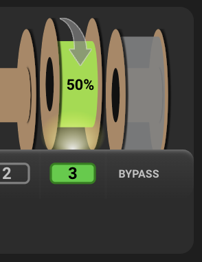
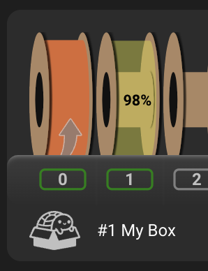

#### Page Sections:
- [Hardware Config](#---hardware-config)
- [Parameter Config](#---parameter-config)
- [Option Setup](#---option-setup)
  - [Rewind/Respool](#-rewind-respool-setup)
  - [Forward Load Assist](#-forward-load-assist-setup)
  - [In-Print Assist](#-basic-in-print-assist-operation)
  - [Intelligent in-print Assist](#-intelli-assist-trigger-based-assist-operation)
    - [Extruder Movement Trigger](#-option-1-extruder-movement-burst-operation)
    - [Sensor Trigger](#-option-2-sensor-based-burst-operation)
- [MMU_ESPOOLER Command](#---mmu_espooler-command)
- [Espooler UI](#---espooler-ui)

Happy Hare now can optionally drive a DC "espooler" for each gate. Typically this will be a DC20 (e.g. in the Box Turtle design). The primary value of this is to respool the filament when it unloads, however it can also be used to assist movement when loading or even relieve friction when printing.

<br>

##    Hardware Config
If you need to control an espooler, you will need to ensure that `mmu_hardware.cfg` and `mmu.cfg` are setup up correctly. On a fresh installation this should be added automatically but you can add manually if missing:


### `mmu_hardware.cfg`
Add this section to you `mmu_hardware.cfg` file. The commented lines can be left commented and are there to remind you of some advanced configuration options. Note that the choice of pwm/digital motor control, hardware/software pwm, scaling, etc are applied to all gates because the assumption is that configuration will be consistent. It is recommended that you leave the pin aliases and define the actual pins in the pins alias file `mmu.cfg`

```yml
# ESPOOLER (OPTIONAL) -------------------------------------------------------------------------------------------------
# ███████╗███████╗██████╗  ██████╗  ██████╗ ██╗     ███████╗██████╗
# ██╔════╝██╔════╝██╔══██╗██╔═══██╗██╔═══██╗██║     ██╔════╝██╔══██╗
# █████╗  ███████╗██████╔╝██║   ██║██║   ██║██║     █████╗  ██████╔╝
# ██╔══╝  ╚════██║██╔═══╝ ██║   ██║██║   ██║██║     ██╔══╝  ██╔══██╗
# ███████╗███████║██║     ╚██████╔╝╚██████╔╝███████╗███████╗██║  ██║
# ╚══════╝╚══════╝╚═╝      ╚═════╝  ╚═════╝ ╚══════╝╚══════╝╚═╝  ╚═╝
#
# An espooler controls DC motors (typically N20) that are able to rewind a filament spool and optionally provide
# forward assist to overcome spooler rotation friction. This should define pins for each of the gates on your mmu
# starting with '_0'. 
# An empty pin can be deleted, commented or simply left blank. If you mcu has a separate "enable" pin
#
[mmu_espooler mmu_espooler]
pwm: 1                                          # 1=PWM control (typical), 0=digital on/off control
#hardware_pwm: 0                                # See klipper doc
#cycle_time: 0.100                              # See klipper doc
scale: 1                                        # Scales the PWM output range
#value: 0                                       # See klipper doc
#shutdown_value: 0                              # See klipper doc

respool_motor_pin_0: mmu:MMU_ESPOOLER_RWD_0     # PWM (or digital) pin for rewind/respool movement
assist_motor_pin_0: mmu:MMU_ESPOOLER_FWD_0      # PWM (or digital) pin for forward motor movement
enable_motor_pin_0: mmu:MMU_ESPOOLER_EN_0       # Digital output for Afc mcu
assist_trigger_pin_0: mmu:MMU_ESPOOLER_TRIG_0   # Trigger pin for sensing need to assist during print

respool_motor_pin_1: mmu:MMU_ESPOOLER_RWD_1
assist_motor_pin_1: mmu:MMU_ESPOOLER_FWD_1
enable_motor_pin_1: mmu:MMU_ESPOOLER_EN_1
assist_trigger_pin_1: mmu:MMU_ESPOOLER_TRIG_1

respool_motor_pin_2: mmu:MMU_ESPOOLER_RWD_2
assist_motor_pin_2: mmu:MMU_ESPOOLER_FWD_2
enable_motor_pin_2: mmu:MMU_ESPOOLER_EN_2
assist_trigger_pin_2: mmu:MMU_ESPOOLER_TRIG_2

respool_motor_pin_3: mmu:MMU_ESPOOLER_RWD_3
assist_motor_pin_3: mmu:MMU_ESPOOLER_FWD_3
enable_motor_pin_3: mmu:MMU_ESPOOLER_EN_3
assist_trigger_pin_3: mmu:MMU_ESPOOLER_TRIG_3
```

### `mmu.cfg` (pin alias file):
Define your pins here. Typically you will either be using just the "_RWD" pins to implement respooling or both "_RWD" and "_FWD" if you have the ability to drive in a forward (extrude) direction. Optionally some MCUs require the setup of an enable pin (e.g. Afc Lite board)
```yml
    MMU_ESPOOLER_RWD_0=,
    MMU_ESPOOLER_FWD_0=,
    MMU_ESPOOLER_EN_0=,
    MMU_ESPOOLER_TRIG_0=,

    MMU_ESPOOLER_RWD_1=,
    MMU_ESPOOLER_FWD_1=,
    MMU_ESPOOLER_EN_1=,
    MMU_ESPOOLER_TRIG_1=,

    MMU_ESPOOLER_RWD_2=,
    MMU_ESPOOLER_FWD_2=,
    MMU_ESPOOLER_EN_2=,
    MMU_ESPOOLER_TRIG_2=,

    MMU_ESPOOLER_RWD_3=,
    MMU_ESPOOLER_FWD_3=,
    MMU_ESPOOLER_EN_3=,
    MMU_ESPOOLER_TRIG_3=,
```

> [!NOTE]  
> - If you were using the previous macro based respooler then you might need to remove the old pin aliases

<br>

##    Parameter Config

The upgrade process should have added the following section to your `mmu_parameters.cfg`
```yml
# ESpooler control -----------------------------------------------------------------------------------------------------
# ███████╗███████╗██████╗  ██████╗  ██████╗ ██╗     ███████╗██████╗ 
# ██╔════╝██╔════╝██╔══██╗██╔═══██╗██╔═══██╗██║     ██╔════╝██╔══██╗
# █████╗  ███████╗██████╔╝██║   ██║██║   ██║██║     █████╗  ██████╔╝
# ██╔══╝  ╚════██║██╔═══╝ ██║   ██║██║   ██║██║     ██╔══╝  ██╔══██╗
# ███████╗███████║██║     ╚██████╔╝╚██████╔╝███████╗███████╗██║  ██║
# ╚══════╝╚══════╝╚═╝      ╚═════╝  ╚═════╝ ╚══════╝╚══════╝╚═╝  ╚═╝
#                                                                  
# If your MMU has a dc motor (often N20) controlled respooler/assist then how it operates can be controlled with these
# settings. Typically the espooler will be controlled with PWM signal. This will be at the maximum at speeds equal or
# above 'espooler.max_stepper_speed'. The PWM signal will scale downwards towards 0 for slower speeds. The falloff being
# controlled by the 'espooler_speed_exponent' setting according to this formula and allows for non-linear characteristics
# the DC motor (0.5 is a good starting value).
# 
#     espooler_pwm = (stepper_speed / espooler_max_stepper_speed) ^ {espooler_speed_exponent}
#
# Regardless of h/w configuration you can enable/disable actions with the 'espooler_operations' list. E.g. remove 'play' to
# turn off operation while printing. Options are:
#
#    rewind - when filament is being unloaded under MMU control (aka respool)
#    assist - when filament is being loaded under MMU control (% of "rewind" speed but with minimum of "print" power)
#    print  - while printing. Generally set 'espooler_printing_power' to a low percentage just to allow motor to be turned
#             freely or set to 0 to enable/allow "burst" assist movements
#
# If using a digitally controlled espooler motor (not PWM) then you should turn off the "print" mode and set
# 'espooler_min_stepper_speed' to prevent "over movement"
#
espooler_min_distance: 30                       # Individual stepper movements less than this distance will not active espooler
espooler_max_stepper_speed: 300                 # Gear stepper speed at which espooler will be at maximum power
espooler_min_stepper_speed: 0                   # Gear stepper speed at which espooler will become inactive (useful for non PWM control)
espooler_speed_exponent: 0.5                    # Controls non-linear espooler power relative to stepper speed (see notes)
espooler_assist_reduced_speed: 50               # Control the % of the rewind speed that is applied to assisting load (want rewind to be faster)
espooler_printing_power: 0                      # If >0, fixes the % of PWM power while printing. 0=allows burst movement
espooler_operations: rewind, assist, print      # List of operational modes (allows disabling even if h/w is configured)
#
# The following burst configuration is used only if 'print' operation is enabled and 'espooler_printing_power: 0'
#
espooler_assist_extruder_move_length: 100       # Distance (mm) extruder needs to move between each assist burst
espooler_assist_burst_power: 100                # The % power of the burst move
espooler_assist_burst_duration: 0.4             # The duration of the burst move is seconds
espooler_assist_burst_trigger: 0                # If trigger assist switch is fitted 0=disable, 1=enable
espooler_assist_burst_trigger_max: 3            # If trigger assist switch is fitted this limits the max number of back-to-back advances
```

The supplied defaults are generally a good starting point. Note that unsed options are ignored so it is advised to leave them in place (upgrade will likely reinstall them anyway). For example, if you don't have "assist" motors configured in the hardware, the `espooler_operations` "assist" and "print" will be ignored -- this option is most useful if you wanted to turn OFF the functionality even if the hardware is configured.

Most of the settings are self explanatory but a couple of worth further explanation:

#### `espooler_speed_exponent`
This adjusts the speed conversion ratio meaning the profile of how the DC motor speed is adjusted over the speed range of the MMU gear (filament drive) stepper.

For the following examples, let's assume `espooler_max_stepper_speed = 50`<br>
And remember actual eSpooler pwm speed values are between 0.0 (off) and 1.0 (full speed) inclusive

The formula looks like this:<br>
```yml
    (stepper_speed / espooler_max_stepper_speed) ^ espooler_speed_exponent

  With `stepper_speed_exponent` of 1 would have a linear ratio:
    If I am running with a step speed of 50mm/s, the eSpooler would run at full speed (1.0)
      Calculated as (50/50)^1
    If I am running with a step speed of 25mm/s, the eSpooler would run at half speed (0.5)
      Calculated as (25/50)^1

    With `stepper_speed_exponent` of 0.2 would have a non-linear ratio:
    If I am running with a step speed of 50mm/s, the eSpooler would run at full speed (1.0)
      Calculated as (50/50)^0.2
    If I am running with a step speed of 25mm/s, the eSpooler would run at half speed (0.87)
      Calculated as (25/50)^0.2
```
Note that the PWM signal range is scaled by the h/w configuration `scale` if set (see klipper doc).

#### `espooler_min_stepper_speed`
This defines the stepper speed at which the espooler will start. It is generally most useful with digital controlled DC motors when you want to set a threshold below which the espooler doesn't run

#### `espooler_assist_reduced_speed`
This is a percentage of the calculated "rewind" speed and is because, whilst you want the espooler to over-rewind to keep the filament tight you DON'T want it to over unwind when loading. Thus a 50% setting will run the loading "assist" at 50% of the unloading "rewind" speed. Note that this speed will never drop before the "in-print" power.

#### `espooler_printer_power`
This is a % of the maximum power (max pwm signal) that is applied to the espooler motor while printing. This should not be large enough to sping the spool but rather acts as "releasing the braking effort" so there is less strain pulling from the spool while printing. It is recommended that you exclude "print" from `espooler_operations` initially until you determine that it is causing too much of a braking effect.

#### `espooler_assist_extruder_move_length` and `espooler_assist_burst_*`
These control the "Intelli-Assist" options for in-print operation discussed later

> [!NOTE]  
> - As with most Happy Hare `mmu_parameters` you can change these settings at any time without re-starting klipper with the `MMU_TEST_CONFIG var=value` command. Remember that parameters changed this way are only valid until the next restart.

<br>

##    Option Setup

###  Rewind (Respool) Setup
1. Ensure you have pins defined for `respool_motor_pin_*` and `enable_motor_pin_*` if you mcu board requires it.
2. Ensure that these parameters are correctly defined and tuned:
```yml
espooler_min_distance
espooler_max_stepper_speed
espooler_min_stepper_speed
espooler_speed_exponent
```
3. Then make sure that `rewind` appears in the list of operations:
```yml
espooler_operations: rewind
```
4. Test with:
```yml
MMU_ESPOOLER GATE=0 OPERATION=rewind
MMU_ESPOOLER GATE=0 OPERATION=off
```

###  Forward (Load Assist) Setup
1. Ensure you have pins defined for `assist_motor_pin_*` and `enable_motor_pin_*` if you mcu board requires it.
2. Ensure that parameters specified for "respool" above are correctly defined and tuned (even if not using respool) then add the percentage of  the defined rewind speed to use for forward motion:
```yml
espooler_assist_reduced_speed
```
3. Then make sure that `assist` appears in the list of operations:
```yml
espooler_operations: assist
```
4. Test with:
```yml
MMU_ESPOOLER GATE=0 OPERATION=assist
MMU_ESPOOLER GATE=0 OPERATION=off
```

###  Basic In-print Assist Operation
1. Ensure you have pins defined for `assist_motor_pin_*` and `enable_motor_pin_*` if you mcu board requires it.
2. Ensure that parameters specified for "respool" above are correctly defined and tuned (even if not using respool) then add the percentage of  the defined rewind speed to use for in-print motion.  This should typically be a very small amount so that it "lifts the brakes" off the DC motor but not enough to allow it to turn uncontrollably:
```yml
espooler_printing_power: 5
```
3. Then make sure that `print` appears in the list of operations:
```yml
espooler_operations: print
```
4. Test with:
```yml
MMU_ESPOOLER GATE=0 OPERATION=print
MMU_ESPOOLER GATE=0 OPERATION=off
```

###  Intelli-Assist (Trigger based Assist) Operation

If you set the `espooler_printing_power: 0` then the burst-mode kicks into play. This waits for a trigger before advancing the espooler in a burst operation.

####  Option 1: Extruder movement "burst" operation
This option setups up a watchdog on extruder movement so that every `espooler_assist_extruder_move_length` of extruder movement it will run the espooler at `espooler_assist_burst_power` % power for `espooler_assist_burst_duration` seconds.

1. Ensure all the setup for basic in-print assist
2. Set espooler_printing_power to 0 to enable burst mode:
```yml
espooler_printing_power: 0
```
3. Define the % of motor power (equates to a PWM from 0 to 1) and duration in seconds for the motor burst. E.g:
```yml
espooler_assist_burst_power; 80
espooler_assist_burst_duration: 0.5
```
4. Test with:
```yml
MMU_ESPOOLER GATE=0 OPERATION=print POWER=0
MMU_ESPOOLER OPERATION=burst
MMU_ESPOOLER OPERATION=burst
MMU_ESPOOLER ALLOFF=1
```
You should see the jump to burst operation and then falling back to 0% but in burst mode.

####  Option 2: Sensor based "burst" operation
As a more reliable alternative to extruder movement triggering the espooler assist, Happy Hare can accept a sensor input. This is by far the best method and overcomes variability by introducing closed loop feedback: when the sensor detects tension on the filament it "bursts" the espooler into action thus relieving tension and providing intelligent assist. If the filament is not under tension the espooler will be inactive. This both prolongs the life of the espooler DC motor but also means that problematic unspooling is eliminated. Mods to popular MMU's/AFC's like Box Turtle are in the works...

1. Ensure all the setup for basic in-print assist
2. Ensure you have pins defined for `assist_trigger_pin_*`. These would be standard input pins setup as you would for a microswitch sensor.
3. Set espooler_printing_power to 0 to enable burst mode:
```yml
espooler_printing_power: 0
```
4. Define the % of motor power (equates to a PWM from 0 to 1) and duration in seconds for the motor burst. E.g:
```yml
espooler_assist_burst_power; 80
espooler_assist_burst_duration: 0.5
```
5. Ensure that the burst trigger option is enabled and you set the maximum number of back-to-back bursts that are allowed (this is to prevent a stuck trigger sensor from ruining your print):
```yml
espooler_assist_burst_trigger: 1
espooler_assist_burst_trigger_max: 3 
```
6. Test with:
```yml
MMU_ESPOOLER GATE=0 OPERATION=print POWER=0
MMU_ESPOOLER OPERATION=burst
MMU_ESPOOLER OPERATION=burst
MMU_ESPOOLER ALLOFF=1
```
You should see the jump to burst operation and then falling back to 0% but in burst trigger mode.

<br>

##    MMU_ESPOOLER Command

The `MMU_ESPOOLER` command is idea for testing but may have uses elsewhere where you want direct control of the motors.

Examples:
```yml
MMU_ESPOOLER GATE=0 OPERATION="rewind" POWER=50
```
This turns on the espooler in the rewind (retract) direction at 50% power/speed for gate 0.

```yml
MMU_ESPOOLER GATE=0 OPERATION="off"
```
This will turn off the epooler for gate 0

```yml
MMU_ESPOOLER GATE=2 OPERATION="print"
```
This will energise the gate 2 espooler ready for printing at the default configured power level.. perhaps useful when purging out of a print

```yml
MMU_ESPOOLER
```
Without options this will give a status of all espooler motors

> [!TIP]  
> - `MMU_ESPOOLER ALLOFF=1` will quickly turn off ALL espoolers

### Burst operation

Typically burst operation is automatic based on configuration but you can test/experiment directly with the `MMU_ESPOOLER` command. The gate, power an duration will default to the current gate, configured power and duration, if not specified:

```yml
MMU_ESPOOLER OPERATION="burst" [GATE=xx] [POWER=xx] [DURATION=xx]
```
Note that if the espooler for the given gate is not in a "print" mode the burst request will be ignored. So to completely test standalone you will need to first put one of the espoolers into "in-print" mode, then the burst can be sent.
```yml
MMU_ESPOOLER GATE=0 OPERATION=print POWER=0
MMU_ESPOOLER OPERATION=burst
```

<br>

##    Espooler UI

The Mainsail and Fluidd support will render the operation of the espooler motor in their UIs with an arrow on the spool.
<table>
  <tr>
    <td>
      <br>
      Rewinding (respooling)
    </td>
    <td>
      <br>
      Assisting (load and in-print)
    </td>
  </tr>
</table>

Don't forget you can get a quick summary with this command without options (remember that klipper can't run under the current command is complete):
```yml
MMU_ESPOOLER
0 : off     (0%)
1 : print   (0%) [assist for 0.8s at 80% power on trigger, max 3 bursts]
2 : off     (0%)
3 : off     (0%)
```
