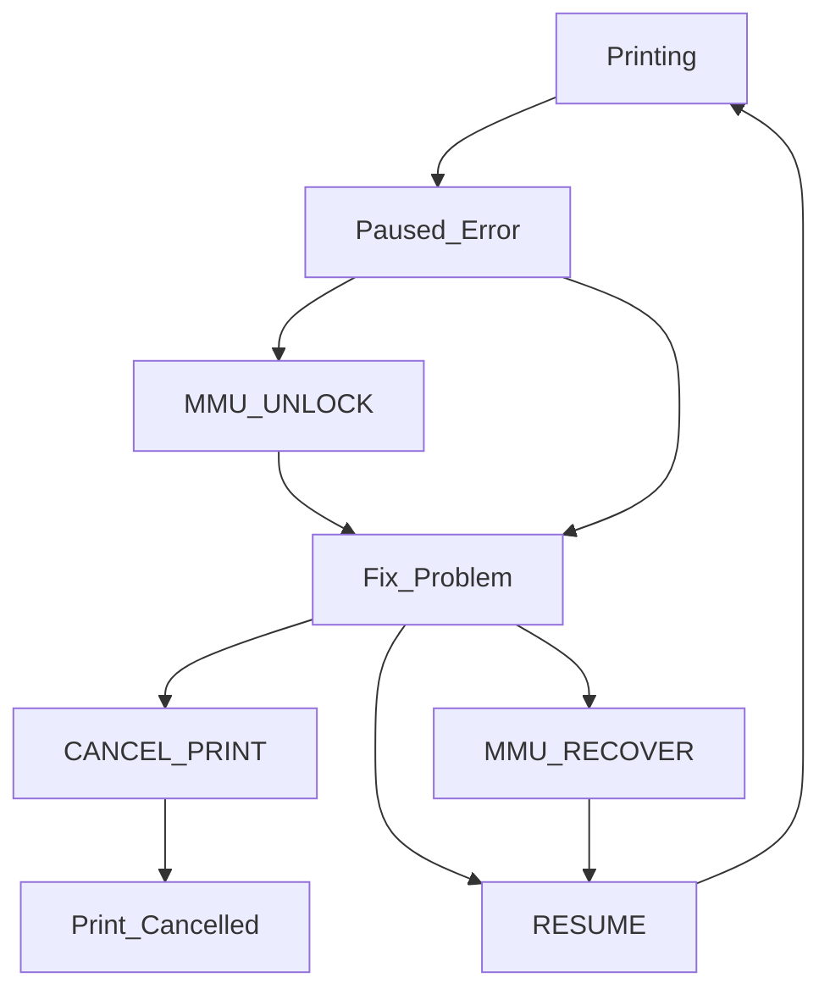

We all hope that printing is straightforward, and everything works to plan. Unfortunately that is not always the case with an MMU, it may pause and require manual intervention to complete a successful print.

<br>

##    Causes of Errors

Happy Hare will pause the print whenever a condition occurs that it can't automatically handle. These include unavoidable conditions as well as unexpected issues E.g.

- Running out of filament
- MMU malfunction
- Detecting a clog
- Misconfiguration
- Unreliability issues
- etc.

Although error conditions are inevitable, that isn't to say mostely reliable operation isn't possible - I've had many multi-thousand swap prints complete without a single incident. Spending time to tune your MMU and correctly tackle problems one at a time is the key to reliability.

<br>

##    What to do when MMU pauses

When the print pauses Happy Hare a few things happen:

<ul>
  <li>Happy Hare will lift the toolhead off the print to avoid blobs</li>
  <li>The `PAUSE` macro will be called. Typically this will further move the toolhead to a parking position</li>
  <li>The heated bed will remain heated for the time set by `timeout_pause`</li>
  <li>The extruder will remain hot for the time set with `disable_heater`</li>
</ul>

The `timeout_pause` config variable overrides the default klipper idle_timeout as is applied during the paused state. This allow the bed heater to remain on for a longer period and prevents the steppers from de-energising and loosing position. Similarly the `disable_heater` config controls how long the extruder is kept heated. Typically the extruder can be allowed to cool after a few minutes but you want to make sure the bed remains hot long enough for you to notice the pause.

The best way to describe the workflow is as follows:



### Explanation:
- While the MMU is paused you can fix the problem either by careful manual manipulation or by running `MMU_*` commands.
- If the extruder has dropped temperature or it is about to it is a good idea to run `MMU_UNLOCK` first and to wait for the extruder to get back to temperature
- When the problem is fixed decide if `MMU_RECOVER` or similar is necessary. Generally this won't be necessary.
- If you decide to abort the print you can with the usual `CANCEL_PRINT` command
- Resume printing with the `RESUME` command

> [!NOTE]  
> You can mimick a pause behavior for testing with this command:<br>
> > MMU_PAUSE FORCE_IN_PRINT=1

<br>

##    State Recovery

Happy Hare is a state machine (see [Macro Based Sequences](Custom-Load-Unload-Sequences#---_mmu_load_sequence--_mmu_unload_sequence) for all the gory details). That means it keeps track of the state of the MMU. It uses knowledge of this state to determine how to handle a particular situation. For example, if you ask it to unload filament... Is the filament in the toolhead, is it in the bowden, or is there no filament present? If uses this information to make the correct decisions on what to do next. Occasionally, through print error or manual intervention the state may become stale and it is necessary to re-sync with Happy Hare.

If you fix a problem using Happy Hare command or operations you probably don't need to do any recovery, but if you are fixing completely manually you might have too else it may fail to resume (just results in another error).

You can decide if recovery is necessary by using the [MMU_STATUS](Understanding-Operation) command and validating the MMU state by interpreting the status display:

```
2:18 AM Gates: |#0 |#1 |#2 |#3 |#4 |#5 |#6 |#7 |#8 |
        Tools: |T0 |T1 |T2 |T3 |T4 |T5 |T6 |T7 |T8 |
        Avail: | B | B | B | ? | . | ? | S | ? | B |
        Selct: --------| * |------------------------ T4
2:18 AM MMU [T2] >>> [En] >>>>>>> [Ex] >> [Ts] >> [Nz] LOADED (@0.0 mm)
```

If you need to recover there is a simple command that will do this automatically the majority of the time:

> MMU_RECOVER

Here the tool or gate selection will not be changed, only the filament position reset

By default this causes Happy Hare to run some tests (like reading sensors and wiggling the filament) to try to assertain the correct state, for example, to confirm the position of the filament. But you can also force it by specifying additional options. Here are some examples:

> MMU_RECOVER TOOL=0

Tell MMU that T0 is selected but automatically look at filament location

> MMU_RECOVER TOOL=5 LOADED=1

Tell Happy Hare that T5 is loaded and ready to print

> MMU_RECOVER TOOL=1 GATE=2 LOADED=0

Tell Happy Hare that T1 is being serviced by gate #2 and the filament is Unloaded

> MMU_RECOVER TOOL=1 GATE=1 LOADED=1

Tell Happy Hare that T1 is being serviced by gate #2 and the filament is Unloaded

This will ensure that Happy Hare understands that tool 1 is selected on gate 1 and the filament is loaded in the extruder. See the [Command Reference](Command-Reference) for more details.

One other operation that may be useful during recovery is updating the Gate map and Tool-to-Gate map. For example, correcting the tool to gate mapping or noting availabily of filament in a gate after loading new filament. The need for this depends a lot of configuration and sensor options - e.g. pre-gate sensors will automatically set filament availability. Read [Tool and Gate Maps](Tool-and-Gate-Maps) for a better understanding of the sate contained ini these maps.

> [!NOTE]  
> Remember this is optional and ONLY needed if you may have confused the MMU state. I.e. if you left everything where the MMU expects it there is no need to run and indeed if you use MMU commands then the state will be correct and there is never a need to run. However, this can be useful to force Happy Hare to run its own checks to, for example, confirm the position of the filament.
> The default automatic recovery will avoid some expensive/invasive testing that can detect conditions that would not normally be discovered (like filament trapped in extruder but not registering on toolhead sensor). Use can add the `MMU_RECOVER STRICT=1` parameter to force these extra tests or by configuring `strict_filament_recover: 1` in `mmu_parameters.cfg`. The reason this isn't the default behavior is that it could result in the extruder heating up unexpectedly.

<br>

##    Resuming a print

Once you have addressed the issue, optionally correctly MMU state you are ready to resume printing:

> RESUME

This will not only run your own print resume logic, but it will reset the heater timeout clocks and restore the z-hop move to put the printhead back on the print at the correct position.
