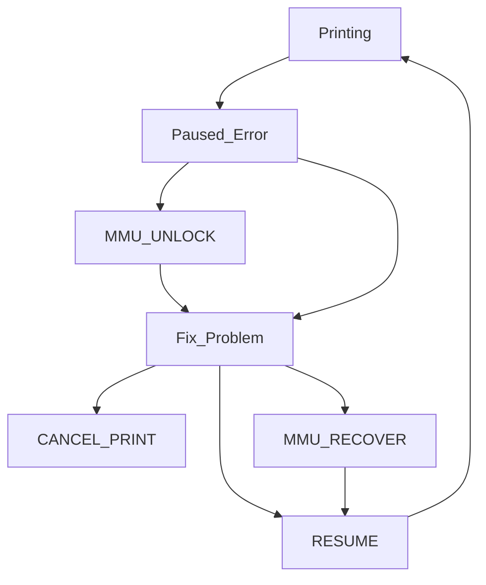

We all hope that printing is straightforward, and everything works to plan. Unfortunately that is not always the case with an MMU, it may pause and require manual intervention to complete a successful print.

 

##    Causes of Errors

Happy Hare will pause the print whenever a condition occurs that it can't automatically handle. These include unavoidable conditions as well as unexpected issues E.g.

- Running out of filament
- MMU malfunction
- Detecting a clog
- Misconfiguration
- Unreliability issues
- etc.

Although error conditions are inevitable, that isn't to say mostely reliable operation isn't possible - I've had many multi-thousand swap prints complete without a single incident. Spending time to tune your MMU and correctly tackle problems one at a time is the key to reliability.

 

##    What to do when MMU pauses

When the print pauses Happy Hare a few things happen:

<ul>
  <li>Happy Hare will lift the toolhead off the print to avoid blobs</li>
  <li>The `PAUSE` macro will be called. Typically this will further move the toolhead to a parking position</li>
  <li>The heated bed will remain heated for the time set by `timeout_pause`</li>
  <li>The extruder will remain hot for the time set with `disable_heater`</li>
</ul>

The `timeout_pause` config variable overrides the default klipper idle_timeout as is applied during the paused state. This allow the bed heater to remain on for a longer period and prevents the steppers from de-energising and loosing position. Similarly the `disable_heater` config controls how long the extruder is kept heated. Typically the extruder can be allowed to cool after a few minutes but you want to make sure the bed remains hot long enough for you to notice the pause.

Note that you can mimick a pause behavior for testing with this command:

> MMU_PAUSE FORCE_IN_PRINT=1

The best way to describe the workflow is as follows:

 

##    State Recovery

If you fix a problem using Happy Hare command or operations you can ignore this section, but if you are fixing completely manually, Happy Hare may not know the current state of the MMU (see [Macro Based Sequences](Custom-Load-Unload-Sequences#---_mmu_load_sequence--_mmu_unload_sequence) for all the gory detail) and this can lead to it failing to resume (just results in another error). Thankfully there is a command that will do this automatically the majority of the time:

> MMU_RECOVER

By default this causes Happy Hare to run some tests (like reading sensors and wiggling the filament) to try to assertain the correct state, for example, to confirm the position of the filament. But you can also force it by specifying additional options. E.g.

> MMU_RECOVER TOOL=1 GATE=1 LOADED=1

This will ensure that Happy Hare understands that tool 1 is selected on gate 1 and the filament is loaded in the extruder. See the [Command Reference](Command-Reference) for more details.

One other operation that may be useful during recovery is updating the Gate map and Tool-to-Gate map. For example, correcting the tool to gate mapping or noting availabily of filament in a gate after loading new filament. The need for this depends a lot of configuration and sensor options - e.g. pre-gate sensors will automatically set filament availability. Read [Tool and Gate Maps](Tool-and-Gate-Maps) for a better understanding of the sate contained ini these maps.

> [!NOTE]  
> Remember this is optional and ONLY needed if you may have confused the MMU state. I.e. if you left everything where the MMU expects it there is no need to run and indeed if you use MMU commands then the state will be correct and there is never a need to run. However, this can be useful to force Happy Hare to run its own checks to, for example, confirm the position of the filament.

 

##    Resuming a print

Once you have addressed the issue, optionally correctly MMU state you are ready to resume printing:

> RESUME

This will not only run your own print resume logic, but it will reset the heater timeout clocks and restore the z-hop move to put the printhead back on the print at the correct position.
