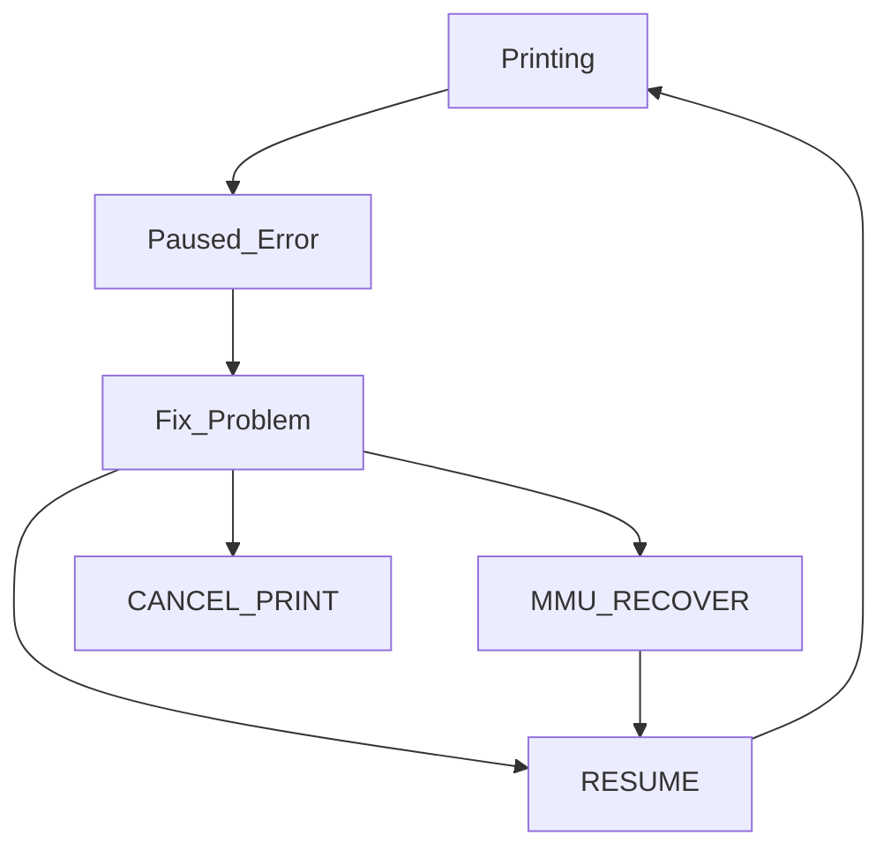

We all hope that printing is straightforward, and everything works to plan. Unfortunately that is not always the case with an MMU, it may pause and require manual intervention to complete a successful print.

 

##    Causes of Errors

Happy Hare will pause the print whenever a condition occurs that it can't automatically handle. These include unavoidable conditions as well as unexpected issues E.g.

- Running out of filament
- MMU malfunction
- Detecting a clog
- Misconfiguration
- Unreliability issues
- etc.

Although error conditions are inevitable, that isn't to say mostely reliable operation isn't possible - I've had many multi-thousand swap prints complete without a single incident. Spending time to tune your MMU and correctly tackle problems one at a time is the key to reliability.

 

##    What to do when MMU pauses

When the print pauses Happy Hare a few things happen:

<ul>
  <li>Happy Hare will lift the toolhead off the print to avoid blobs</li>
  <li>The `PAUSE` macro will be called. Typically this will further move the toolhead to a parking position</li>
  <li>The heated bed will remain heated for the time set by `timeout_pause`</li>
  <li>The extruder will remain hot for the time set with `disable_heater`</li>
</ul>

The `timeout_pause` config variable overrides the default klipper idle_timeout as is applied during the paused state. This allow the bed heater to remain on for a longer period and prevents the steppers from de-energising and loosing position. Similarly the `disable_heater` config controls how long the extruder is kept heated. Typically the extruder can be allowed to cool after a few minutes but you want to make sure the bed remains hot long enough for you to notice the pause.

 

##    State Recovery

We all hope that printing is straightforward, and everything works to plan. Unfortunately that is not always the case with an MMU and it may need manual intervention to complete a successful print and specifically how you use `MMU_RECOVER`, etc.

 

Although error conditions are inevitable, that isn't to say fairly reliable operation isn't possible - I've had many multi-thousand swap prints complete without incident. Here is what you need to know when something goes wrong.

When Happy Hare detects something has gone wrong, like a filament not being correctly loaded or perhaps a suspected clog, it will pause the print and ready the printer for fixing. You can test this condition by running:

> MMU_PAUSE FORCE_IN_PRINT=1

To proceed you need to address the specific issue. You can move the filament by hand or use basic MMU commands. Once you think you have things corrected you may (optionally) need to run:

> MMU_RECOVER

This is optional and ONLY needed if you may have confused the MMU state. I.e. if you left everything where the MMU expects it there is no need to run and indeed if you use MMU commands then the state will be correct and there is never a need to run. However, this can be useful to force Happy Hare to run its own checks to, for example, confirm the position of the filament. By default, this command will automatically fix essential state, but you can also force it by specifying additional options. E.g. `MMU_RECOVER TOOL=1 GATE=1 LOADED=1`. See the [Command Reference](/doc/command_ref.md) for more details.

When you ready to continue with the print:

> RESUME

This will not only run your own print resume logic, but it will reset the heater timeout clocks and restore the z-hop move to put the printhead back on the print at the correct position.

