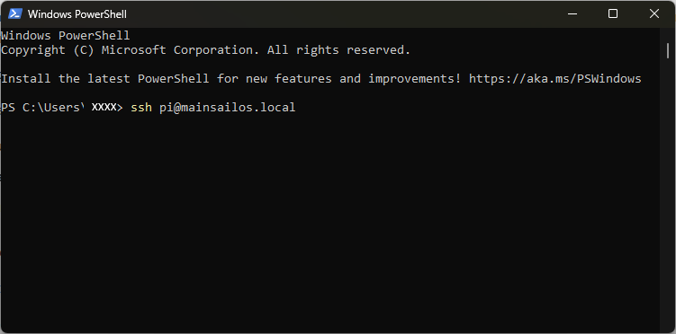
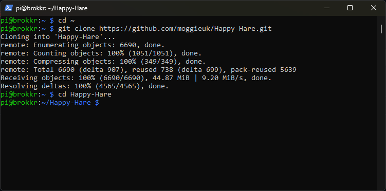

#### Page Sections:
- [Cloning Happy Hare Repo](#---cloning-happy-hare-repo)
- [Creating Base Klipper Config](#---creating-base-klipper-config)
- [Pause/Resume/Cancel_Print Macros](#---pauseresumecancel_print-macros)
- [Upgrading](#---upgrading)
- [Config Overview](#---config-overview)
- [MMU Vendor Notes](#---mmu-vendor-notes)

This section deals with installing Happy Hare to the host computer (most commonly the Raspberry Pi).

Happy Hare consists of a set of Klipper "extra" modules, a moonraker "component" and a set of macros and configuration files. To install you must first clone from Github and then install using the supplied install script. This install will both setup a base set of klipper configuration files as well as creating the symlinks necessary to link the cloned files into your Klipper/Moonraker installation.

Once installed it will be added to Moonraker update-manager for easy updates like other Klipper plugins.

<br>
 
##    Cloning Happy Hare Repo

The first step is to clone the Happy Hare repository onto your Raspberry Pi. If you're unfamiliar with cloning, it just copies all the data in the git repository to your local computer. Since the Happy Hare git has all the necessay software, we use the `git clone` functionality to pull everything from github to the local computer (the rpi, in most cases of Klipper). So, go ahead and log into your rpi via ssh.

In power shell, and with Mainsail, this will look like this:  

```yml
ssh pi@mainsailos.local
```  

> [!NOTE]  
> You will notice in the following pictures the bash prompt is `pi@brokkr:~`. Yours won't look like that. It will be `pi@<hostname.:~` where the hostname is likely "mainsailos" or the ip address. No need to worry. I have more than one printer running Klipper, so I had to change the name to keep them separate.

Alternatively, you can use your Klipper ip address, which will look something like this:  
```
ssh pi@192.168.0.256
```  
(You'll need to change the ip address.)  

<p align="center"></p>

From there, you're going to clone Happy Hare software to your rpi:  

```yml
cd ~
git clone https://github.com/moggieuk/Happy-Hare.git
```

(it's ok to click the copy icon and right click in the ssh terminal to paste or just type it out if you want.)  
Let that finish. It should only take a few seconds, and you'll now have your very own copy of Happy Hare stored on your rpi!
<p align="center"></p>

Now, you're going to change to the Happy Hare directory using the `cd` command (`cd` is Linux Geek for "change directory"):  

```yml
cd Happy-Hare
```

Here is a picture of the previous steps successfully performed:
<p align="center"></p>

<br>
 
##    Creating Base Klipper Config

The install does not ship a set of template config files, instead you can create your starting templates by running the installer in interactive mode. This will ask questions that will be used to generate and install the template config:

```
cd ~/Happy-Hare
./install.sh -i
```

The `-i` option will bring up an interactive installer to aid setting some confusing parameters. For popular external mcu boards it will also configure all the pins for you. If run without with the `-i` flag it defaults to updating the current installation which is sometimes necessary for significant version updates (see [here](doc/update.md)). Note that if an existing install is found it will never be overwritten, it will be moved to a numbered backup folder with a `<file>.<date>` extension and current configuration defaults carried over. If you still choose not to install the new `mmu*.cfg` files automatically you can copy the templates and fill in all the tokens and blank parameters by hand. Frankly it is much easier to run through an initial install and use the generated config files as a starting point.
<br>

Note that the installer will look for Klipper install and config in standard locations. If you have customized locations or multiple Klipper instances on the same rpi, or the installer fails to find Klipper you can use the `-k` and `-c` flags to override the Klipper home directory and Klipper config directory respectively. Also, if installing on Repetier-Server add the `-r` option. E.g.
```
./install.sh -k /opt/klipper/LK5_Pro_ERCF -c /var/lib/Repetier-Server/database/klipper -m /opt/klipper/LK5_Pro_ERCF/moonraker -r LK5_Pro_ERCF -i
```

If you have multiple Klipper instances installed with for example Kiauh. You can use the `-a` flag to specify the service name. E.g.
```
./install-sh -a klipper-two -k <klipper_home_dir> -c <klipper_config_dir>
```

<br>

> [!IMPORTANT]  
> `mmu.cfg`, `mmu_hardware.cfg`, `mmu_macro_vars.cfg` & `mmu_parameters.cfg` (and other base config files) must all be referenced by your `printer.cfg` master config file with `mmu.cfg` and `mmu_hardware.cfg` listed first (the recommended way to achieve this is simply with `[include mmu/base/*.cfg]`). `mmu/optional/client_macros.cfg` should also explicitly be referenced if you don't already have working PAUSE / RESUME / CANCEL\_PRINT macros (but be sure to read the section beforehand regarding macro expectations and review the default macros). The install script can also include these optional config files for you.
<br>

> [!TIP]  
> If you are concerned about running `install.sh -i` then run like this: `install.sh -i -c /tmp -k /tmp` This will build the `*.cfg` files for you but put then in /tmp rather than overwriting your active configuration. You can then refer to them, pulling out the bits you need to augment your existing install or simply see what answers to the various questions will do...

```
Usage: ./install.sh [-k <klipper_home_dir>] [-c <klipper_config_dir>] [-m <moonraker_home_dir>] [-b <branch>] [-r <Repetier-Server stub>] [-i] [-d] [-z]

-i for interactive install
-d for uninstall
-z skip github check (nullifies -b <branch>)
-r specify Repetier-Server <stub> to override printer.cfg and klipper.service names
(no flags for safe re-install / upgrade)
```

<br>

##    Pause/Resume/Cancel\_Print Macros

Regardless of whether you use your own PAUSE / RESUME / CANCEL\_PRINT macros or use the ones provided in `client_macros.cfg`, Happy Hare will automatically wrap anything defined so that it can inject the necessary steps to control the MMU.

During a print, if Happy Hare detects a problem, it will record the print position, safely lift the nozzle up to `z_hop_height_error` at `z_hop_speed` (to prevent a blob). It will then call the user's PAUSE macro (which can be the example one supplied in `mmu_software.cfg`). As can be seen with the provided examples it is expected that pause will save it's starting position (GCODE\_SAVE\_STATE) and move the toolhead to a park area, often above a purge bucket, at fast speed.<br>

The user then addresses the issue and calls `RESUME` to continue with the print.<br>

The user's RESUME macro may do some purging or nozzle cleaning but is expected to return the toolhead to where it was left when the pause macro was called. At this point the Happy Hare wrapper takes over and is responsible for dropping the toolhead back down to the print and resumes printing.<br>

Happy Hare will always return the toolhead to the correct position, but if you leave it in your park area will will move it back very slowly. You can to follow the above sequence to make this operation fast to prevent oozing from leaking on your print.

<br>

##    Upgrading

Happy Hare is always being improved. You can update in the same way as you update Klipper through the update-manager facility in Moonraker. Sometimes an update includes a major change and simply upgrading through update manager is not sufficent. When this occurs you should see an error message directing you to the [Upgrade Notice](Upgrade-Notice) page (read that now because it explains major/minor/point release conventions).

Alternatively you can periodically run the following. Note that you **must not add the `-i` option to update**. This will pull the very latest code from Github and upgrade any necessary configuration files. This is also a good option to run if you suspect you have broken something or you have upgraded Klipper and it has removed the Happy Hare modules (possible because these are extensions that Klipper doesn't know about):

```yml
cd ~/Happy-Hare
./install.sh
```

> [!TIP]  
> Don't be shy about runnning this. If there is nothing to update the script will do nothing.

> [!IMPORTANT]  
> If you have Klipper installed in a non-default location (i.e. you used the `-c`,`-k` or `-r` flags) you will need to add these flags again to the above, otherwise the upgrade will look in the default location and likely not find/upgrade what you expect.

<br>

##    Config Overview

TODO


#    Software Installation


This section deals with installing Happy Hare to the host computer (most commonly the Raspberry Pi).

## Software Installation Steps
Let's install the software now.
Basically, the installation proceeds as with any other git based software, indeed like Klipper itsself.


### Running the installation script
Finally, you'll install Happy Hare using a bash script which contains all the commands necessary to install Happy Hare:  
```./install.sh -i```  

 - *Here, we're using the `-i` switch (switch is more Linux Geek for "option") to activate an interactive install. This will help guide you through setting most basic options for your MMU. This is generally only needed for the first install. Upgrading can be done by `./install.sh` with no switches.*   

You'll be asked a series of questions pertaining to your hardware and options.
#### 1.  MMU Type
Choose from the list. The options will from here out based on what you choose:   

* ERCF v1.1
    - "stock" ERCF v1.1 (Threaded rods, support blocks between every 3rd gate, etc.) 
* ERCF V2.0
    - This includes the "ThumperBlocs" mod. However, you'll need the "Thicker" ThumperBlocks.
* Tradrack v1.0  
* Other  
    - Custom setup
    - Just basic files you can edit yourself later.  

<p align="center">
  </p>  

For this example, we're just going to run through a ERCF V2.O install, as that is the most popular option at the time of this writing.  

#### 3. Number of Gates
Happy Hare installer then asks for the number of gates.  
<p align="center">
  
</p>
Enter the correct number of gates for your ERCF.  

#### 4. Control Board
Select the type of control board you have installed.  
<p align="center">
  
</p>

#### 5. Control Board Address
Happy Hare will then attempt to figure out where your control board is. So far, this doesn't work for CANBUS boards.  
<p align="center">
  
</p>  

#### 6.  Selector Touch Operation
Decide whether or not to enable Selector Touch operation. This can help with recovery of an error, but is also a bit difficult to get set up properly. It's better to say "no" and get it working after you're more familiar with the ERCF and Happy Hare.  
<p align="center">
  
</p>  

#### 7. LED Options
If you have neopixels installed on your ERCF, enable them here.  
<p align="center">
  
</p>

#### 8. Servo Options
Select your servo option from the list.  
<p align="center">
  
</p>

#### 9.  Clog detection
If you have a reliable encoder, it's probably best to enable clog detection and set it to automatic. This acts like a smart filament sensor and will pause the print if something goes bad with the filament feed.  
<p align="center">
  
</p>  

#### 10.  Tool to gate mapping  
Happy Hare has the capability to map multiple gates to one tool. This allows for "endless spool" operation. When one spool runs out, if you have the same material and color mapped to another gate, it will automatically switch to the other gate and resume printing. If you have an encoder and gate switches, this option is recommended for long prints.
<p align="center">
  
</p>

#### 11. Final step
The last step asks to add the `[include mmu*]` lines to your printer.cfg. ***On initial setup, select yes.*** In the image below, it was set to "no" because Happy Hare is already installed and wasn't needed.  
<p align="center">
  
</p>

From here, Happy Hare will install itself with the options you've selected. You should have a nice little report that Happy Hare is ready:  
<p align="center">
  
</p>

Now, you have Happy Hare installed on your rpi. Feels good, doesn't it?  
<p align="center">
  
</p>
