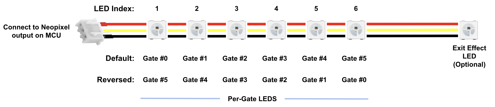
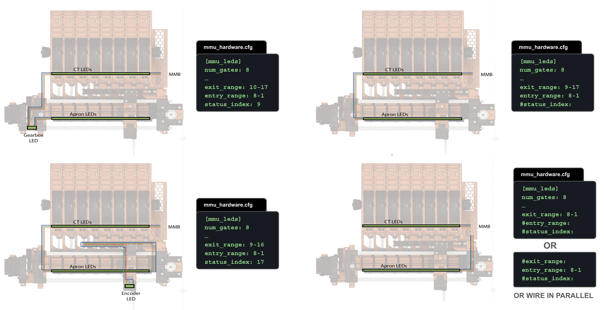

#### Page Sections:
- [Wiring](#---wiring)
- [Hardware Config](#---hardware-config)
- [Controlling LED Effects](#---controlling-led-effects)
- [Summary of Default Effects](#---summary-of-default-effects)

Happy Hare now can drive LEDs (NeoPixel/WS2812) on your MMU to provide both functional feedback as well as to add a little bling to your machine.  Typically you would connect a string of neopixels (either descrete components or an LED strip, or combination of both if compatible contollers) to the neopixel output on the MCU that drives your MMU although this can be changed.

The setup for LED's is contained at the bottom of the `mmu_hardware.cfg` file. If you would like you use LED animation you must also install the [LED Effects for Klipper](https://github.com/julianschill/klipper-led_effect). If this module is not installed, more static LED changes can be employed.

> [!IMPORTANT]  
> This page has been updated for the v3.4.0 and later releases. Earlier versions were a little different - read the text in the `mmu_hardware.cfg`

<br>

##    Wiring

<p align=center></p>

LED strips can be formed but soldering together individual neopixels or using pre-made strips.  You can also mix the two but if the "RGBW" order is different you must specify `color_order` as a list with the correct spec for each LED.  There is complete flexibility in how the LEDs are connected because Happy Hare creates a virtual chain of all the components. Segments can even be joined in parallel to drive two LED's for the same index number.  The only important concept is that when specifying the virtual chain representing gates the LEDs must be contiguous (ascending or decending).

<br>

##    Hardware Config
If you have run the Happy Hare installer it should have added a section to the end of your `mmu_hardware.cfg` that starts like this:
```yml
# LED SUPPORT (OPTIONAL) -----------------------------------------------------------------------------------------------
# ██╗     ███████╗██████╗ ███████╗
# ██║     ██╔════╝██╔══██╗██╔════╝
# ██║     █████╗  ██║  ██║███████╗
# ██║     ██╔══╝  ██║  ██║╚════██║
# ███████╗███████╗██████╔╝███████║
# ╚══════╝╚══════╝╚═════╝ ╚══════╝
#
# Define mmu leds, both the "neopixel" config and [mmu_led] to define their purpose
#
[neopixel mmu_leds]
pin: mmu:PC13
chain_count: 6
color_order: GRBW
```
This section may be all commented out, if so and you wish to configure LEDS and don't have them configured elsewhere, uncomment the entire section and ensure that the `MMU_NEOPIXEL` pin is correctly set in the aliases in `mmu.cfg` and that the `color_order` matches your particular LED (don't mix type or if you do, set to a comma separated list of the type of each led in the chain. e.g. "GRB, GRB, GRB, RGBW, RGBW, RGBW").  Note that you must also install "Klipper LED Effects" plugin.

The wiring of LED's is very flexible and doesn't have to be in a chain controlled by the same pin. You can mix multiple chains, individual LEDs, change the order, or choose leds from an existing chain. You may therefore add additional definitons here for each LED or LED segment. The reason is that Happy Hare creates "virtual" chains with the `[mmu_leds]` section below for each of these segments: "entry", "exit", "status" and "logo" for easy configuration and control. Thus you can create a virtual chain from leds from multiple strips on different pins (each with separate [neopixel] section) and Happy Hare will control them as if they were one!
```yml
# MMU LED EFFECT SEGMENTS ----------------------------------------------------------------------------------------------
# Define neopixel LEDs for your MMU. The chain_count must be large enough for your desired ranges:
#   exit   .. this set of LEDs, one for every gate, usually would be mounted at the exit point of the gate
#   entry  .. this set of LEDs, one for every gate, could be mounted at the entry point of filament into this MMU/buffer
#   status .. these LED. represents the status of the MMU (and selected filament). More than one status LED is possible
#   logo   .. these LEDs don't change during operation and are designed lighting a logo. Multiple logo LEDs are possible
#
# Note that all sets are optional. You can opt to just have the 'exit' set for example. The advantage to having
# both entry and exit LEDs is, for example, so that 'entry' can display gate status while 'exit' displays the color
# 
# The animation effects requires the installation of Julian Schill's awesome LED effect module otherwise the LEDs
# will be static:
#   https://github.com/julianschill/klipper-led_effect
#
# LED's are indexed in the chain from 1..N. Thus to set up LED's on 'exit' and a single 'status' LED on a 4 gate MMU:
#
#    exit_leds:   neopixel:mmu_leds (1,2,3,4)
#    status_leds: neopixel:mmu_leds (5)
#
# In this example no 'entry' set is configured. Note that constructs like "mmu_leds (1-3,4)" are also valid
#
# The range is completely flexible and can be comprised of different led strips, individual LEDs, or combinations of
# both on different pins. In addition, the ordering is flexible based on your wiring, thus (1-4) and (4-1) both
# represent the same LED range but mapped to increasing or decreasing gates respectively. E.g if you have two Box
# Turtle MMUs, one with a chain of LEDs wired in reverse order and another with individual LEDs, to define 8 exit LEDs:
#
#   exit_leds: neopixel:bt_1 (4-1)
#              neopixel:bt_2a
#              neopixel:bt_2b
#              neopixel:bt_2c
#              neopixel:bt_2d
#
# Note the use of separate lines for each part of the definition,
#
# ADVANCED: Happy Hare provides a convenience wrapper [mmu_led_effect] that not only creates an effect on each of the
# [mmu_leds] specified segments as a whole but also each individual LED for atomic control. See mmu_leds.cfg for examples
#
# (comment out this whole section if you don't have/want leds; uncomment/edit LEDs fitted on your MMU)
#
[mmu_leds unit0]
exit_leds:   neopixel:mmu_leds (1-4)
entry_leds:
status_leds: neopixel:mmu_leds (5)
logo_leds:   neopixel:mmu_leds (6)
frame_rate: 24
```
> [!IMPORTANT]  
> One thing that is important for `entry` and `exit` led chains is that their length must be the same as the number of gates or a multiple of that. BTT ViViD design has 7 leds for each of the 4 gates, so there are 28 leds in the sequence. If you do have multiple leds per gate, Happy Hare will leverage that to create "mini" effects on each individual gate. E.g. can indicate loading and unloading animation!

Some examples of how to set these values can be seen in this illustration (ERCFv2 MMU example):
<p align=center></p> <!-- TODO: Update pic -->

> [!TIP]  
> If you don't have a particular type of led on your mmu you can comment/delete the line or easiest, just leave undefined.

<br>

##    Controlling LED Effects
Happy Hare LED effects are controlled by Happy Hare but you have a large amount of configuration options. The `[mmu_leds ..]` section above continues:
```yml
# Default effects for LED segments when not providing action status
#    off              - LED's off
#    on               - LED's white
#    gate_status      - indicate gate availability / status            (printer.mmu.gate_status)
#    filament_color   - display filament color defined in gate map     (printer.mmu.gate_color_rgb)
#    slicer_color     - display slicer defined set color for each gate (printer.mmu.slicer_color_rgb)
#   (r,g,b)           - display static r,g,b color e.g. "0,0,0.3" for dim blue
#    _effect_         - display the named led effect
#
enabled: True                           # True = LEDs are enabled at startup (MMU_LED can control), False = Disabled
animation: True                         # True = Use led-animation-effects, False = Static LEDs
exit_effect: gate_status                #    off|gate_status|filament_color|slicer_color|r,g,b|_effect_
entry_effect: filament_color            #    off|gate_status|filament_color|slicer_color|r,g,b|_effect_
status_effect: filament_color           # on|off|gate_status|filament_color|slicer_color|r,g,b|_effect_
logo_effect: (0, 0, 0.3)                #    off                                        |r,g,b|_effect_
white_light: (1, 1, 1)                  # RGB color for static white light
black_light: (.01, 0, .02)              # RGB color used to represent "black" (filament)
empty_light: (0, 0, 0)                  # RGB color used to represent empty gate
```
This is where the default function you want for each set of leds can be specified. For example `gate_status` is probably the most useful indicator for leds next to exit of each gate but you have a choice. Static colors can also be sepcified and are most useful for the "logo" leds. You will also see the default (r,g,b) colors used to indicate white and black color -- e.g. black is represented as a very faint purple (think black-light).

Finally, the effects that are applied during each stage of MMU operation follow. In each case a static alternative (r,g,b) color is configured and will be used if you turn off animation for any led chain:
```yml
# Default effects (animation: True) / static rbg (animation False) to apply to actions
#   effect_name, (r,b,g)
#
# IMPORTANT: Effects must be from [mmu_led_effects] set defined in mmu_hardware.cfg
#
effect_loading:            mmu_blue_clockwise_slow, (0, 0, 0.4)
effect_loading_extruder:   mmu_blue_clockwise_fast, (0, 0, 1)
effect_unloading:          mmu_blue_anticlock_slow, (0, 0, 0.4)
effect_unloading_extruder: mmu_blue_anticlock_fast, (0, 0, 1)
effect_heating:            mmu_breathing_red,       (0.3, 0, 0)
effect_selecting:          mmu_white_fast,          (0.2, 0.2, 0.2)
effect_checking:           mmu_white_fast,          (0.8, 0.8, 0.8)
effect_initialized:        mmu_rainbow,             (0.5, 0.2, 0)
effect_error:              mmu_strobe,              (1, 0, 0)
effect_complete:           mmu_sparkle,             (0.3, 0.3, 0.3)
effect_gate_selected:      mmu_static_blue,         (0, 0, 1)
effect_gate_available:     mmu_static_green,        (0, 0.5, 0)
effect_gate_available_sel: mmu_ready_green,         (0, 0.75, 0)
effect_gate_unknown:       mmu_static_orange,       (0.5, 0.2, 0)
effect_gate_unknown_sel:   mmu_ready_orange,        (0.75, 0.3, 0)
effect_gate_empty:         mmu_static_black,        (0, 0, 0)
effect_gate_empty_sel:     mmu_ready_orange2,       (0.1, 0.04, 0)
```

> [!NOTE]  
> If you are wondering where all these effects are defined, look in `mmu_leds.cfg`.  They are all defined with a special `[mmu_led_effect]` section that is able to duplicate effect setup across each gate and the desired chains. Read the notes in `mmu_leds.cfg` for more details.

To change the default effect for a segment edit the appropriate line. These effects can be any of the built-in functional defaults, any named effect you define, or even an RGB color specification in the form `red,green,blue` e.g. `0.5,0,0.5` would be 50% intensity red and blue with no green. In each case a static alternative (r,g,b) color is specified and will be used if you turn off animation for the given mmu unit.

Happy Hare also has a command to control LEDs:

```yml
> MMU_LED
Unit 0 LEDs (enabled)
Animation: enabled
Default exit effect: 'gate_status'
Default entry effect: unavailable
Default status effect: 'filament_color'
Default logo effect: '(1.0, 1.0, 1.0)'
```

> [!TIP]  
> Many command in Happy Hare have a built-in help system...
> ```
> MMU_LED HELP=1
> MMU_LED: Manage mode of operation of optional MMU LED's
> └ UNIT          = #(int) default all units
> └ ENABLE        = [0|1]
> └ ANIMATION     = [0|1]
> └ EXIT_EFFECT   = [off|gate_status|filament_color|slicer_color|r,g,b|_effect_]
> └ ENTRY_EFFECT  = [off|gate_status|filament_color|slicer_color|r,g,b|_effect_]
> └ STATUS_EFFECT = [off|on|filament_color|slicer_color|r,g,b|_effect_]
> └ LOGO_EFFECT   = [off|r,g,b|_effect_]
> └ REFRESH       = [0|1]
> └ QUIET         = [0|1]
> ```

You can change the effect at runtime, e.g. `MMU_LED ENTRY_EFFECT=gate_status` or `MMU_LED ENABLE=0` to turn off and disable the LED operation.  Please note that similarly to `MMU_TEST_CONFIG` changes made like this don't persist on a restart. Update the default values in `mmu_hardware.cfg` to make changes persistent.

The colors displayed by the `slicer_color` option is set with the command `MMU_SLICER_TOOL_MAP GATE=.. COLOR=..` as is done in the recommended `MMU_START_SETUP` macro. These colors thus only exist during a print or until the next print overwrite them. If you are modifying the slicer tool map yourself note that the color can be a w3c color name or `RRGGBB` value.

The Mainsail/Fluidd UI's and Happy Hare version of Klipperscreen have buttons to quickly "toggle" between `gate_status` and `filament_color` for the default gate effect...

If you want to reduce load on your system (arguably because it realy is  minor) but still want to support LEDs then you can opt to turn off the animations by setting `animation: False` or using `MMU_LED ANIMATION=0`.

<br>

##    Summary of Default Effects
The default effects, which are both functional as well as adding a little color, are summerized here. The logo LED is typically a static RGB color::

  | State            | Filament Entry LEDs<br>(typically gate loading) | Filament Exit LEDs<br>(to bowden tube) | Status LED |
  | ---------------- | ----------------------------------------------- | -------------------------------------- | ---------- |
  | MMU Disabled     | OFF                                             | OFF                                    | OFF        |
  | Filament Loaded  |                                                 |                                        | Dim Blue   |
  |||||
  | **MMU Print States:** ||||
  | "initialization" | OFF                                             | `Shooting stars`<br>(for 3 seconds)    | OFF        |
  | "ready"          | _default_                                       | _default_                              | _default_  |
  | "printing"       | _default_                                       | _default_                              | _default_<br>(Blue if loaded) |
  | "pause_locked"<br>(mmu pause)   | OFF                              | `Strobe`                               | `Strobe`   |
  | "paused"<br>(after unlock)      | OFF                              | Current gate: `Strobe`                 | `Strobe`   |
  | "completed"      | _default_                                       | `Sparkle`<br>(for 20 seconds)          | _default_  |
  | "cancelled"      | _default_                                       | _default_                              | _default_  |
  | "error"          | _default_                                       | `Strobe`<br>(for 20 seconds)           | _default_  |
  | "standby"        | OFF                                             | OFF                                    | OFF        |
  |||||
  | **Actions States:** ||||
  | "Loading"<br>(whole sequence)   |                                  | Current gate: `Slow Pulsing White`     | `Slow Pulsing Blue`<br>(slow forward animation) |
  | "Loading"<br>(toolhead)   |                                        |                                        | `Fast Pulsing Blue`<br>(fast forward animation)  |
  | "Unloading"<br>(whole sequence) |                                  | Current gate: `Slow Pulsing White`     | `Slow Pulsing Blue`<br>(slow reverse animation) |
  | "Unloading"<br>(toolhead)   |                                      |                                        | `Fast Pulsing Blue`<br>(fast reverse animation) |
  | "Heating"        | _default_                                       | Current gate: `Pulsing Red`            | `Pulsing Red`        |
  | "Selecting"      | _default_                                       | `Fast Pulsing White`                   | OFF                  |
  | "Checking"       | _default_                                       | _default_                              | `Fast Pulsing White` |
  | "Idle"           | _default_                                       | _default_                              | _default_            |
  |||||
  | **Possible Defaults** | **default_entry_effect**:<br>-`gate_status`<br>-`filament_color`<br>-`slicer_color`<br>-`off` | **default_exit_effect**:<br>-`gate_status`<br>-`filament_color`<br>-`slicer_color`<br>-`off` | **default_status_effect**:<br>-`filament_color`<br>-`slicer_color`<br>-`on` (white)<br>-`off` |

In the table above, `Effect` designates effect (animation) rather than static color if `variable_led_animation_enable: True`

<br>

> [!NOTE]  
> - MMU Print State is the same as the printer variable `printer.mmu.print_state`
> - Action State is the same as the printer variable `printer.mmu.action`
> - These are built-in functional "effects":
>   - **filament_color** - displays the static color of the filament defined for the gate from MMU_GATE_MAP (specifically `printer.mmu.gate_color_rgb`). Requires you to setup color either directly or via Spoolman.
>   - **slicer_color** - dispays the static color of the filament defined in the slicer tool map (printer.mmu.slicer_color_rgb). Note this might be empty until a print starts.
>   - **gate_status** - dispays the status for the gate (printer.mmu.get_status): **red** if empty, **green** if loaded, **orange** if unknown

> [!TIP]  
> Whilst not LEDs, Mailsail and Fluidd have visualizations of the filament color next to the "extruder" `T0`, `T1`, `T2`, ... buttons. Happy Hare can drive these in various ways similar to LED visualization here. Read [Mainsail/Fluidd Integration](Mainsail-Fluidd-Integration) for more details
