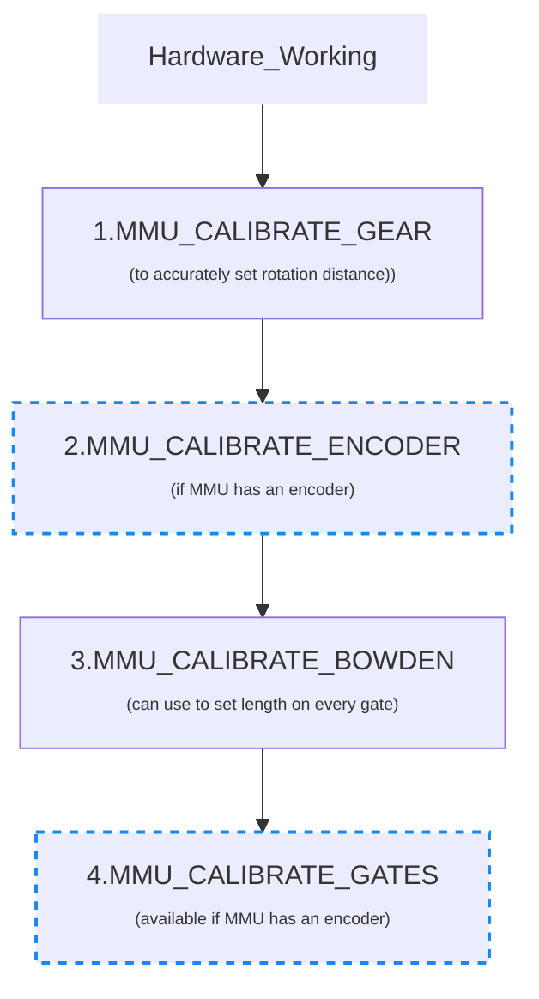

#### Page Sections:
This guide is for [Type-B](Conceptual-MMU#---type-b) MMU/AFC's including:
<br>
&bull; **QuattroBox**<br>
&bull; **Box Turtle**<br>
&bull; **Night Owl**<br>
&bull; **Angry Beaver**<br>
&bull; **3MS**<br>

- [Calibration Steps](#---calibration-steps)
  - [1. Gear 0 Stepper](#---step-1-calibrate-rotation-distance-of-gear-0-stepper)
  - [2. Encoder (option)](#---step-2-calibrate-your-encoder-option)
  - [3. Bowden Length](#---step-3-calibrate-bowden-length)
  - [4. Gates/Lanes](#---step-4-calibrating-individual-gates)
- [Calibration Storage](#---calibration-storage)
- [Calibration Commands Reference](Command-Reference#---calibration)

This discussion assumes that you have setup and debugged your hardware configuration. A detailed discusion can be found under [Hardware Configuration](Hardware-Configuration).

Before using your MMU you will need to calibrate it to adjust for differences in components used on your particular build. Be careful to calibrate in the recommended order because some settings build and depend on earlier ones. Happy Hare now automated calibration for some of the traditionally longer steps and does not require any Klipper restarts so the process is quick and painless.

Note that some MMUs require slight variations to these basic steps - always refer to the the respective Quick Start Guide for details.

<br>

##    Calibration Steps

> [!IMPORTANT]  
> When calibrating the first time you must perform in the prescribed order.  Once complete you can re-calibrate particular steps but remember that some calibration changes will cascade.  E.g. after calibrating the gear, you must recalibrate the encoder (if fitted), and the bowden.


- Most type-B MMU designs will have disimilar `rotation_distance` on each gate and really require separate measured calibration of each with `MMU_CALIBRATE_GEAR` (or if an encoder is fitted, automatied with `MMU_CALIBRATE_GATES`). This is important even if the drive gears look similar because minor differences are amplified over the movement distances managed by the MMU.
- Most MMU designs will share the same bowden length (and thus only one needs to be calibrated), however if the design can have different lengths each must be calibrated separately.

<br>

> [!TIP] 
> All of the calibration commands can be run in a "check/test" mode. Simply add `SAVE=0` to the command and the calibration will be run but the results will not be saved. This is very useful to practice or to verify calibration

<br>

###    Step 1. Calibrate rotation distance of gear 0 stepper
Applicable to all MMU's: **Very important to get right!**

#### PURPOSE
In this step you are simply ensuring that when the gear stepper is told to drive 100mm of filament it really does move 100mm.  It is akin to what you did when you set up your extruder rotational distance although in this case no Klipper restart is necessary! We single out gate 0 to make it the reference gate. Although it is necessary for each gate to be calibrated some MMU designs will allow Happy Hare to automatically calibrate the rest over time so gate 0 is singled out as a minimal step the user must undertake. If this step is not complete you will see this message:

  > Use MMU_CALIBRATE_GEAR (with gate 0 selected) to calibrate gear rotation_distance on gate: 0

Until this step is completed Happy Hare will use the default `rotation_distance` defined in `mmu_hardwared.cfg` as a fallback.

#### RESULT
After calibration the calibrated rotation distance will be persisted to `mmu_vars.cfg` in a line similar to (length of array will match the number of gates you have and the recorded rotation distance will be for the selected gate):

  > mmu_gear_rotation_distances: [22.56783, -1, -1, -1]


#### PROCEDURE
Select gate #0:

  > MMU_SELECT GATE=0

Now you need to get some filament to a point you want to use for measurement. This will be the point at which the filament emerges from the MMU. If the design has an embedded combiner/splitter (like Box Turtle) then it will be the exit of the MMU (e.g. Turtle Neck). If the design has separate bowden tubes then it will be that specific exit.

Load the gate and use this command repeatedly to advance the filament so it is visible:

  > MMU_TEST_MOVE MOVE=50

Next remove the bowden tube and cut the filament flush with the ECAS connector at the output of the MMU (as determined above). Then run this command to attempt to move exactly 100mm of filament:

  > MMU_TEST_MOVE MOVE=100

Get out your ruler and very carefully measure the length of the emited filament.  Hold your ruler up to the ECAS and gently pull the filament straight to get an accurate measurement. Next run this specifying your actual measured value (102.5 used in this example):

  > MMU_CALIBRATE_GEAR MEASURED=102.5

```
    Gear stepper 'rotation_distance' calculated to be 23.117387 (currently: 22.56783)
    Gear calibration for gate 0 has been saved
```

If you are not in a rush and don't want to rely on auto-calibration you can calibrate other gates now by repeating replacing `GATE=0` with the gate to calibrate.

> [!NOTE]  
> You can also measure over a different length by using something like `MMU_TEST_MOVE MOVE=200` and `MMU_CALIBRATE_GEAR LENGTH=200 MEASURED=205.25` for a 200mm length for example.

**Validation:** If you want to test, snip the filament again flush with the ECAS connector and run `MMU_TEST_MOVE`.  Exactly 100mm should be moved this time.

Although it is not strictly necesssary to do this now, you can repeat for all other gates if your MMU has variable gears (which will almost certainly be the case). This optimizes the accuracy of other gates rather than relying on the calibration of gate 0.  If you have an encoder you can shortcut and use `MMU_CALIBRATE_GATES` discussed later or one of the advanced auto-calibration options. That said, if you have the time, why not optimize all gates now...

<br>

###    Step 2. Calibrate your encoder (Option)
APPLICABLE ONLY IF AN ENCODER IS FITTED

#### PURPOSE
If your MMU includes an Encoder the next step is to calibrate so it measures distance accurately. This will set the "encoder resolution" for the encoder gear. I.e. What filament movement (distance in mm) does each signal pulse from the encoder represent.

#### RESULT
After this step the calibrated encoder resolution will be persisted to `mmu_vars.cfg` in a line similar to:

  > mmu_encoder_resolution: 1.085049

#### PROCEDURE
Re-fit the bowden to your MMU, re-select gate 0, if not selected, and make sure you have some filament loaded in gate #0 before starting. Use this command to advance filament into view at the start of the bowden (this is simply to ensure the filament is fully through the encoder):

  > MMU_TEST_MOVE MOVE=50

Now run:

  > MMU_CALIBRATE_ENCODER

You will see an output similar to:

```
    Calibrating over 400mm...
      + counts: 368
      - counts: 368
      + counts: 369
      - counts: 369
      + counts: 369
      - counts: 369
    Load direction:   mean=368.67 stdev=0.58 min=368 max=369 range=1
    Unload direction: mean=368.67 stdev=0.58 min=368 max=369 range=1
    Before calibration measured length: 394.47mm
    Calculated resolution of the encoder: 1.085049 (currently: 1.094543)
    Encoder calibration has been saved
```

> [!NOTE]  
> (i) Use fresh filament - grooves from previous passes through extruder gears can lead to slight count differences.<br>
> (ii) You want the counts on each attempt to be the same or very similar but don't sweat +/-3 counts.<br>
> (iii) You can run this (like all calibration commands) without saving the result by adding a `SAVE=0` flag.

If this step worked then you can unload the residual filament with `MMU_UNLOAD`. If you aren't happy with results, leave the filament ready for the next run and run the calibration again.

<br>

###    Step 3. Calibrate bowden length
Applicable to MMU's with fast bowden move: **Most designs except Angry Beaver** where filaments combine at the toolhead

#### PURPOSE
The last calibration before use! Here you can calibrate the length of your bowden from MMU gate to extruder entrance. This is important because it allows the MMU to move the filament at a fast pace over this distance because getting to the more complicated part of the load sequence. To speed up this process and depending on what sensors you have fitted for extruder homing, you may need to give the calibration routine a hint of how far way the extruder is.

#### RESULT
After this step the calibrated bowden length will be persisted to `mmu_vars.cfg` in a line similar to this with one entry per gate (designs with different bowden lengths will only set the selected gate bowden distance):

  > mmu_calibration_bowden_lengths = [681.4, 681.4, 681.4, 681.4]


#### PROCEDURE
There are different ways to do this depending on your MMU configuration and sensor options:

1. If `extruder_homing_endstop: extruder`, `mmu_gear_touch` or `filament_compression`, then you have a homing endstop and you can simply specify a `BOWDEN_LENGTH` that is GREATER than your estimated length to give plenty of room to find the homing stop (technically, Happy Hare defaults to 2000mm so you can probably omit this parameter completely).

  > MMU_CALIBRATE_BOWDEN<br>
  > MMU_CALIBRATE_BOWDEN BOWDEN_LENGTH=1500

```
    Tool T0 enabled
    Calibrating bowden length for gate 3 (automatic method) using mmu_gate SENSOR as gate reference point
    Filament homed to extruder after 724.5mm movement
    Calibrated bowden length is 724.5mm
```


2. If you are relying on an encoder (i.e. `extruder_homing_endstop: collision`, then during Bowden calibration `BOWDEN_LENGTH` needs to be supplied and MUST be slightly SHORTER than the actual length (so the sensing has room to "feel" for the end of the bowden). A good rule of thumb is to manually measure the distance from exit from the selector to the entrance to your extruder. Subtract 40-50mm from that distance. If you measure approximately 690mm, supply 650mm as the starting value. For example:
<br>**(This method is only used if encoder is fitted AND used as extruder "endstop")**

  > MMU_CALIBRATE_BOWDEN BOWDEN_LENGTH=650

```
    Tool T0 enabled
    Calibrating bowden length from reference Gate #0
    Heating extruder to minimum temp (200.0)
    Finding extruder gear position (try #1 of 3)...
    Pass #1: Filament homed to extruder, encoder measured 683.5mm, filament sprung back 3.2mm
    - Bowden calibration based on this pass is 683.5
    Finding extruder gear position (try #2 of 3)...
    Pass #2: Filament homed to extruder, encoder measured 682.7mm, filament sprung back 3.2mm
    - Bowden calibration based on this pass is 682.7
    Finding extruder gear position (try #3 of 3)...
    Pass #3: Filament homed to extruder, encoder measured 683.9mm, filament sprung back 3.2mm
    - Bowden calibration based on this pass is 683.4
    Recommended calibration reference is 680.2mm. Clog detection length: 16.8mm
    Bowden calibration and clog detection length have been saved
```
Note this method uses telemetry to also sets a good starting value for the clog detection length.

3. Finally, if you run into problems or don't have an encoder or one of the possible homing sensors (or have problems with collision detection) you can run manually. To do this, select gate 0, push filament through manually all the way to the extruder gears. Then run with the `MANUAL=1` option. This will measure the distance in the reverse to the configured gate homing position:
<br>(**This is the method for MMU designs like Tradrack that don't have encoder but do have `mmu_gate` sensor**)

  > MMU_CALIBRATE_BOWDEN MANUAL=1
  > MMU_CALIBRATE_BOWDEN BOWDEN_LENGTH=1500 MANUAL=1

This will reverse homes to the gate and uses Klipper's measurement of stepper movement.

<br>

###    Step 4. Calibrating individual gates
Applicable to **MMU's with encoder** to automate the setting of rotation distance for gates other than the reference gate 0

#### PURPOSE
This step allows for calibrating slight `rotation distance` differences between gates and saves you from having to use `MMU_CALIBRATE_GEAR` on every gate. If encoder is fitted, this is still optional because if not run, the gates will tune themselves as they are used automatically (see `autotune_rotation_distance` in `mmu_parameters`)!  That said it can be beneficial to get this out of the way with a test piece of filament because doing it also: (i) removes the need to set the `autotune_rotation_distance` in `mmu_parameters.cfg`, (ii) is necessary if there is substantial variation between gates -- e.g. if BMG gears for different gates are sourced from different vendors and wildly different.

If this method is possible and you have not calibrated all gates in Step 1, you will see a calibration warning message similar to:

  > Use MMU_CALIBRATE_GEAR (with gate selected) or MMU_CALIBRATE_GATES GATE=xx

#### RESULT
After calibration the calibrated rotation distance will be persisted to `mmu_vars.cfg` for remaining gate in a line similar to (length of array will match the number of gates you have and the recorded rotation distance for the calibrated gates):

  > mmu_gear_rotation_distances: [22.567835, 22.941324, 22.943590, 22.600300]

#### PROCEDURE
Simply make sure filament is available at the gate you want to calibrate -- you can hold a (500mm) loose piece of filament and run:

> MMU_CALIBRATE_GATES GATE=1

You will see an output similar to:

```
    Tool T1 enabled
    Calibrating gate 1 over 400.0mm...
      + measured: 404.4mm
      - measured: 404.4mm
      + measured: 404.4mm
      - measured: 404.4mm
      + measured: 405.5mm
      - measured: 405.5mm
    Load direction:   mean=404.7 stdev=0.63 min=404.4 max=405.5 range=1.1
    Unload direction: mean=404.7 stdev=0.63 min=404.4 max=405.5 range=1.1
    Calibration move of 6x 400.0mm, average encoder measurement: 404.7mm - Ratio is 1.011872
    Calculated gate 1 rotation_distance: 22.941324 (currently: 22.672165)
    Calibration for gate 1 has been saved
```

> [!NOTE]  
> (i) You can also quickly run through all gates (even pass the loose filament from gate to gate) with `MMU_CALIBRATE_GATES ALL=1`<br>
> (ii) If you see "Calibration ignored because it is not considered valid (>20% difference from gate 0)" then it either means the calibration failed because filament was not moving or the encoder was not working correctly. Less likely but possible is because you have not calibrated gate 0 (`MMU_CALIBRATE_GEAR` and `MMU_CALIBRATE_ENCODER`) correctly which serves as the reference gate.

<br>

###    Calibration Storage
All calibrated results are stored in the configured `[save_variables]` file. By default and most usually this will be the `mmu_vars.cfg`. Here is a list of possible modified variables and the command that sets them:

  | Variable | Command | Notes |
  | -------- | ------- | ----- |
  | mmu_gear_rotation_distances | MMU_CALIBRATE_GEAR or MMU_CALIBRATE_GATES | The list represents `rotation_distance` for each gate |
  | mmu_encoder_resolution | MMU_CALIBRATE_ENCODER | The distance each encoder signal transition represents |
  | mmu_calibration_bowden_home | MMU_CALIBRATE_BOWDEN | Records the gate homing endstop used as a basis for the calibration |
  | mmu_calibration_bowden_lengths | MMU_CALIBRATE_BOWDEN | The list will be the same length as the number of gates on your MMU |
  | mmu_calibration_clog_length | MMU_CALIBRATE_BOWDEN | Only used with encoder although always set incase you add in the future |
