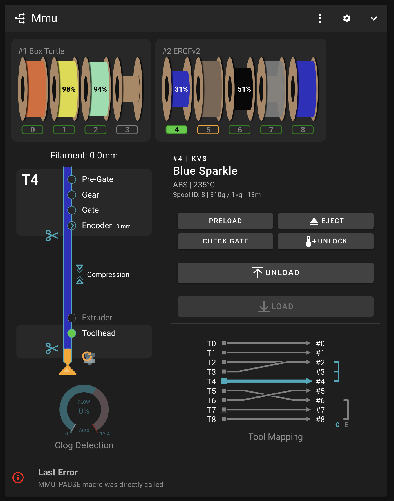
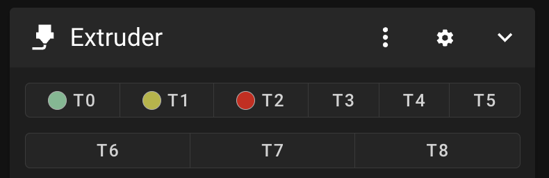
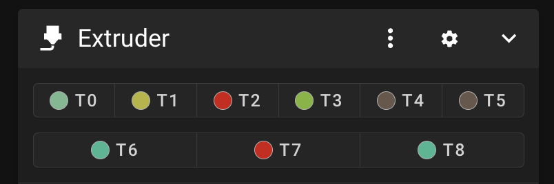
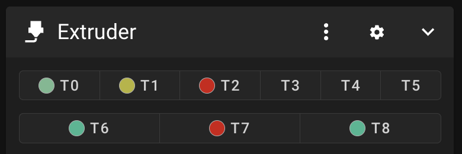
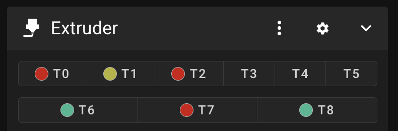

Mainsail (and soon Fluidd) support has arrived!

<br>

##    Main Panel

</p>

Documentation to come..


##    Extruder/Filament Color

Mainsail and (I believe Fluidd) have added support to display additional attributes about each extruder. These are exploited by Happy Hare to give you even more visual feedback

When you start a print the `MMU_START_SETUP` macro reads information from the sliced gcode file and loads it into the slicer tool map (discussed in [Tool and Gate Maps](https://github.com/moggieuk/Happy-Hare/wiki/Tool-and-Gate-Maps#---slicer-tool-map). Once this map is loaded, Happy Hare reports to Mainsail so that it can dynamically display the filament colors. What is displayed next to the tools is controlled by this parameter in `mmu_parameters.cfg`:

```yml
t_macro_color: slicer
```

The default is slicer, but possible values are:
- `slicer`   - Color from slicer tool map (what the slicer expects)
- `allgates` - Color from all the tools in the gate map after running through the TTG map
- `gatemap`  - As per gatemap but hide empty tools

<br>

Here is an example from a three color print (T0, T1, T2) with the default `slicer` setting where tools that are not used have not color:

</p>

<br>

If you would prefer to see the colors of all the filaments loaded into the gates of your MMU, simple use the `allgates` setting:

</p>

<br>

Sometimes it is visually clearer to hide gates that are empty despite being in Happy Hare's gate map. You can do that with the `gatemap` setting:

</p>

<br>

Finally, note that when displaying `allgates` or `gatemap` the TTG (tool-to-gate) mapping is interpreted, so here is an example of what happens with tool `T0` is remapped to gate 7:
> MMU_TTG_MAP TOOL=0 GATE=7

</p>

Notice that `T0` is now red because gate 7 contains red filament.

> [!TIP]  
> Fun tip: You don't need to restart klipper to make this change! Simple change the parameter dynamically with:
> > MMU_TEST_CONFIG t_macro_color=allgates QUIET=1<br>
>
> Boom! The update is immediate!<br>
> Now try:<br>
> > MMU_TEST_CONFIG t_macro_color=gatemap QUIET=1<br>
>
> and:<br>
> > MMU_TEST_CONFIG t_macro_color=slicer QUIET=1<br>
>
> Now you can think of the Mainsail Extruder UI as another set of LED's! Remember though that these are "Tools" and are subject to the tool-to-gate (TTG) map unlike the gate LEDs.


<br>

##    Gate Assignment Visualization

_comming soon when I energy to write more_

### allgates
```yml
t_macro_color: allgates
```

### gatemap
```yml
t_macro_color: gatemap
```
