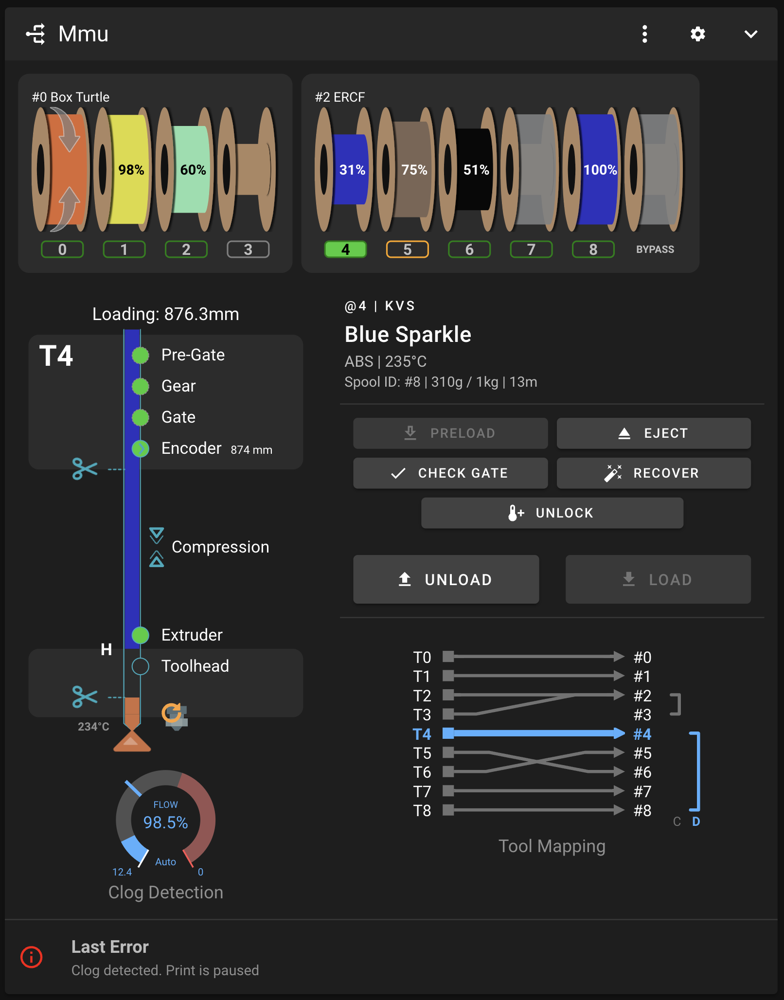
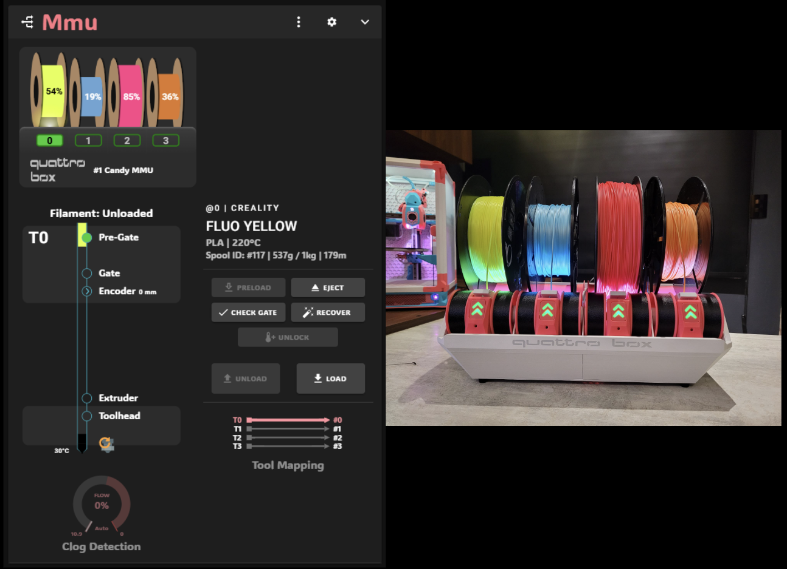
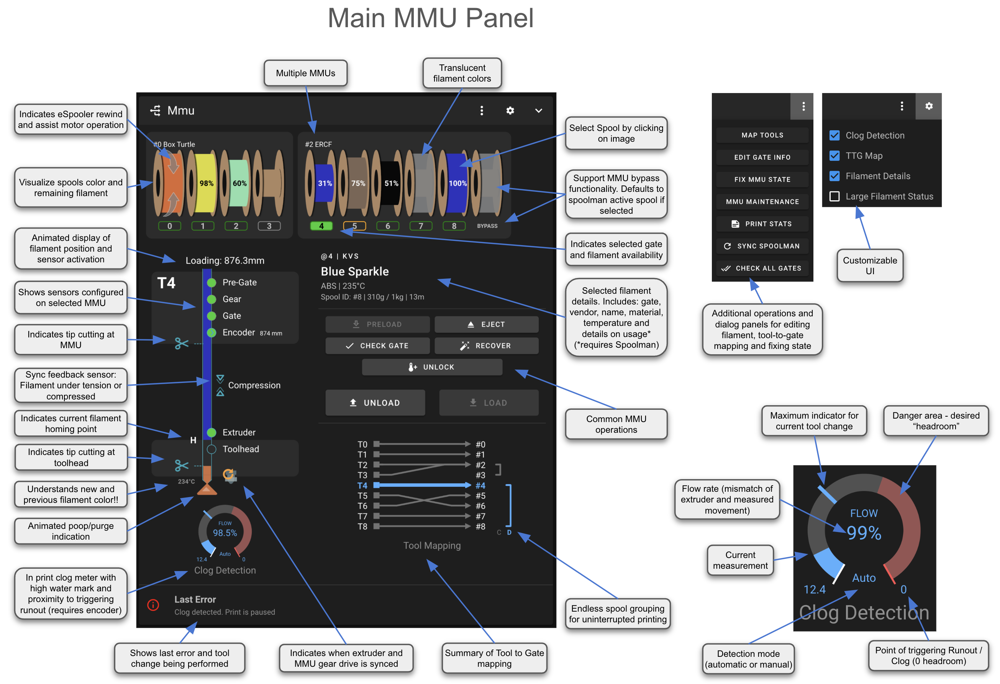
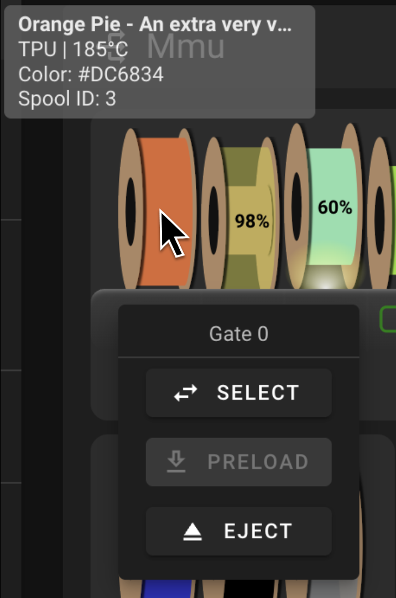
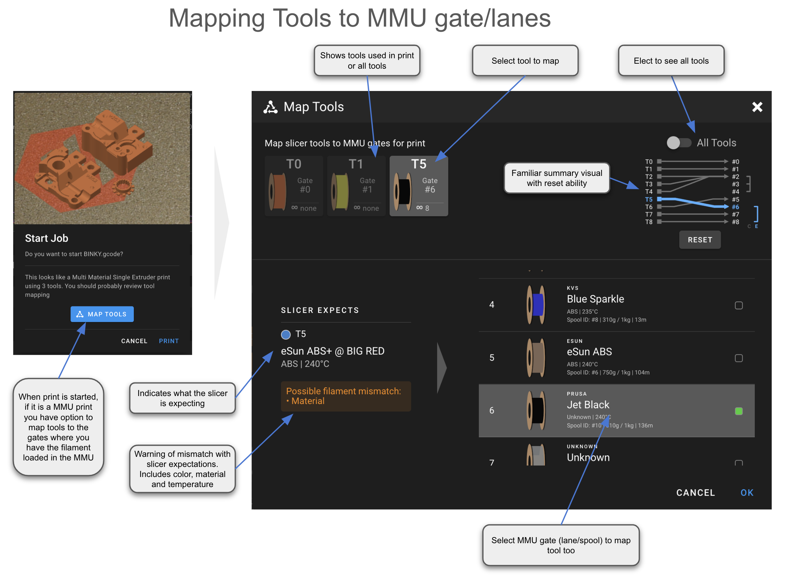
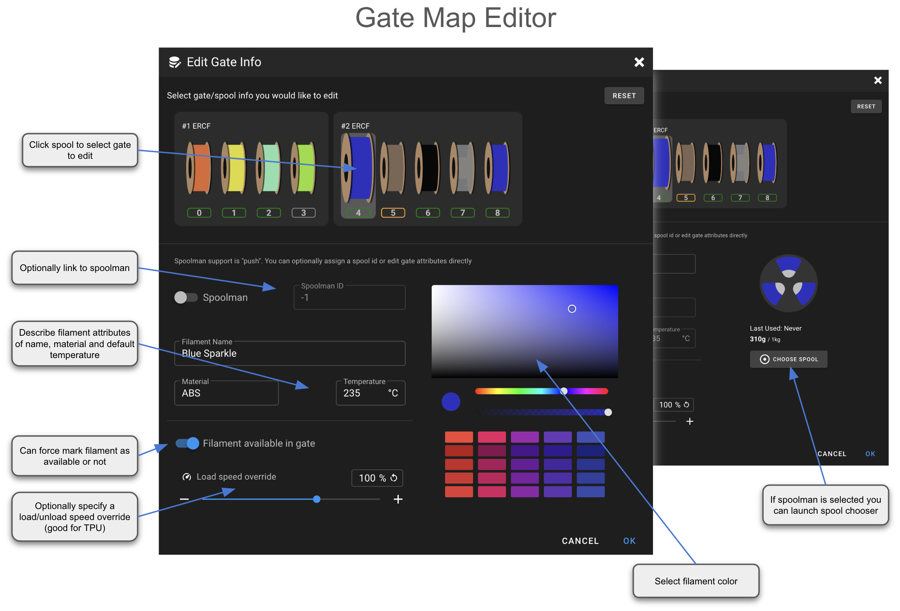
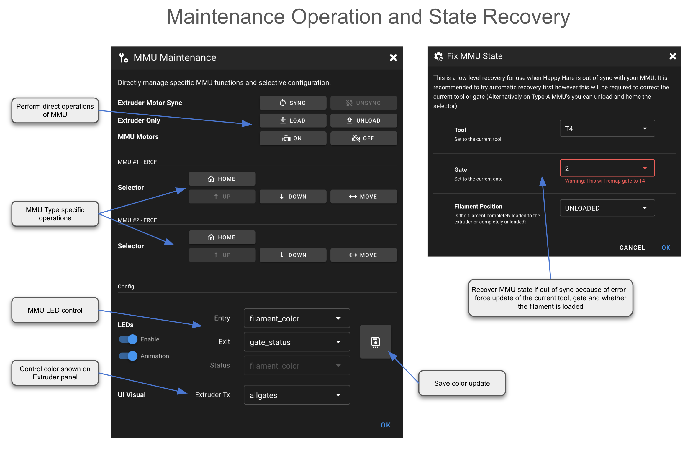

#### Page Sections:
- [Main Mainsail/Fluidd Panel](#---main-panel)
 - [Tool to Gate mapping](#---tool-to-gate-mapping)
 - [Gate Map Editor](#---gate-map-editor)
 - [Maintenance and State Recovery](#---maintenance-and-state-recovery)
- [Extruder/Filament Color](#---extruderfilament-color)

<br>

<p align="center"></p>

Mainsail/Fluidd integration has arrived! Mainsail PR is in queue, Fluidd PR already integrated. You can always get the very latest enhancements via my Mainsail fork here: <a href="https://github.com/moggieuk/mainsail-happy-hare-edition">mainsail-happy-hare-edition</a> and Fluidd fork here: <a href="https://github.com/moggieuk/fluidd-happy-hare-edition">fluidd-happy-hare-edition</a>

<br>

<p align="center"></p>

<br>

##    Main Panel

The Mainsail integration includes a new "MMU" panel. The integration into the existing "Extruder" panel documented later still works for tool selection but this panel is decidated to monitoring and operating the MMU outside of just selecting a tool at the physical gate level

<p align="center"><a href="https://github.com/moggieuk/Happy-Hare/wiki/Mainsail-Fluidd-Integration/mainsail_annotated_panel.png"></a>
Click for larger image...
</p>

Generally the approach in the UI is that you select the gate/lane you want to operate on, then perform the action. With type-B MMU's that have separate gear stepper for each gate/lane some operations are possible even if another gate is loaded. In these situations when you select another gate a drop down menu will appear with possible operations. This allows, for example, to eject filament from the non-active gate.

<p align="center"><a href="https://github.com/moggieuk/Happy-Hare/wiki/Mainsail-Fluidd-Integration/non-selected-gate.png"></a>

<br>

##    Tool to Gate mapping

When you start a print that has multiple colors with a single extruder you have the opportunity to map the tools the slicer expects to the physical gates/lanes on the MMU.  You can also map all tools at any time to adjust the tool-to-gate mapping.

<p align="center"><a href="https://github.com/moggieuk/Happy-Hare/wiki/Mainsail-Fluidd-Integration/mainsail_annotated_ttg_editor.png"></a>
Click for larger image...
</p>

<br>

##    Gate Map editor

This screen is used to edit the attributes on the filament loaded on your MMU. You can either specify the individual attributes or link the filament to spoolman and have Happy Hare pull attributes from the database.

<p align="center"><a href="https://github.com/moggieuk/Happy-Hare/wiki/Mainsail-Fluidd-Integration/mainsail_annotated_gate_editor.png"></a>
Click for larger image...
</p>

<br>

##    Maintenance and State Recovery

If an error occurs with the MMU and the state cannot be automatically recovered you are fix with the "Recover" screen or you can perform some setup and operations specific to you particular MMU with the "Maintenance" screen.

<p align="center"><a href="https://github.com/moggieuk/Happy-Hare/wiki/Mainsail-Fluidd-Integration/mainsail_annotated_maintenance.png"></a>
Click for larger image...
</p>

<br>

##    Extruder/Filament Color

Mainsail and (I believe Fluidd) have added support to display additional attributes about each extruder. These are exploited by Happy Hare to give you even more visual feedback

When you start a print the `MMU_START_SETUP` macro reads information from the sliced gcode file and loads it into the slicer tool map (discussed in [Tool and Gate Maps](https://github.com/moggieuk/Happy-Hare/wiki/Tool-and-Gate-Maps#---slicer-tool-map). Once this map is loaded, Happy Hare reports to Mainsail so that it can dynamically display the filament colors. What is displayed next to the tools is controlled by this parameter in `mmu_parameters.cfg`:

```yml
t_macro_color: slicer
```

The default is slicer, but possible values are:
- `slicer`   - Color from slicer tool map (what the slicer expects)
- `allgates` - Color from all the tools in the gate map after running through the TTG map
- `gatemap`  - As per gatemap but hide empty tools
- `off`      - Turns off support

<br>

Here is an example from a three color print (T0, T1, T2) with the default `slicer` setting where tools that are not used have not color:

</p>

<br>

If you would prefer to see the colors of all the filaments loaded into the gates of your MMU, simple use the `allgates` setting:

</p>

<br>

Sometimes it is visually clearer to hide gates that are empty despite being in Happy Hare's gate map. You can do that with the `gatemap` setting:

</p>

<br>

Finally, note that when displaying `allgates` or `gatemap` the TTG (tool-to-gate) mapping is interpreted, so here is an example of what happens with tool `T0` is remapped to gate 7:
> MMU_TTG_MAP TOOL=0 GATE=7

</p>

Notice that `T0` is now red because gate 7 contains red filament.

> [!TIP]  
> Fun tip: You don't need to restart klipper to make this change! Simple change the parameter dynamically with:
> > MMU_TEST_CONFIG t_macro_color=allgates QUIET=1<br>
>
> Boom! The update is immediate!<br>
> Now try:<br>
> > MMU_TEST_CONFIG t_macro_color=gatemap QUIET=1<br>
>
> and:<br>
> > MMU_TEST_CONFIG t_macro_color=slicer QUIET=1<br>
>
> Now you can think of the Mainsail Extruder UI as another set of LED's! Remember though that these are "Tools" and are subject to the tool-to-gate (TTG) map unlike the gate LEDs.

