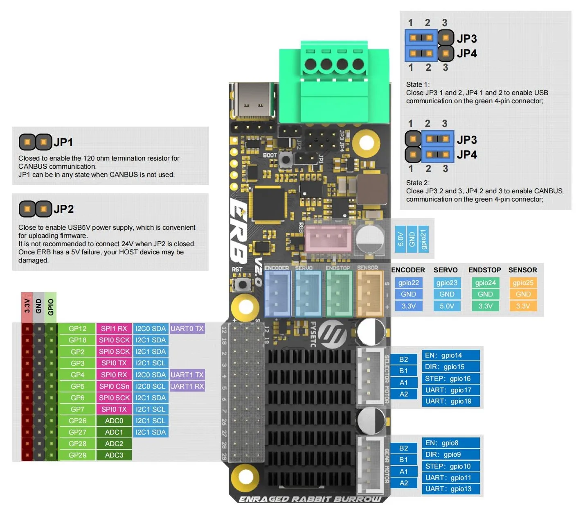
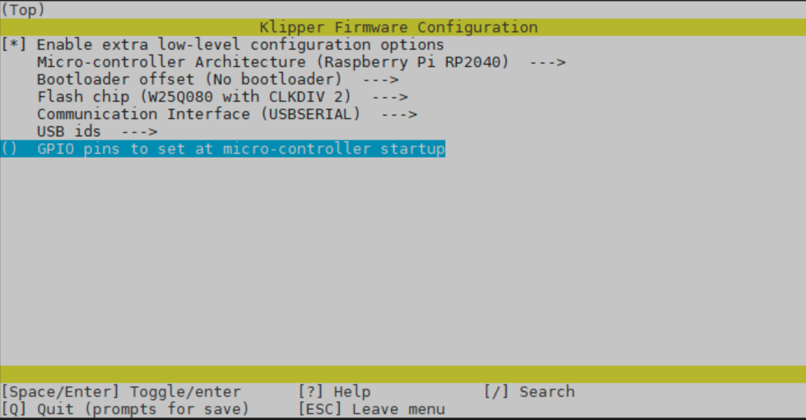

#### Page Sections:
- [Popular MCUs](#popular-mcus)
  - [BigTreeTech BTT MMB CAN v1](#bigtreetech-btt-mmb-can-v1)
  - [BigTreeTech BTT MMB CAN v2.0](#bigtreetech-btt-mmb-can-v20)
  - [Fysetc ERB v2](#fysetc-erb-v2)
  - [Mellow CAN v1](#mellow-can-v1)
  - [Mellow CAN v2](#mellow-can-v2)
  - [ERCF Easy Brd v1.1](#ercf-easy-brd-v11)
- [Flashing Firmware](#flashing-firmware)

<br>

##    Popular MCUs
The folling a collection of reference material showing pinouts, pin numbering and firmware programming notes for the most popular MCU's used for MMU Designs

### BigTreeTech BTT MMB CAN v1
<p align="center"></p>

<details>
  <summary>Click for details on Firmware flashing</summary>
  
Probably the best guide available is Esoterical's site:
**[Firmware Guide](https://canbus.esoterical.online/toolhead_flashing/common_hardware/BigTreeTech%20MMB%20CAN%20V1.0/README.html)**

</details>

<hr>
<br>

### BigTreeTech BTT MMB CAN v2.0
<p align="center"></p>

<details>
  <summary>Click for details on Firmware flashing</summary>
  
Probably the best guide available is Esoterical's site:
**[Firmware Guide](https://canbus.esoterical.online/toolhead_flashing/common_hardware/BigTreeTech%20MMB%20CAN%20V2.0/README.html)**

</details>

<br>

### Fysetc ERB v2
<p align="center"></p>

ERCF v2 Connection Diagram:
<p align="center"></p>

<details>
  <summary>Click for details on Firmware flashing</summary>
  
Read the [Flashing Firmware Notes](#---flashing-firmware)



</details>

<hr>
<br>

### Mellow CAN v1
<p align="center"></p>

<details>
  <summary>Click for details on Firmware flashing</summary>
  
Probably the best guide available is Esoterical's site:
**[Firmware Settings](https://canbus.esoterical.online/toolhead_flashing/common_hardware/Mellow%20Fly%20ERCF/README.html)**

</details>

<hr>
<br>

### Mellow CAN v2
<p align="center"></p>

<details>
  <summary>Click for details on Firmware flashing</summary>
  
Probably the best guide available is Esoterical's site:
**[Firmware Settings](https://canbus.esoterical.online/toolhead_flashing/common_hardware/Mellow%20Fly%20SB2040/README.html)**

</details>

<hr>
<br>

### ERCF Easy Brd v1.1
<p align="center"></p>

<details>
  <summary>Click for details on Firmware flashing</summary>
  
Read the [Flashing Firmware Notes](#---flashing-firmware)

)

</details>

<hr>
<br>

##    Flashing Firmware

When using any MCU with Klipper, it is important to first flash Klipper firmware. Follow these steps to flash your MCU with Klipper firmware:

> [!IMPORTANT] 
> For MCU's using CANbus, follow [this guide](https://canbus.esoterical.online/toolhead_flashing.html).

1. SSH (PuTTy) into your Raspberry Pi
2. Run the following commands:

    ```
    cd ~/klipper
    make menuconfig
    ```

3. Enter your MCU board's firmware settings, as explained later in this page.
4. Save (Q)
5. Run the following command:
    ```
    make flash FLASH_DEVICE=/dev/serial/by-id/<your-mcu-id>
    ```
  > [!TIP]
  > To find your serial port, open a new SSH window, unplug your controller board, and 
  run:
  > ```
  >  ls /dev/serial/by-id
  > ```
  > Next, plug in your controller board, and re-run the command. The newly added line is your controller's serial address.
