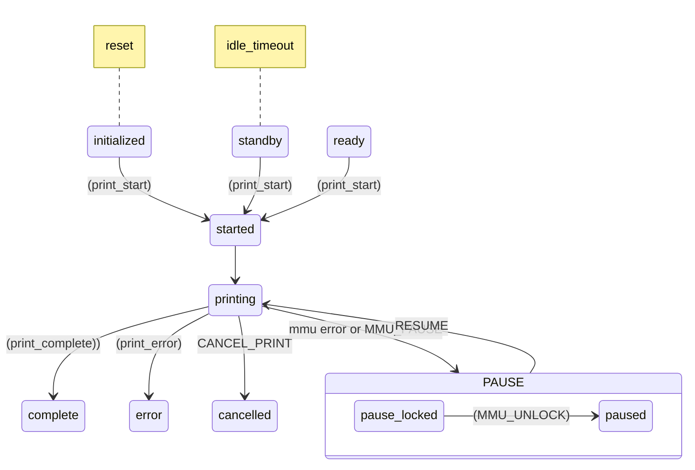

Happy Hare keeps track of the current print state in a similar way to the klipper `print_stats` module. It is subtly difference and can even work when streaming a job for Octoprint (altough some special precautions must be taken). The current state is available via the printer variable `printer.mmu.print_job_state`. This can be useful in your own custom gcode macros but also ensures that Happy Hare restores things like temperatures, stepper motor current and idle_timeout at the right time.

It is a good idea to familiarize yourself with this to aid debugging and state recovery even if you are not using in your own macros.

##    Job State Transitions

> [!IMPORTANT]
> Users printing from the "virtual SD-card" via Mainsail or Fluuid don't have any extras steps to take but if streaming a job (e.g. from Octoprint) the user is responsible to add `_MMU_PRINT_START` to their print_start macro or sequence and `_MMU_PRINT_END` to their end_print macro or sequence. The addition of those commands on "virtual sd-card print" will not cause harm but they are but are unecessary and will be ignored (hence the underscore naming). Also note that the `print_start_detection` setting can be used to disable the automatic behavior and act like a job streamed from Octoprint.

### State machine transitions in detail...
MMU starts in `initialized` state. On printing it will briefly enter `started` (until _MMU_PRINT_START is complete) then transition to `printing`. On job completion (at end of _MMU_PRINT_END) or job error the state will transition to `complete` or `error` respectively.  If the print is explicitly cancelled the `CANCEL_PRINT` interception transitions to `cancelled`. If `idle_timeout` is experience the state will transition back to `standby`. `ready` is a resting state similar to `standby` an just means that the printer is not yet idle.

While printing, if an mmu error occurs (or the user explicitly calls `MMU_PAUSE`) the state will transition to `pause_locked`.  If the user is quick to respond (before extruder temp drops) the print can be resumed with `RESUME` command.  The `MMU_UNLOCK` is optional and will restore temperatures allowing for direct MMU interaction and thus can be considered a half-step towards resuming (must still run `RESUME` to continue printing).

> [!NOTE]
> - `MMU_PAUSE` outside of a print will have no effect unless `MMU_PAUSE FORCE_IN_PRINT=1` is specified to mimick the behavior (like z-hop move and running PAUSE macro, etc).
> - Directly calling `PAUSE` will stop the job but will have no effect on the MMU (i.e. it does not put the MMU into the `pause_locked` state, only MMU_PAUSE does that.
> - When entering `pause_locked` Happy Hare will always remember the toolhead position and, if configured, perform a z-hop, but will also run the user PAUSE macro
> - When `RESUME` is called the user RESUME macro will be called, finally followed by Happy Hare restoring the original toolhead position.
> - Outside of a print the toolhead is never moved by Happy Hare (only user's PAUSE/RESUME macros).
> - `MMU_PRINT_END STATE=xxx` if called directly can accept states `complete|error|cancelled|standby|ready` although typically would only be called with `complete|error`

