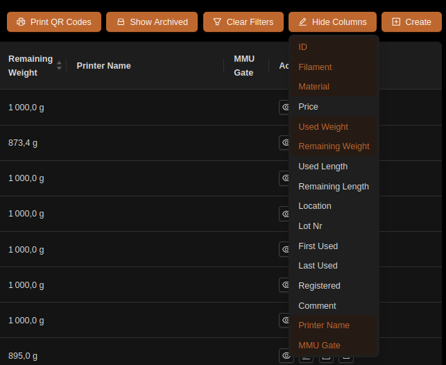
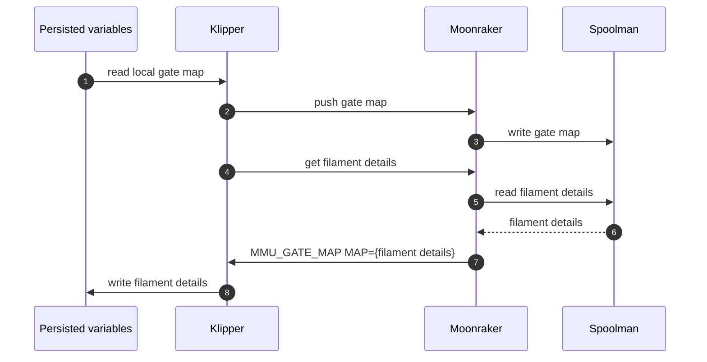
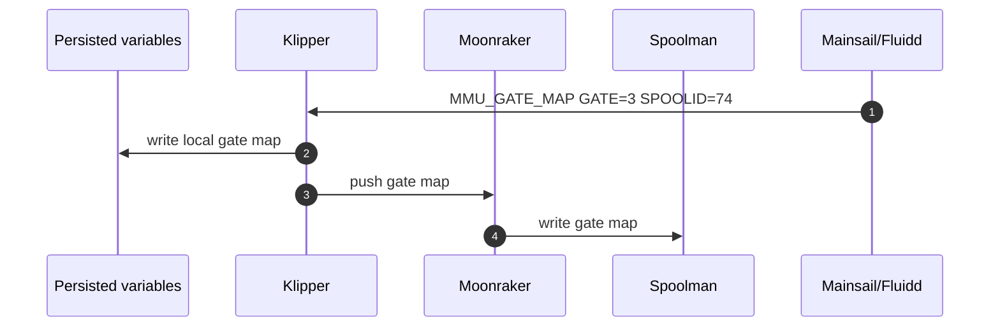
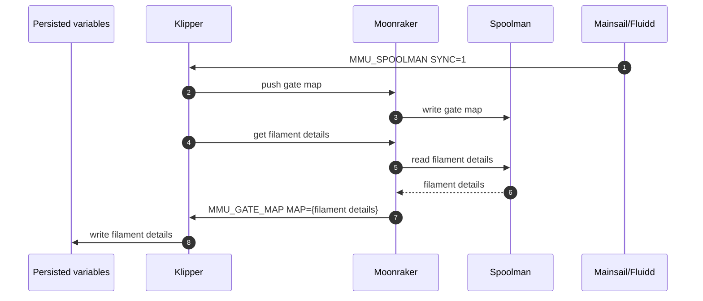
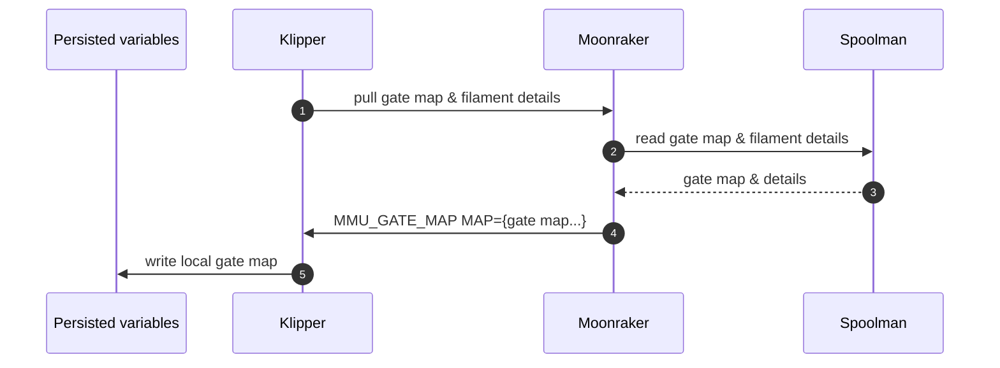
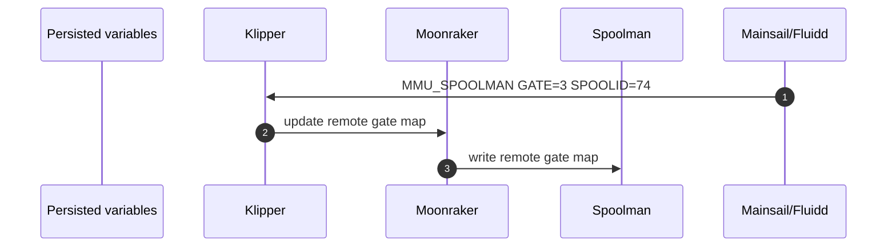
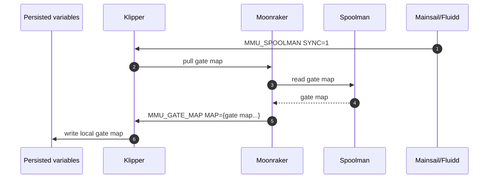
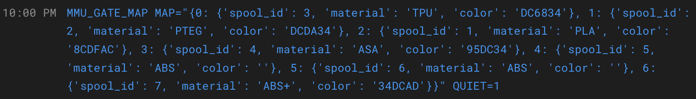
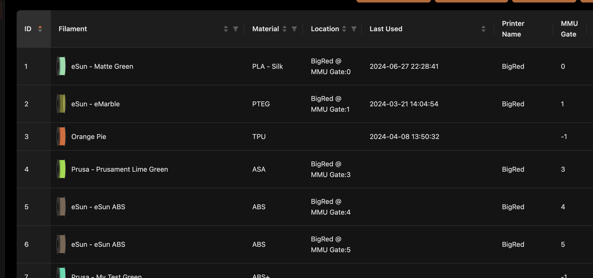

#### Page Sections:
- [Configuration](#---configuration)
- [Gate Map and Spool ID](#---gate-map-and-spool-id)
  - [Auto-setting with RFID reader](#auto-setting-with-rfid-reader)
- [MMU\_SPOOLMAN Command](#---mmu_spoolman-command)

Spoolman has become a popular way to manage a large collection of print spools. It is a database that you host somewhere (commonly on same rpi as your printer) that can be accessed through a web UI and web based remote procedure calls. Other than providing spool management it does two additional things:
- Tracks filament usage
- Stores attributes about the filament, like print temperature, color and material

Happy Hare fully integrates with spoolman and leverages these two capabilities. Specifically, when Happy Hare selects a filament/spool, spoolman is notified of the selection so that the printer can update usage against the correct spool.  Secondly, spoolman is asked again for filament attributes to ensure Happy Hare's knowledge is up to date. Note that the load of filament attributes is also done in bulk during MMU initialization.

To use spoolman with Happy Hare you need to configure and understand the roll of the "gate map" and the "spool_id" attribute.

<br>

##    Configuration

Firstly, Happy Hare's moonraker extension should be installed. It will be by default but check that you have the following in your `moonraker.conf`:
```yml
[mmu_server]
enable_file_preprocessor: True
enable_toolchange_next_pos: True
update_spoolman_location: True
```
> [!IMPORTANT]
> The number and setting value of parameters may be different from above, but having this section is important.

Secondly, in `mmu_parameters.cfg` enable support:
```yml
spoolman_support: push|pull
```

The `spoolman_support` parameter can be set to:
- `off` - No spoolman support
- `push` - The local gate map is considered as the source of truth and will be pushed to spoolman
- `pull` - The remote spoolman database is considered as the source of truth and will be pulled into the local gate map

Please note that both `push` and `pull` modes require you to have [spoolman **0.18.1**](https://github.com/Donkie/Spoolman/releases) or later installed. If you are using an older version of spoolman you will need to upgrade to use this feature.

If spoolman support is enabled (`push` or `pull` modes), you will notice that two additional columns (`Printer Name` and `MMU Gate`) will be added to spoolman db. To display this in spoolman web interface you will need to open "Hide Columns" and select them:

<p align="center"></p>

An alternative to displaying these additional columns is to use the default behavior of concatenating `Printer Name` and `MMU Gate` into the "Location" column (see note below). The printer name will refer to the klipper machine's hostname and the MMU gate will refer to the gate number that the spool is loaded into. This can be useful if you have multiple printers and MMUs and want to keep track of which spool is loaded into which MMU. It also unclutters the spoolman web interface.

> [!NOTE]
> The use of the "Location" field can be controlled be `update_spoolman_location` parameter in `moonraker.conf`. If not specified it defaults to `True`
>
> ```
> [mmu_server]
> update_spoolman_location: False
> ```

<br>

### Off:
If you set `spoolman_support` to `off` then Happy Hare will not interact with spoolman and spool ids will not be seen in the gate map. In this case the filament color and material details are used and retrieval from spoolmand is disabled. Automapping of tools to gates (detailed [Here](Tool-and-Gate-Maps#---automatic-tool-to-gate-ttg-mapping)) might still be useful in this mode but will not be as powerful as when spoolman is enabled.

<br>

### Push:
If you set `spoolman_support` to `push` then Happy Hare will push the local gate map (that can be seen in `mmu_vars.cfg` file) to spoolman at klipper startup and when explicitely asked.
In this mode klipper will read the `mmu_vars.cfg` file at startup to initialize its internal gate map and then push that to spoolman by asking moonraker to update the spoolman database. In this case the local configuration is the source of truth and spoolman is updated to match.
When you make changes to the gate map using `MMU_GATE_MAP GATE=<int> SPOOLID=<int>` you can push those changes to spoolman by calling the `MMU_SPOOLMAN SYNC=1` command. (see section on [Command Reference](Command-Reference) for more details).


<br>

The graph below details the klipper startup sequence: the local gate map (gate, printer and spool_id) is pushed to spoolman db and filament details for gate with spool_id are retrieved/updated.



<br>

To update the gate map you would execute commands similar to this:
> MMU_GATE_MAP GATE=3 SPOOLID=74<br>
> MMU_SPOOLMAN SYNC=1

Will result in the following gate map in the spoolman web browser interface (assuming compatible spoolman version):


#### Sequence explained

The next two graphs detail the explicit actions described above. First the local gate map is updated as it would be with spoolman disabled.

> MMU_GATE_MAP GATE=3 SPOOLID=74


Then the local gate map (gate, printer and spool_id) is pushed to spoolman db and filament attributes are updated from spoolman for gates with spool_id set. Note this is very similar to the startup sequence.

> MMU_SPOOLMAN SYNC=1


<br>

### Pull:
If you set `spoolman_support` to `pull` then Happy Hare will pull the gate map from spoolman at klipper startup and when explicitely asked.
In this mode klipper will ask moonraker to pull the gate map from spoolman at startup and then read the gate map from moonraker to initialize its internal gate map. In this case spoolman is the source of truth and klipper is updated to match. When you make changes to the gate map in spoolman you can pull those changes to klipper by calling the `MMU_SPOOLMAN SYNC=1` command. (see section on [commands](Command-Reference) for more details).
To make changes in spoolman you can either do it directly or more conveniently by using the `MMU_SPOOLMAN GATE=<int> SPOOLID=<int>` command. (see section on [Command Reference](Command-Reference) for more details).

<br>

The graph below details the klipper startup sequence: the remote gate map is requested and it is used to sync the local gate map.



To perform a similar update to the "push" example above, you would execute (note MMU_GATE_MAP is not used):
> MMU_SPOOLMAN GATE=3 SPOOLID=74<br>
> MMU_SPOOLMAN SYNC=1

#### Sequence explained

The next two graphs detail the explicit actions described above. Firstly a request is sent via moonraker to persist the change in the remote gate map (spoolman).

> MMU_SPOOLMAN GATE=3 SPOOLID=74


Then a sync is requested: The remote gate map (mapping and filament attribtues) is pulled from the spoolman db. The map is then persisted locally.

> MMU_SPOOLMAN SYNC=1


If you made changes, restart klipper and moonraker services and you are done.

<br>

##    Gate Map and Spool ID

Each gate can have configured information about what is loaded (technically it can have information even if the gate is currently empty). This information used in various features and UI visualization but also is available to you via `printer.mmu.*` printer variables for use in your custom gocde.

The gate map currently consists of: (1) availability of filament, (2) filament material type, (3) filament color in W3C color name or in RGB format, (4) the spoolman spool ID, (5) load/unload speed override. If spoolman is enabled the material and color is automatically retrieved from the spoolman database. Note a direct way to manipulate the gate map is via the `MMU_GATE_MAP` command. For example:
```
Gates / Filaments:
Gate 0: Status: Unknown, SpoolId: 3, Material: TPU, Color: DC6834, Name: Filamentum Industrial Flexifill TPU 98A Grey
Gate 1: Status: Spool, SpoolId: 2, Material: PTEG, Color: DCDA34, Name: n/a
Gate 2: Status: Empty, SpoolId: 1, Material: PLA, Color: 8CDFAC, Name: n/a
Gate 3: Status: Buffer, SpoolId: 4, Material: ASA, Color: 95DC34, Name: Nanovia ASA Black
Gate 4: Status: Buffer, SpoolId: 5, Material: ABS, Color: n/a, Name: n/a
Gate 5: Status: Unknown, SpoolId: 6, Material: ABS, Color: n/a, Name: Sakata 3D ABS-E Black
Gate 6: Status: Buffer, SpoolId: 7, Material: ABS+, Color: 34DCAD, Name: n/a
Gate 7: Status: Buffer, SpoolId: n/a, Material: TPU, Color: grey, Name: n/a, Load Speed: 50%
Gate 8: Status: Unknown, SpoolId: 9, Material: TPU, Color: black, Name: n/a, Load Speed: 60%
```
If spoolman is enabled and a `SpoolID` is available, Happy Hare will use this to pull attributes from spoolman and set the other elements of the gate map. I.e. it will replace whatever was statically created with dynamic data from spoolman. If you exploit that you can simple keep the `SpoolID` up to date when you replace or reload a filament spool and not worry about anything else. If you have LEDs installed they can display the dynamically set filament color.

To set the `SpoolID` use the command like this to set the ID to 5 on gate #0:

> MMU_GATE_MAP GATE=0 SPOOLID=5

A `SpoolID` of `-1` can be used to unset the spool ID and other attributes can be set manually as in `MMU_GATE_MAP GATE=0 SPOOLID=-1 COLOR=red MATERIAL=PLA`

See the [command reference](Command-Reference) for a complete list of command arguments.

> [!NOTE]
> If you see a command similar to this appear on the console during boot, don't worry. It is the startup sync of gate map with spoolman at work. It doesn't always appears because the sync can occur before the console is ready but seeing it occassionaly is confirmation that everything is connected
>
> 

<br>

### Changing SpoolID on Toolchange
Once configured Happy Hare will, on a change of tool, let spoolman know (via moonraker) to deactivate the previous spool and activate the new one. You will see this occur in a UI like mainsail:


If you use my enhanced [KlipperScreen Happy Hare Edition](https://github.com/moggieuk/KlipperScreen-Happy-Hare-Edition) there are also screens to visualize the gate map with spoolman setup as well as to edit the spool\_id:


<br>

### Auto-setting with RFID reader
So you have fitted all you spools with a fancy RIFD tags and built a nifty RFID onto your printer or MMU, perhaps are already using [nfc2klipper](https://github.com/bofh69/nfc2klipper) to be able to read that info into klipper. How do you automatically use that with Happy Hare?  Here is how...

Because it isn't practical to build a RFID into every gate, the workflow supported by Happy Hare is this:
- Offer up spool to reader
- Read the spool\_id you have programmed onto the RFID tag
- In this reader macro, call: `MMU_GATE_MAP NEXT_SPOOLID=..` with the read spool\_id
  - Insert filament into gate and run MMU_PRELOAD` to load and park the filament, or
  - If you have pre-gate sensors then simply insert the filament into the back of the gate (this can even be done in print although obviously the filament cannot be preloaded in that case

The gate map entry for this gate will automatically be updated with the spool_id and the rest of the gate map parameters (material/color/temp) will be retrieved from spoolman and, if configured, LEDs updated. The length of time that "NEXT_SPOOLID" remains valid is configured in `mmu_parameters.cfg`:
```yml
pending_spool_id_timeout: 20            # Seconds after which this pending spool_id (set with rfid) is voided
```

> [!TIP]
> If the `pending_spool_id_timeout` is exceed the spool_id will be forgotten and the RFID would need to be read again. Set this to a little longer than the time it takes you to load a spool into your MMU but not too long that it never expires

<br>

> [!NOTE]
> In the future Happy Hare may include direct RFID reader support but at present you need to program the calling of `MMU_GATE_MAP NEXT_SPOOLID=..`

<br>

##    MMU_SPOOLMAN command

This command allows for management of the added functionality to Spoolman. Specifically, Happy Hare adds the printer name and gate assignment to the spoolman db (in addition to reading filament attributes from it). You can use this command to modify the the gate association as well as retrieve information about spools.

Here you can see the additional extra fields `Printer Name` and `MMU Gate` added to the database in the Spoolman web interface. The "Location" field is updated by default but this can be controlled with the `update_spoolman_location` config option in `moonraker.conf`. Add/set it to `False` to prevent the overwriting of the "Location" field.

<p align="center"></p>

To view the essential information about a spool use this command. If the `SPOOLINFO` parameter is `0` or `-1` it will default to the currently active spool (if available):

> MMU_SPOOLMAN SPOOLINFO=1
```
Spool is: Matte Green (id: 1)
- Material: n/a
- Used: 56 g
- Remaining: 943 g
```

If the spool is not currently assigned to this printer you will additionally see this action message:

```
Spool id 1 is not assigned to this printer!
Run: MMU_SPOOLMAN SPOOLID=1 GATE=..
```

### Re-syncing with spoolman
Happy hare will resync on its own as necessary, but you can force a re-sync of the local gate map and the remote gate map with this command. The synchronization will be in the direction of the `spoolman_support` setting.  If 'push' the printer name, gate and optionally the location field will be updated to match local map. If 'pull' the local gate mapping will be synced based on the printer name, gate assignment stored in spoolman. Note that this does not rebuild the cache (see `REFRESH=1` later)

> MMU_SPOOLMAN SYNC=1

### Working with a remote gate map
This is useful if managing more that one printer or in a print farm scenario where centralized management if preferable. To set this up, change `spoolman_support: pull` in `mmu_parameters.cfg`

> [!TIP]
> You can practice switching between modes with the `MMU_TEST_CONFIG spoolman_support=xxx`. If you have the spoolman web UI active you should dynamically see it change.

If `spoolman_support: pull` set in `mmu_parameters.cfg` the MMU will get its gate map and filament attributes from spoolman. Technically it pulls from spoolman and stores locally. The local gate map will display slightly differently to remind you:

> MMU_GATE_MAP
```
Gates / Filaments:
Gate 0: Status: Unknown
Gate 1: Status: Unknown
Gate 2: Status: Unknown
Gate 3: Status: Empty
Gate 4: Status: Empty
Gate 5: Status: Empty, SpoolId: 5 --> Material: ABS, Color: 7C6555, Name: eSun ABS
Gate 6: Status: Buffer, SpoolId: 6 --> Material: ABS, Color: 7C6555, Name: eSun ABS
Gate 7: Status: Unknown
Gate 8: Status: Spool
```

When operating in this mode these commands are also useful:

### Checking remote gate map
Without any parameters the command will list the gate assignment for the printer. If you want to quickly check the gate assignment for another printer that shares the same spoolman db by specifing the `PRINTER=xxx` parameter:

> MMU_SPOOLMAN
```
Spoolman gate assignment for printer: BigRed
Gate | Spool ID
-----+---------
0    | 1
1    | 23
3    | 41
4    | 5
5    | 11
6    |
7    |
8    | 12
```

#### Updating remote gate map
In this mode changing the gate map locally will not have a lasting effect because it will be overwritten by the "map" stored in spoolman. Thus to update remotely specify the `SPOOLID` and/or `GATE` parameters

For example to remotely **SET** (associate) gate 1 with spool id 5, run:

> MMU_SPOOLMAN GATE=1 SPOOLID=5

If another gate was previously set to spool id 5 it will automatically be cleared.

There are two ways to  **UNSET** (disassociate) a spool id and gate. Either run with `SPOOLID` but without the `GATE` or specifiy the `GATE` but without the `SPOOLID`. The latter will find spool currently associated the gate on this printer and clear it. Examples:

> MMU_SPOOLMAN SPOOLID=5<br>
> MMU_SPOOLMAN GATE=1

To quickly clear the entire remote gate map for this printer:

> MMU_SPOOLMAN CLEAR=1
```
Spool 5 gate cleared in spoolman db
Spool 6 gate cleared in spoolman db
```

#### Recovering if out of sync with spoolman db
Normally this command is unecessary but since Happy Hare keeps a cache to reduce load on spoolman, it may be necessary if you remotely edit the spoolman db or an error condition occurs. Running it will completely reload spoolman, refresh the cache and then synchronize the local gate map with spoolman in the direction of the `spoolman_support` setting in `mmu_parameters.cfg` (either pushing the local map or pulling remote map):

> MMU_SPOOLMAN REFRESH=1

> [!NOTE]  
> To automatically fix and out of sync spoolman database, add the `FIX=1` parameter:
> > MMU_SPOOLMAN REFRESH=1 FIX=1
> This will clear offending entries of printer and gate association and retain only the first spool found if multiple are currently assigned to a gate

> [!IMPORTANT]
> This is not recommended to run during a print which large spoolman databases

#### Using in your macros
If using `MMU_SPOOLMAN` in your own macros note that operations can be combined. E.g. To clear database, ensure all inconsistencies are fixed, then assign spool 6 to gate 0:

> MMU_SPOOLMAN CLEAR=1 REFRESH=1 FIX=1 GATE=0 SPOOLID=6

You can suppress output with the `QUIET=1` parameter

