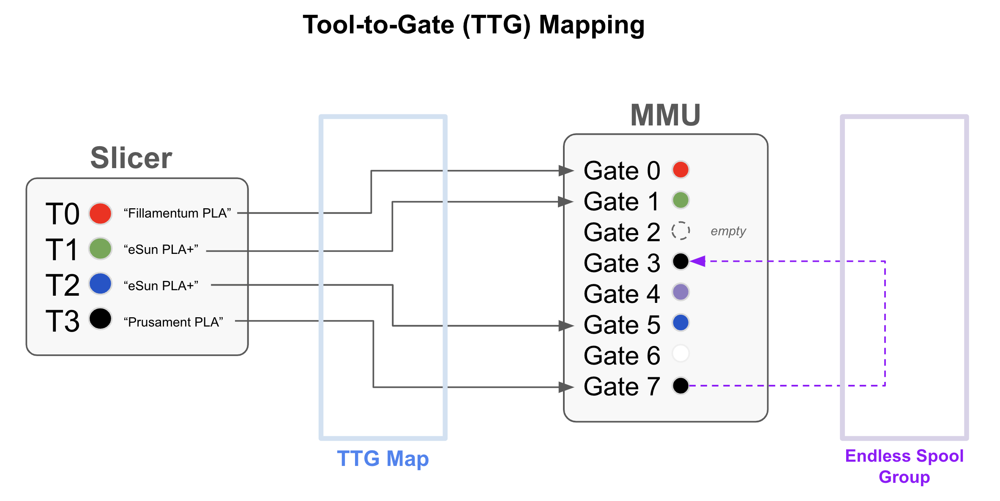
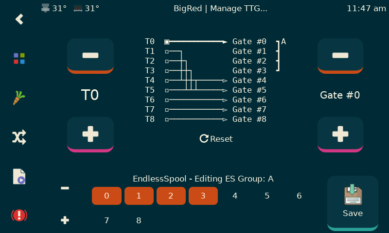

#### Page Sections:
- [Gate Map](#---gate-map) - The filaments currently loaded in the MMU
- [Slicer Tool Map](#---slicer-tool-map) - What the slicer defines for each tool of the current print
- [Tool to Gate Map](#---tool-to-gate-ttg-mapping) - The mapping of `Tx` tool numbers to gates
    - [Automatic Tool to Gate (TTG) Mapping](#---automatic-tool-to-gate-ttg-mapping) - The automated mapping of tools to gates

Happy Hare maintains a set of "maps" (exposed by printer variables) that are used to keep track of filaments:

<br>

##    Gate Map
**Management Command: `MMU_GATE_MAP`**<br>

**Printer Variables:** `printer.mmu.gate_status`, `printer.mmu.gate_material`, `printer.mmu.gate_color`, `printer.mmu.gate_color_rgb` and `printer.mmu.gate_spool_id`, `printer.mmu.gate_filament_name`

Happy Hare can keep track of the type and color for each filament you have loaded in the MMU as well as the current availability. This is leveraged in KlipperScreen visualization but also has more practical purposes because this information is made available through printer variables so you can leverage in your own macros to, for example, customize pressure advance, temperature and more. The map is persisted in `mmu_vars.cfg`.

The gate map can be viewed with the following command with no parameters (shown without spoolman enablement):<br>

> MMU_GATE_MAP

```
    MMU Gates / Filaments:
    Gate #0: Status: Buffered, Material: PLA, Color: red
    Gate #1: Status: Buffered, Material: ABS+, Color: orange
    Gate #2: Status: Buffered, Material: ABS, Color: tomato
    Gate #3: Status: Unknown, Material: ABS, Color: green
    Gate #4: Status: Unknown, Material: PLA, Color: blue
    Gate #5: Status: Unknown, Material: PLA, Color: indigo
    Gate #6: Status: Unknown, Material: PETG, Color: violet
    Gate #7: Status: Unknown, Material: ABS, Color: ffffff
    Gate #8: Status: Buffered, Material: ABS, Color: black
```

To change for a particular gate use a command in this form:

> MMU_GATE_MAP GATE=8 MATERIAL=PLA COLOR=ff0000 AVAILABLE=1

If you remove buffered filament from a gate and want to quickly tell Happy Hare that it is loading from spool again (for slower loads) the easiest way is simply this:

> MMU_GATE_MAP GATE=8 AVAILABLE=1

Multiple gates can be specified for bulk updates. A very useful command is this, which will reset the availability status of all gates back to the default of "unknown":

> MMU_GATE_MAP GATES=0,1,2,3,4,5,6,7,8 AVAILABLE=-1

> [!IMPORTANT]  
> There is no enforcement of material names but it is recommended use all capital short names like PLA, ABS+, TPU95, PETG. The color string can be one of the [w3c standard color names](https://www.w3schools.com/tags/ref_colornames.asp) or a RRGGBB red/green/blue hex value. Because of a Klipper limitation don't add `#` to the color specification.

One potentially interesting built-in functionality is the exposing of filament color and RGB values suitable for directly driving LEDs.  The `gate_color_rgb` printer value will convert any color format (string name or hex spec) into truples like this: `(0.5, 0.0, 0.0)`.  You can use this to drive LED's with the Klipper led control in your macros similar to this because "bling" is important!

Here is an example snippet of a macro controlling LED's for reference:
```
  
  
  SET_LED LED={leds_name} INDEX={index} RED={rgb[0]} GREEN={rgb[1]} BLUE={rgb[2]} TRANSMIT=1
```

> [!NOTE]  
> KlipperScreen Happy Hare edition has a nice editor with color picker for easy updating<br>
> [Spoolman](Spoolman-Support) integration can also be used to automatically update colors

> [!TIP]  
> The initial gate map (and therefore the default after a reset `MMU_GATE_MAP RESET=1`) can also be specified in the `mmu_parameters.cfg` file by updating the follow list parameters, ensuring each is the same length as the number of gates. E.g.<br>
>
> ```yml
> gate_material:        PLA,    ABS,    ABS,    ABS+,   PLA,    PLA,    PETG,   TPU,    ABS
> gate_color:           red,    black,  yellow, green,  blue,   indigo, ffffff, grey,   black
> gate_spool_id:        3,      2,      1,      4,      5,      6,      7,      -1,     9
> gate_status:          1,      0,      1,      2,      2,     -1,     -1,      0,      1
> gate_speed_override:  100,    100,    100,    100,    100,    100,    100,    50,     100
> ```
>
> If not specified or commented out (the default) the gate map will default and reset to empty attributes. Remember this is the default/reset values. With persistence enabled (`persistence_level`) the latest values are remembered accross restarts.

<br>

##    Slicer Tool Map
**Management Command: `MMU_SLICER_TOOL_MAP`**

**Printer Variables:** `printer.mmu.slicer_tool_map`

The slicer tool map will typically be set up in the print start macros as documented in [Slicer Setup](Slicer-Setup) and it is only valid for the current print (i.e. each print replaces the old map). It represents what the slicer is expecting to see for each tool and is pulled from information stored in the slicer's g-code file.

Here is an example map stored in the printer variable:
```yml
   printer.mmu.slicer_tool_map.
      initial_tool: 0                  ; Initial tool number expected to be loaded at the beginning of the print
      referenced_tools : [0, 3]        ; List of all the tools referenced in the print (T0 and T3)
      tools.0.color: ff0000            ; Color in RRGGBB format for T0
      tools.0.material: ABS            ; Material type for T0
      tools.0.temp: 240                ; Extruder temperature for T0
      tools.0.name: eSun ABS Red       ; Filament name for T0
      tools.0.in_use: 1                ; Tool is used in print
      tools.3.color: 00e410            ; Color in RRGGBB format for T3
      tools.3.material: ASA            ; Material type for T3
      tools.3.temp: 245                ; Extruder temperature for T3
      tools.3.name: eSun ABS+ Lt Green ; Filament name for T3
      tools.3.in_use: 1                ; Tool is used in print
      purge_volumes: [[100, 100, ...], [100, 100, ...]] ; NxN matrix of purge volume changing from tool X to tool Y
```

The map can be displayed on the console at any time during the print by running the `MMU_SLICER_TOOL_MAP` command without any set parameters:

> MMU_SLICER_TOOL_MAP

```
-------- Slicer MMU Tool Summary ---------
2 color print (Purge volume map loaded)
T0 (Gate 0, ABS, ff0000, 240°C)
T3 (Gate 3, ASA, 00e410, 245°C)
Initial Tool: T0
-------------------------------------------
```

Although typical setup in the print start macro, you can manually manipulate this map with the `MMU_SLICER_TOOL_MAP` command. See [Command Reference](Command-Reference#filament-specification-tool-to-gate-map-and-endless-spool-commands) for full details.

> [!NOTE]  
> The purge volume portion of the map is covered under [Tip Forming and Purging](Tip-Forming-and-Purging#---purge-volumes) and not shown here

<br>

##    Tool to Gate (TTG) Mapping
**Management Command: `MMU_TTG_MAP`**<br>

**Printer Variables:** `printer.mmu.ttg_map`, `printer.mmu.endless_spool_groups`

When changing a tool with the `Tx` command the MMU will by default select the filament at the gate (spool) of the same number. The mapping built into this _Happy Hare_ driver allows you to modify that.

There are a few use cases for this feature, for example:
<ul>
  <li>You have loaded your filaments differently than you sliced gcode file... No problem, just issue the appropriate remapping commands prior to printing</li>
  <li>Some of "tools" don't have filament and you want to mark them as empty to avoid selection or remap then to an alternative filament</li>
  <li>EndlessSpool - when a filament runs out on one gate (spool) then next in the sequence is automatically mapped to the original tool. It will therefore continue to print on subsequent tool changes. You can also replace the spool and update the map to indicate availability mid print</li>
  <li>Turning a colored print into a monochromatic one... Remap ALL the tools to a single gate</li>
  <li>With `automap` explained next choose the best matching gate!
</ul>

Conceptually you can visualize this feature:

<p align="center">

In this example, the slicer is set up for 4 tools "extruders" with red/green/blue/black colors but you have loaded your 8 gate MMU in a different order. The TTG map defines this relationship and saves your from either reconfiguring your slicer or reloading your MMU. In addition, because there are two spools of the black PLA filament loaded an EndlessSpool group can be established so when gate 7 runs out, printing continues from gate 3 automatically!

To view the current detailed mapping you can use either `MMU_STATUS DETAIL=1` or `MMU_REMAP_TTG` with no parameters

The TTG map is controlled with the `MMU_REMAP_TTG` command although the graphical user interface with [KlipperScreen - Happy Hare Edition](https://github.com/moggieuk/KlipperScreen-Happy-Hare-Edition) makes this trivial (as well as editing EndlessSpool groups):

<p align="center">

For console example, to remap T0 to Gate #8, issue:

> MMU_REMAP_TTG TOOL=0 GATE=8

This will cause both T0 and the original T8 tools to pull filament from gate #8. If you wanted to then change T8 to pull from gate #0 (i.e. complete the swap of the two tools) you would issue:

> MMU_REMAP_TTG TOOL=8 GATE=0

You can also use this command to mark the availability of a gate. E.g.

> MMU_REMAP_TTG TOOL=1 GATE=1 AVAILABILE=1

Would ensure T0 is mapped to gate #1 but more importantly mark the gate as available. You might do this mid print after reloading a spool for example.

It is possible to specify an entirely new map in a single command as such:

> MMU_REMAP_TTG MAP=8,7,6,5,4,3,2,1,0

Which would reverse tool to gate mapping for a 9 gate MMU!

An example of how to interpret a TTG map (this example has EndlessSpool disabled). Here tools T0, T1, T2 and T7 are mapped to respective gates, T3, T4 and T5 are all mapped to gate #3, tools T6 and T8 have their gates swapped. This also tells you that gates #1 and #2 have filament available in the buffer rather than fresh on the the spool (this controls how fast Happy Hare will load the filament). T7 (gate #7) is currently empty/unavailable and the remaining gates have filament that is not yet buffered.

```
    T0 -> Gate #0(S)
    T1 -> Gate #1(B) [SELECTED on gate #1]
    T2 -> Gate #2(B)
    T3 -> Gate #3(S)
    T4 -> Gate #3(S)
    T5 -> Gate #3(S)
    T6 -> Gate #8(S)
    T7 -> Gate #7( )
    T8 -> Gate #6(S)

    MMU Gates / Filaments:
    Gate #0(S) -> T0, Material: PLA, Color: red, Status: Available
    Gate #1(B) -> T1, Material: ABS+, Color: orange, Status: Buffered [SELECTED supporting tool T1]
    Gate #2(B) -> T2, Material: ABS, Color: tomato, Status: Buffered
    Gate #3(S) -> T3,T4,T5, Material: ABS, Color: green, Status: Available
    Gate #4(S) -> ?, Material: PLA, Color: blue, Status: Available
    Gate #5(S) -> ?, Material: PLA, Color: indigo, Status: Available
    Gate #6(S) -> T8, Material: PETG, Color: violet, Status: Available
    Gate #7( ) -> T7, Material: ABS, Color: ffffff, Status: Empty
    Gate #8(S) -> T6, Material: ABS, Color: black, Status: Available
```

The lower paragraph of the status is the gate centric view showing the mapping back to tools as well as the configured filament material type and color which is explained later in this guide.<br>


> [!TIP]  
> The initial TTG map (and therefore the default after a reset `MMU_TTG_MAP RESET=1`) can also be specified in a similar form to other "gate map attributes" in the `mmu_parameters.cfg` file by updating the `tool_to_gate_map` list, ensuring it is the same length as the number of gates. E.g.<br>
>
> ```yml
> tool_to_gate_map = 0, 1, 2, 3, 7, 6, 5, 4"
> ```
>
> If not specified the gate map will default to a "pass-through" mapping with each tool mapped to their respective gate. Further there is an option to automatically reset the TTG map at the end of every print to prevent confusion on the next print
>
> Default EndlessSpool groups can be setup in a similar way with the `endless_spool_groups` parameter. See `mmu_parameters.cfg` for full details

<br>

##    Automatic Tool to Gate (TTG) Mapping

Automatic TTG mapping is a feature that can be enabled in the `mmu_macro_vars.cfg` file. When enabled, the [MMU_START_SETUP](Slicer-Setup#1-mmu_start_setup) macro will automatically map tools to gates based on a strategy that you define. The strategy can be one of the following:
- `none` No automapping with occur (the default)
- `filament_name` The tool will be mapped one or more gates based on the filament name.
- `material` The tool will be mapped to one or more gates based on the filament material type. This can be useful if you have multiple spools of the same color but different material and don't care which one is used.
- `color` The tool will be mapped to one or more gates based on the filament color. In this case HH will try to exactly match the desired color on a gate that matches its material.
<!-- COOPER : For each of the modes described above, if multiple gates match then an endless spool will be created. -->
- `closest_color` The tool will be mapped to the gate with the closest color match. This can be useful if you have a lot of spools of the same material and you want HH to select the closest color match without having you to remap the tools manually. When using this strategy the automapping feature will display a color match status in the console.
- `spool_id` [FUTURE] The tool will be exactly mapped based on the spool_id [_when slicers pass spool id_]

When your slicer and MMU are fully configured, the 4-color print illustration above (in the TTG mapping section) can have the gate association and EndlessSpool groups set automatically using the strategy of "color" or "closest_color".  Pretty cool, right?!

> [!NOTE]  
>For those of your that are interested, this automated mapping can be called (**after the slicer tool map is loaded**) with a command of the form:
> > MMU_SLICER_TOOL_MAP TOOL=1 AUTOMAP=name<br>
>This example with decide the best gate mapping of tool T1 to a gate based on the filament name
>
> > MMU_SLICER_TOOL_MAP TOOL=6 AUTOMAP=closest_color<br>
This example with decide the best gate mapping of tool T6 to a gate based on the closest available color match

Of course you can also use `MMU_TTG_MAP` to manually choose the mapping
