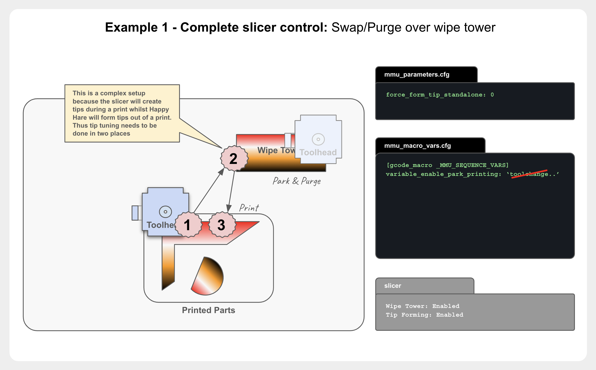
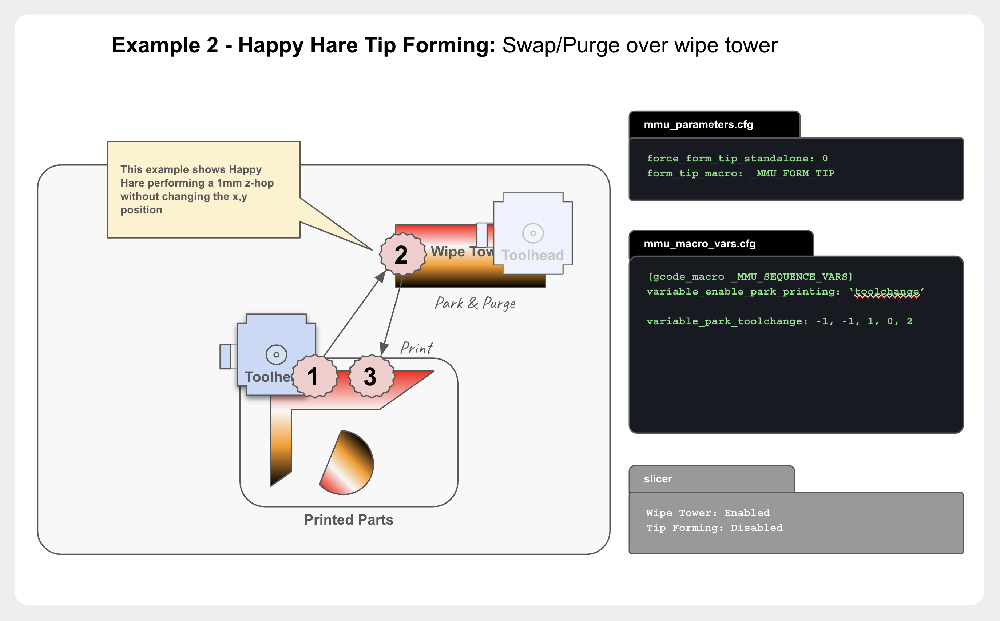
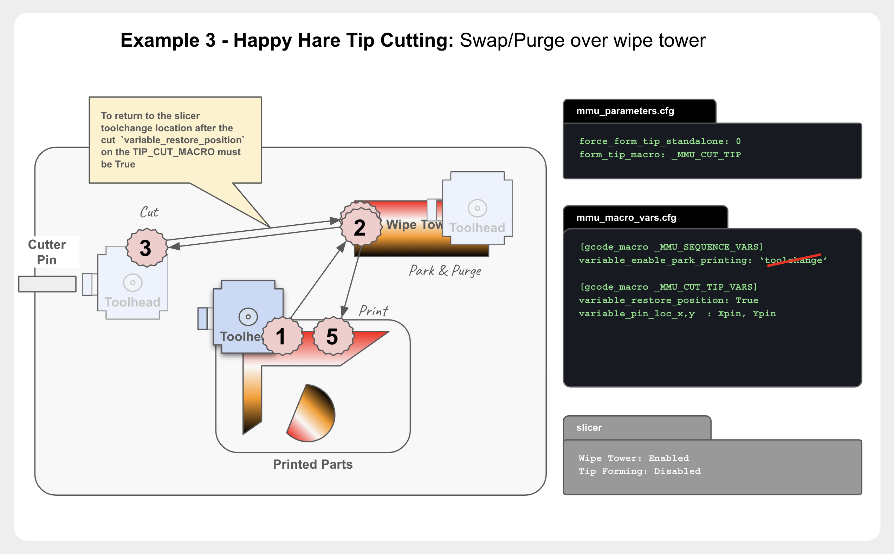
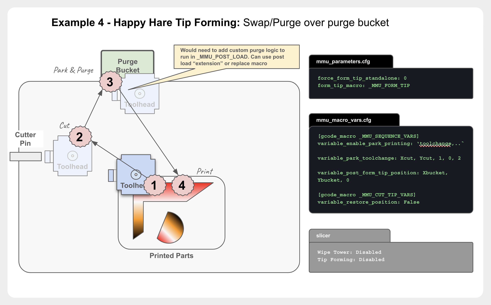
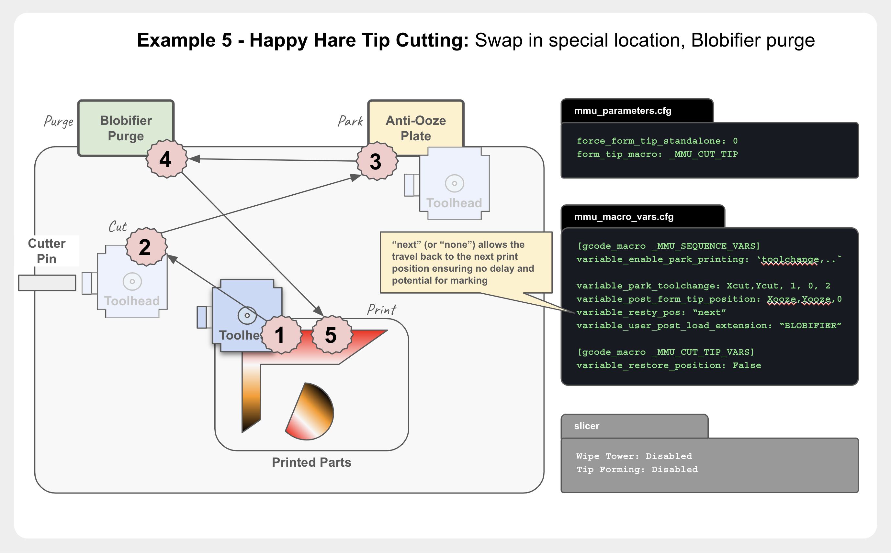
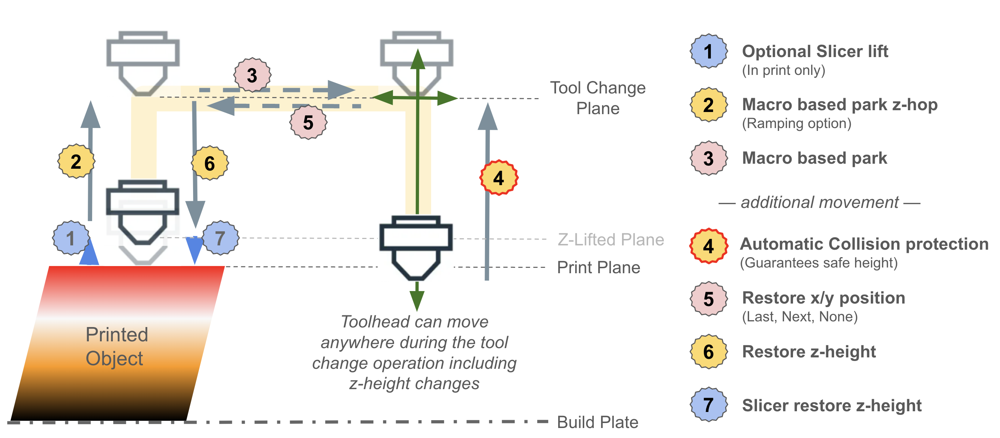
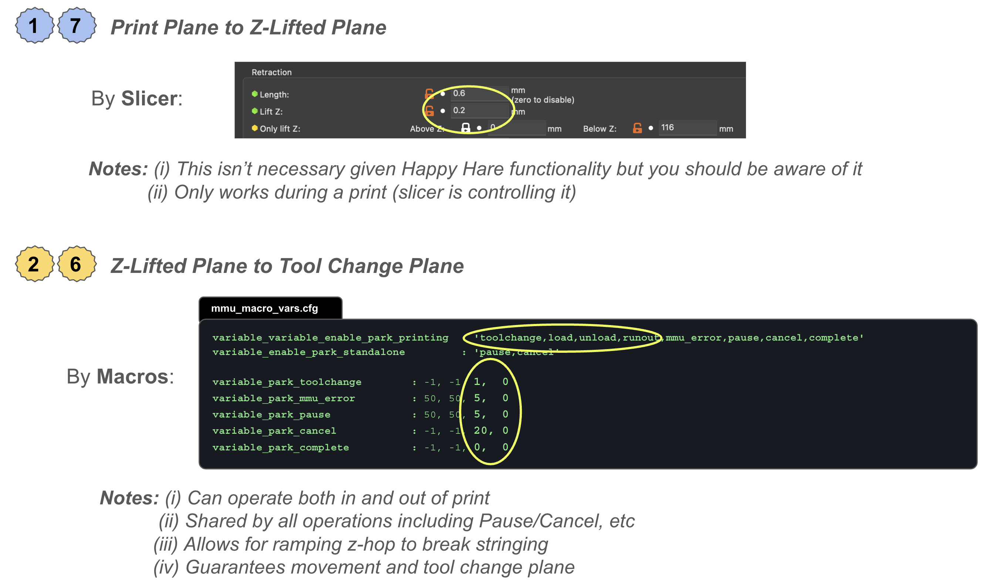

#### Page Sections:
- [Overview of toolhead parking movement](#---overview-of-toolhead-parking-movement)
- [Toolhead movement during toolchange](#---toolhead-movement-during-toolchange)
  - [Tip cutting options](#---tip-cutting-options)
  - [Tip forming options](#---tip-forming-options)
- [Returning to print movement](#---return-to-print-movement)
- [Z-hop moves](#---z-hop-moves)
  - [Sequential printing](#sequential-printing)

<br>

##    Overview of toolhead parking movement

Happy Hare controls all of the setup, customization and control of your MMU. It allows your to change tools outside of a print as well as controlling the toolchange and movement inside of a print when the `Tx` toolchange command is issued. It also uses the same parking and movement to control what happens when the MMU encounters and error or (optionally) when pausing or canceling a print whether an MMU print or not.

Lets start with the basic parking movement and then discuss the toolchange in more detail. Note that all configuration if controlled with settings in `mmu_macro_vars.cfg` which also contains additional instruction.

Happy Hare defines 7 operations that may require toolhead parking:
- `toolchange` - normal toolchange initiated with Tx or MMU_CHANGE_TOOL command
- `runout`     - when a forced toolchange occurs as a result of runout
- `load`       - individual MMU_LOAD operation
- `unload`     - individual MMU_UNLOAD operation
- `complete`   - when print is complete (Happy Hare enabled)
- `pause`      - a regular klipper PAUSE
- `cancel`     - a regular klipper CANCEL_PRINT

These operations can occur in 3 contexts:
- when printing with Happy Hare enabled
- when not printing with Happy Hare enabled
- when Happy Hare is disabled (MMU ENABLE=0)

Therefore you are able to define what parking you want performed at the intersection of context/operation. While this sounds like a lot it is actually quite easy to set up:

`variable_enable_park_printing`
This is a list of the operations that should result in toolhead parking while in a print. There are really two main starting points from which you can customize. If using the slicer to form tips (and toolchange is over the wipetower) you don't want to park on "toolchange" but you would want to on "runout" which is a forced toolchange unknown by the slicer.  Typically you would want to park on pause (includes mmu errors), cancel and complete if not done elsewhere

`variable_enabled_park_standalone`
List of the operations that should result in toolhead parking when not printing, for example, just manipulating the MMU manually or via Klipperscreen. Really it is up to you to choose based on personal workflow preferences. If you want no parking moves when not printing set this to an empty list

`variable_enabled_park_disabled`
There is really no reason to disable Happy Hare once installed, because you can use the bypass to avoid MMU control howwever if you are using the recommended "client_macros", then when Happy Hare is disabled (MMU ENABLE=0) you can stil configure parking on pause or cancel operations. (Note that these are the only two options that can occur)

For each operation (well, 5 because toolchange, load & unload are all grouped as type of "toolchange") the parking move is defined with 5 parameters: the x,y coordinates you wish to park at; the z-hop; the optional ramp of z-hop move; and the retraction length. Parking positions can be negative if your printer can handle it.
E.g.
```
variable_park_pause: 50, 50, 5, 10, 2
```
Defines a parking position (50,50) with a z-hop of 5mm above the print for pause operations. The z-hop will include a rapid 10mm horizontal movement as it lifts to help break any stringing. The extruder will retract 2mm. To only z-hop define the x,y as -999,-999.  Thus the parking move that does nothing would be `-999,-999,0,0,0`.

One of the features of Happy Hare's parking moves is that they define a "toolhead movement plane" above the print (even when sequentially printing!). This plane is generally the current z-height plus the z-hop, but the absolute minimum height for movement can be set with:
```
variable_min_toolchange_z: 1.0        ; The absolute minimum saftey floor
```
Further if sequentially printing, the movement plane will be above the tallest part.

Finally the speed of travel is set with these two settings, where `park_lift_speed` is only used when the move is only in the z-direction:
```
variable_park_travel_speed: 200       ; Speed for any travel movement XY(Z) in mm/s
variable_park_lift_speed: 15          ; Z-only travel speed in mm/s
```
So bringing this together if you want a 20mm z-hop only parking movement with 5mm of retraction when cancelling a print, you would minimally define:
```
variable_enable_park_printing: `cancel`
variable_park_cancel: -999, -999, 20, 0, 5
```
> [!IMPORTANT] 
> You almost certainly want to define a parking position for the `pause` operation as this is called when the mmu encounters an error. You can place your toolhead in a convenient location away from your print while you fix the problem. Note that the parking movement of any MMU operation (e.g. MMU_UNLOAD, MMU_LOAD, Tx) invoked directly when in a paused state will act in the same way as they do out of the print and subject to the same "standalone" configuration.

Possible context/operations:

|              | toolchange | runout  | load    | unload  | complete | pause   | cancel  |
|--------------|------------|---------|---------|---------|----------|---------|---------|
| printing     | ✅         | ✅      | ✅      | ✅      | ✅       | ✅      | ✅      |
| standalone   | ✅         |         | ✅      | ✅      |          | ✅      | ✅      |
| disabled     |            |         |         |         |          | ✅      | ✅      |

<br>

##    Toolhead movement during toolchange

Parking movement for toolchange is usually a little more nuanced so there are additional options. Firstly, you often want to differentiate beween a regular toolchange and a runout: if you have the slicer performing the tip forming then you often won't have a parking move on "toolchange" but you will likely need one on "runout" because you don't want the whole toolchange to occur touching the print. In addition as you build a more sophisticated toolchange procedure employing tip cutting, custom purging, nozzle parking and cleaning you may want additional parking moves during the process rather than just at the beginning and end. To accomplish this you can specify additional parking moves at these points in the process:
```yml
variable_pre_unload_position    : -999, -999, 0     ; x,y,z-hop position before unloading starts
variable_post_form_tip_position : -999, -999, 0     ; x,y,z-hop position after form/cut tip on unload
variable_pre_load_position      : -999, -999, 0     ; x,y,z-hop position before loading starts
```
Each defines the x,y coordinates desired and optionally z-hop (note: z-hop is not compounded, the largest z-hop will be used to adjust movement plane). The default `-999,-999,0` does nothing.

> [!NOTE] 
> It is also possible to call the parking logic directly from your macros in this form:
> > _MMU_PARK FORCE_PARK=1 X=10 Y=10 Z_HOP=5

No matter how many parking moves are applied the toolhead will always be correctly restored prior to continuing the print (see `variable_restore_xy_pos` options discussed later)

How you setup parking depends largely on the tip forming strategy. Tip forming logic is the only duplicative component between Happy Hare and the slicer and thus you need to decided between always allowing Happy Hare to do it (recommended) or split duties: Happy Hare out of print, slicer while printing. The `force_form_tip_standalone` is an important setting that switches between these options (together with correct slicer configuration).

Here are some common setups with an explanation of the basic configuration for each as a starting point for both tip forming and tip cutting options...

<br>

###    Tip Forming Options

#### Example 1: Complete slicer control with parking and purging on the wipetower
- Pro: Minimizes movement
- Con: The wipetower occupies a portion of your build plate, cannot do sequential printing

Here it is important not to define parking for `toolchange` when in print. Essentially parking is disabled. You may still want parking for pause/cancel/complete as well as in print runout.


#### Example 2: Happy Hare tip forming with parking and purging on the wipetower
- Pro: Minimizes movement, only have to tune tip forming in one place
- Con: The wipetower occupies a portion of your build plate, cannot do sequential printing

Here Happy Hare is forming tips so we define a simple z-hop parking while that occurs at which point the toolhead will be lowered onto the wipetower for the slicer to perform the purge.


<br>

###    Tip Cutting Options

Firstly, although the default way to form tips is through calculated filament movement, there is an easier way -- just cut it off! There are supported ways to do this at the MMU (through piggybacking on the `_MMU_POST_UNLOAD` callback) the more typical way is with a filament cutter at the toolhead.  This it usually some form of blade that is operated via a dedicated servo mechanism or simply the movement of the toolhead itself and pressing against a pin (optionally itself activated by a servo).

<br>

#### Example 3: Cutting tip and parking in a designated park area (often over purge bucket) while making the tool change.
- Pro: Allows of addition of brush cleaning move after the new filament is loaded before returning to wipe tower, can do sequential printing

Here we opt not to park on toolchange, instead allowing the CUT_TIP macro to move the toolhead and then return the toolhead back to the wipetower (`variable_restore_position`).


#### Example 4: Cutting tip and parking in a designated park area (often over purge bucket) while making the tool change.
- Pro: Allows of addition of brush cleaning move after the new filament is loaded before returning to wipe tower, can do sequential printing

Here were define the initial toolchange park to z-hop 1mm and move to the cutter pin, after cutting the `post_form_tip_position` parks at the purge bucket for the remainder of the toolchange. Presumably the `variable_user_post_load_extension` would be used to purge and wipe nozzle.


#### Example 5: Cutting tip and custom park and custom purging with no wipe tower 
- Pro: You get your full buildplate to work with because wipe tower is disabled, don't have to tune tip forming, blobifer purging optimizes speed and waste, custom park location can prevent ooze during toolchange, can do sequential printing
- Con: More complex to set up
- Neutral: This is perhaps the coolest option!

Here the movement has even more steps. There are a few ways to achieve this so this is just one way.


<br>

##    Return To Print Movement

How the toolhead returns to the print has three options contolled by the `variable_restore_xy_pos` variable in `mmu_macro_vars.cfg`:

### "last"
This is the default option and will cause the toolhead to be returned to the **last postion** it was at when the toolchange was issued  before giving control back to the slicer generated code. The exact movement is as follows:
- As a safety step the toolhead Z-height is restored to tool change plane if necessary (this allows for some fault tolerence of user supplied extensions)
- Toolhead travels to the last X,Y position at `variable_travel_speed` speed
- Finally Toolhead Z-height is restored onto the print (and un-retract applied) internally by Happy Hare (undoing `z_hop_height_toolchange` if set) or by slicer g-code

### "none"
In this option the Z-height is restored first to the print height defined at the start of toolchange but no X,Y movement occurs. The specific movements are:
- Toolhead Z-height is restored to the print height defined by the slicer
- When printing resumes the slicer's next travel command (G0 or G1) will move the toolhead back to the print

Caution: If the slicer or Happy Hare isn't configured to do a toolchange z-hop then might result in the toolhead grazing the top of the print

### "next"
This advanced option will cause the toolhead to return to the **next print position**. This is benficial because the travel height can easily be controlled. The specific movements are:
- As a safety step the toolhead Z-height is restored to tool change plane if necessary (this allows for some fault tolerence of user supplied extensions)
- Toolhead travels to the next X,Y position at `variable_travel_speed` speed
- Finally Toolhead Z-height is restored onto the print (and un-retract applied) internally by Happy Hare (undoing `z_hop_height_toolchange` if set) or by slicer g-code
You can see this is a variation on "last" but will prevent print marking. Of course, out of print this will act the same as "last" because there is no concept of "next"

> [!NOTE]  
> To use the "next" functionality you must have this option enabled in your `moonraker.conf`.  This causes Happy Hare to pre-process uploaded g-code file to extract the "next pos" information.
> ```
> [mmu_server]
> enable_toolchange_next_pos: True
> ```

<br>

##    Z-Hop Moves

It's worth noting and to aid debugging that there are three possible origins for z-hop moves during a toolchange:
- The first is input by the slicer which often have a "z-hop on toolchange option". With the settings described above that should be disabled though.
- The second is by Happy Hare: during a print, HH will immediately lift the toolhead away from the print on toolchange and on error if `z_hop_height_toolchange` is non-zero in `mmu_parameters.cfg`. This move only occurs when in a print and is designed to prevent any chance of a blob forming on your part.  The z-hop move is the first move and occurs before any movement in the horizontal plane.
- Finally, the movement macro defined in `mmu_sequence.cfg` can optionally define a Z-hop move. This lifting move, if configured (`variable_enable_park` and `variable_park_z_hop`) will always happen both in and out of a print. Out of a print and for convenience it will be automatically skipped if the z-axis has not been homed.

This illustrations visualize and explain the toolhead movements in the vertical plane:

<br>

<br>

The primary configuration options that effect z-height are described here:

<br>

Personally I find it useful to set toolchange z-hop to 1.0mm in Happy Hare with a 10mm ramp, set the slicer at 0.2mm. Pause, Complete and Cancel are set with larger z-hop between 5mm and 10mm.

<br>

## Sequential Printing
Sequential printing is possible but some additional setup is important because the likely movement path during a toolchange may not be able to avoid completed objects. Therefore it is important to ensure that the z-lifted plane is at least as high as the tallest object. Happy Hare provides a mechanism to make this easy. In you slicer add the following to your POST layer change custom gcode:
```
_MMU_UPDATE_HEIGHT
```
That's it.  This is harmless with normal printing but when printing sequentially it will cause the minimum "z-lifted" plane to be at the height of the highest object.  The z-hop defined in the sequence macros will work relative to this position (rather than current toolhead position) and so will always be the desired height above any printed object thus preventing collisions.

> [!NOTE]  
> If you really want to or have to include in your PRE layer change custom gcode then you must pass the height in like this: `_MMU_UPDATE_HEIGHT HEIGHT=[layer_z]` (or whatever your slicers placeholder variable is that holds the next layer height). The post-layer change is easier because it doesn't need any parameters.

<br>

### Related docs:
- [Slicer Setup](Slicer-Setup)
- [Tip Forming and Purging](Tip-Forming-and-Purging)
- [Toolchange Movement]
