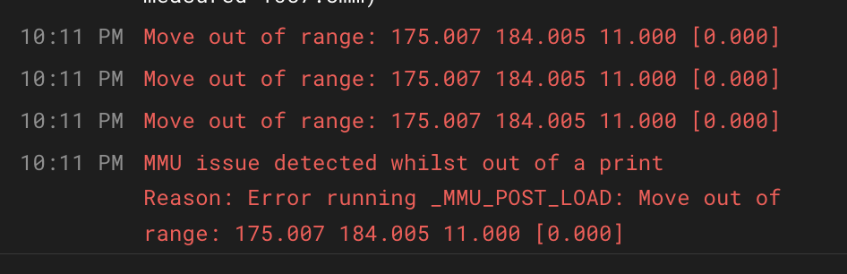
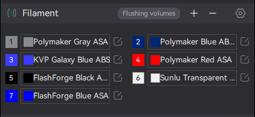
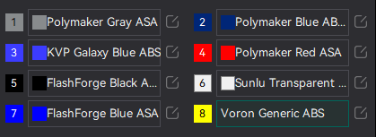

Got problems? Here are some "carrots of wisdom" and common solutions.  

##    Klipper Issues

###  Timer too close
This error typically occurs when the host sends a message to the MCU, scheduling an event at a time that is in the past. Reasons High system load of the host High disk activity of the host Swapping due to low free memory Disk errors / dying SD card Unstable voltage Other hardware hogging the USB bus or other system resources Running in a Virtual Machine USB, UART or CANBUS wiring faults leading to extremely delayed messages ElectroMagnetic Interference (EMI) affecting proper signal. Remember that the host (rPi) only needs to experience a tiny period of high load so watching an average load meter doesn't tell the whole story. Also, as we drive additional functionality on our printers we are naturally getting closer to this annoying error condition. That said it can be avoided with these tips:

- Avoid overly high microsteps on steppers, especially on MMU gear stepper and extruder. Take into account the gear ratio -- the higher the ratio the lower the microsteps can be for the same resolution. Good values are generally 32 for extruder, 8 or 16 for gear stepper.
- Ensure rPi doesn't run too hot because if it reaches certain thresholds (starting a 60 degrees), it will automatically throttle performance, so consider adding a fan hat to keep it frosty
- A known communication delay has been found in some of the latest operating systems that can result in a message from a mcu being delayed beyond the limits set in Klipper. This is especially true when performing a homing move - something that Happy Hare does a lot. You have to manually patch klipper by editing `~/klipper/klippy/mcu.py` and changing:
`TRSYNC_TIMEOUT = 0.025`
to
`TRSYNC_TIMEOUT = 0.05`
(Until klipper incorporates a way to make this perminent you will need to make this change after a major klipper update)<br>

**Update:** Happy Hare v2.7.0 has a parameter called `update_trsync: 1` will automatically apply this without modifing klipper!

Other ideas:
- Decrease load (webcams, plugins, etc..)
- Decrease logging verbosity
- Check load: https://www.klipper3d.org/Debugging.html#generating-load-graphs
- Check wiring
- Increase Pi voltage to 5.1V
- Backup rpi, reformat SD card and restore. This will elminate slowdown that occurs from bad-blocks and residual data erasure that can increase over time
- Replace SD card with one with fast read/write (especially write)
- Upgrade rPi

One additional observation that has been made is if you are running KlipperScreen on the same rpi as your printer.  Whilst there shouldn't be any issues this, certain conditions or timeouts can lead KlipperScreen to swamp `/var/log/syslog` with repeated messages such as "[job\_status.py:update\_file\_metadata()] - Cannot find file metadata. Listening for updated metadata".  This places severe load on writing to the SD card and can lead to TTC errors. A [PR](https://github.com/Arksine/moonraker/pull/862) has been created to update Moonraker, but until then you can enable "object processing" in `moonraker.conf` which will give it more time to perform the pre-processing and thus not generate the KlipperScreen "metadata" error:
```yml
[file_manager]
enable_object_processing: True
```
**UPDATE: PR for Moonraker was incorporated.** This increases the pre-processing default timeout and also allows you to increase it without having to enable object\_processing:
```yml
[file_manager]
default_metadata_parser_timeout: 30
```

> [!NOTE]  
> Esoterical has written a really [good guide](https://canbus.esoterical.online/) of common errors and mitigations. Although it is titled as CANbus, most of it is more generic. The only advice I question is the size of the CANbus queue of 1024. This is too large for homing moves (Klipper's Kevin O'Conner recommends 128).

###  Klipper internal "Step Compress" error
This can occur when syncing the gear and extruder steppers (they are always synced through part of the extruder loading process even if you are not printing with them synced).  It occurs when there is too big a mismatch in the movement of a single step on the gear and the extruder - a small movement can issue "step instructions" to one stepper but not the other.  This is easily avoided by changing the microstep setting on either the gear or extruder.  Often the extruder is set with too high a microstep setting when really no higher than 32 is necessary with common gear ratios. If the extruder is set to 32, try increasing the MMU gear stepper to 16, 32, ...

###  Move out of range error

Often it is tempting to set park and similar moves in Happy Hare macros to the absolute limit of your printer range. This is not a good idea if you have skew/tilt correction enabled because a move that works at z=0mm will fail at heigher heights as the skew correction is added. This will be seen with an error similar to:

<p align="center"></p>

Happy Hare v2.7.0 now includes logic to keep the position within bounds after homing that was previously a common source of this error. If it ocurs elsewhere it is likely to be because of skew/tilt correction and height. To fix, simply change parking positions from using the absolute minimum or maximum movement to say 0.5mm short of that.  This gives Klipper's correction some room to work.

<br>

##    Slicer Errors

###  Purge Volume Error
`Incorrect number of values for PURGE_VOLUMES. Expect 1, 8, 16, or 64, got XXX`
This usually happens when your number of filaments in the slicer doesn't match the number of gates in the MMU.
For instance, if you have an 8 gate MMU and your slicer only has 7 filaments:

<p align="center"></p>

Add in a placeholder filament so the number of tools and filaments matches the number of gates in the MMU:

<p align="center"></p>

**Update:** Since Happy Hare v2.7.0 you can have less extrudes defined than gates in your MMU.

<br>

##    BTT MMB Issues

###  No rule to make target 'flash'
This is because the Linux operating system on the Raspberry Pi doesn't know how to flash the firmware. When you do the `make` command, it compiles the firmware from a bunch of options that you entered in `make menuconfig` into machine readable code. `make flash` is used to send that compiled firmware to the MMB. Somewhere along the way, the `make` command doesn't get the right instructions for pushing the file to the board.
- Make sure you have all the correct options for the processor and communication ports set in `make menuconfig`.
- Make sure your flash device (usually the CANBUS UUID) is correct.  

The MMB is notorious for being difficult to flash. It doesn't seem to like running Katapult without Klipper installed. The instructions from BTT, well, they leave a lot to be desired. Some have had luck flashing both Katapult and Klipper (including the 8kib bootloader offset) over USB. That puts Katapult on the board so you can later flash firmware over CANBUS, as well as having the Klipper firmware running on the MMB before establishing CANBUS communications. So, try flashing both over USB. You'll need to get your UUID and save it first, so it can be put in `printer.cfg` or `mmu.cfg`.  

<br>

##    Issues During Printing

###  Happy Hare pauses the print for a clog when there is no clog
This typically happens when the extruder looses steps. When a stepper on the X or Y looses steps, it's loud, obnoxious, and frightens the neighbors. When an extruder looses steps, you'll probably not even notice due to the other noise the machine makes. So, look for reasons the extruder may be overloading.
- Heavy prime lines are a big cause. If your prime line exceeds the physical capacity for the extruder to melt and move plastic, it will lose steps and cause a pause due to clog.
- Extruder tension setting is off. If the tension is light and it grinds the filament, Happy Hare will see the difference between the encoder and expected movement and pause due to clog. If the tension is too heavy, and it squishes the filament into an oval shape that drags on the filament path after the extruder, this can cause the extruder to grind the filament as well. A good inspection of the filament should give you hints here.
- Poor encoder calibration. Try going back and re-doing the encoder calibration and make sure your Gate 0 calibration is correct, i.e. commanding 100mm of filament movement produces 100mm of measured movement.

One other cause that will be seen immediately after a toolchange occurs when synchronized gear and extruder is disabled but there is a lot of slack in the filament in the bowden tube and this slack is greater than the calibrated clog detection length. This is common with very long bowden lengths or use of 3mm internal diamenter from MMU to toolhead. To help with this the `toolhead_post_load_tighten` (in `mmu_parameters.cfg`) should be enabled. This will add a small filament tightening move after load. Note that this option is ignored if you synchronize gear and extruder.
