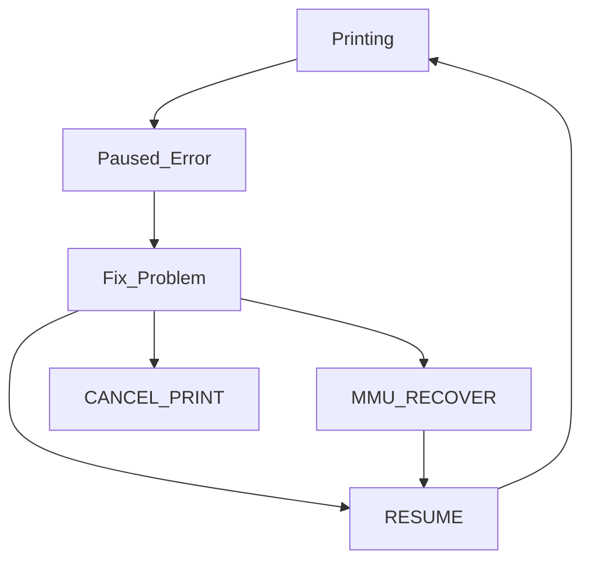

<p align="center">
  
  <h1 align="center">Happy Hare</h1>
</p>

<p align="center">
Universal MMU driver for Klipper
</p>

<p align="center">
<!--
  <a aria-label="Downloads" href="https://github.com/moggieuk/Happy-Hare/releases">
    
  </a>
  -->
  <a aria-label="Stars" href="https://github.com/moggieuk/Happy-Hare/stargazers">
    </a> &nbsp;
  <a aria-label="Forks" href="https://github.com/moggieuk/Happy-Hare/network/members">
    </a> &nbsp;
  <a aria-label="License" href="https://github.com/moggieuk/Happy-Hare/blob/master/LICENSE">
    </a> &nbsp;
  <a aria-label="Commits" href="">
    </a> &nbsp;
</p>

Happy Hare is the second edition of what started life and as alternative software control for the ERCF v1.1 ecosystem - the original open source filament changer for multi-colored printing. However it has now been rearchected to support most types of MMU's connected to the Klipper ecosystem. That includes ERCF, Tradrack, AMS-style and other custom designs. It has extensive configuration to allow for customization and using the installer simplifies setup for common MMU types. The three conceptual types of MMUs and the function and operation of their various sensors can be [found here](https://github.com/moggieuk/Happy-Hare/wiki/Conceptual-MMU) and should be consulted for any customized setup.  It is best partnered with [KlipperScreen for Happy Hare](https://github.com/moggieuk/KlipperScreen-Happy-Hare-Edition) projet at least until the Mainsail integration is complete :-)

Some folks have asked about making a donation to cover the cost of the all the coffee I'm drinking (actually it's been G&T lately!). Although I'm not doing this for any financial reward this is a BIG undertaking (9000 lines of python, 5000 lines of doc, 4000 lines of macros/config). I have put hundreds of hours into this project and if you find value and feel inclined a donation to PayPal https://www.paypal.me/moggieuk will certainly be spent making your life with your favorate MMU more enjoyable. Thank you!
<p align="center"><a href="https://www.paypal.me/moggieuk"></a></p>

<br>

##    Major features:

- Support any brand of MMU and user defined monsters (Caveat: ERCF 1.1, 2.0 and Tradrack, Prusa & KMS coming very soon)
- Synchronized movement of extruder and gear motors (with feedback control) to overcome friction and even work with FLEX materials!
- Sophisticated multi-homing options including extruder!
- Implements a Tool-to-Gate mapping so that the physical spool can be mapped to any tool
- EndlessSpool allowing a spool to automatically be mapped and take over from a spool that runs out
- Sophisticated logging options (console and mmu.log file)
- Can define material type and color in each gate for visualization and customized settings (like Pressure Advance)
- Spoolman integration
- Automated calibration for easy setup
- Supports MMU "bypass" gate functionality
- Ability to manipulate gear and extruder current (TMC) during various operations for reliable operation
- Moonraker update-manager support
- Complete persistence of state and statistics across restarts. That's right you don't even need to home!
- Highly configurable speed control that intelligently takes into account the realities of friction and tugs on the spool
- Optional integrated encoder driver that validates filament movement, runout, clog detection and flow rate verification!
- Vast customization options most of which can be changed and tested at runtime
- Integrated help, testing and soak-testing procedures
- Gcode pre-processor check that all the required tools are avaialble!
- Drives LEDs for functional feed and some bling!
- Built in tip forming and filament cutter support
- Lots more... Detail change log can be found in the [Wiki](https://github.com/moggieuk/Happy-Hare/wiki/Change-Log)

Controlling an ERCF with companion [customized KlipperScreen](https://github.com/moggieuk/Happy-Hare/wiki/Basic-Operation#---klipperscreen-happy-hare) for easy touchscreen MMU control!

<p align="center"></p>

<br>
 
##    Installation

The module can be installed into an existing Klipper setup with the supplied install script. Once installed it will be added to Moonraker update-manager to easy updates like other Klipper plugins. Full installation documentation is in the [Wiki](https://github.com/moggieuk/wiki/Home) but start with cloning the repo onto your rpi:

```
cd ~
git clone https://github.com/moggieuk/Happy-Hare.git
```

<br>
 
##    Documentation
<table>
<tr>
<td width=30%><a href="https://github.com/moggieuk/Happy-Hare/wiki/Home"></a></td>
<td>
MMU's are complexd! Fortunately Happy Hare has elaborate documentation logically organized in the <a href="https://github.com/moggieuk/Happy-Hare/wiki/Home">Wiki</a>

<p><br><p>

**Other Resources:**
<div align="left">
  <a href="https://www.youtube.com/watch?v=uaPLuWJBdQU"></a>
<br>
German instructional video created by Crydteam
<!--
    
-->
  </a>
</div>

</td>
</tr>
</table>

<br>

##    My Testing and Setup:

Most of the development of Happy Hare was done on my trusty ERCF v1.1 setup but as it's grown, so has my collection of MMU's and MCU controllers. Multi-color printing is addictive but can be frustrating during setup and learning. Be patient and use the forums for help!  **But first read the [Wiki](https://github.com/moggieuk/Happy-Hare/wiki/Home)!**

<p align="center"><i>
There once was a printer so keen,<br>
To print in red, yellow, and green.<br>
It whirred and it spun,<br>
Mixing colors for fun,<br>
The most vibrant prints ever seen!</br>
</i></p>
<p align="center"></p>

 
---


```yml
  (\_/)
  ( *,*)
  (")_(") Happy Hare Ready
```


#### Optional hardware - Encoder

Happy Hare supports the use of an encoder which is fundamental to the ERCF MMU design. This is a device that measures the movement of filament and can be used for detecting and loading/unloading filament at the gate; validating that slippage is not occurring; runout and clog detection; flow rate verification and more. The following is an output of the `MMU_ENCODER` command to control and view the encoder:

> MMU_ENCODER ENABLE=1<br>MMU_ENCODER

```
    Encoder position: 743.5mm
    Clog/Runout detection: Automatic (Detection length: 10.0mm)
    Trigger headroom: 8.3mm (Minimum observed: 5.6mm)
    Flowrate: 0 %
```

Normally the encoder is automatically enabled when needed and disabled when not printing. To see the extra information, you need to temporarily enable if out of a print (hence the extra `ENABLE=1` command).

<ul>
  <li>The encoder, when calibrated, measures the movement of filament through it.  It should closely follow movement of the gear or extruder steppers but can drift over time.</li>
  <li>If enabled the clog/runout detection length is the maximum distance the extruder is allowed to move without the encoder seeing it. 
 A difference equal or greater than this value will trigger the clog/runout logic in Happy Hare</li>
  <li>If clog detection is in `automatic` mode the `Trigger headroom` represents the distance that Happy Hare will aim to keep the clog detection from firing.  Generally around 6mm - 8mm is good starting point.</li>
  <li>The minimum observed headroom represents how close (in mm) clog detection came to firing since the last toolchange. This is useful for tuning your detection length (manual config) or trigger headroom (automatic config)</li>
<li>Finally the `Flowrate` will provide an averaged % value of the mismatch between extruder extrusion and measured movement. Whilst it is not possible for this to be real-time accurate it should average above 94%. If not it indicates that you may be trying too extrude too fast.</li>
</ul>

</details>

### 3\. Calibration Commands

Before using your MMU you will need to calibrate it to adjust for differences in components used on your particular build. Be careful to calibrate in the recommended order because some settings build and depend on earlier ones. Happy Hare now has automated calibration for some of the traditionally longer steps and does not require any Klipper restarts so the process is quick and painless. See [MMU Calibration doc](/doc/calibration.md) for detailed instructions

### 4\. Setup configuration in mmu_parameters.cfg

After calibration you might want to review and tweak the configuration and options in `mmu_parameters.cfg`. The default values set by the installer are good starting points although you will always have to specify things like the dimensions of your extruder which are very specific to your build. The [MMU Configuration guide](/doc/configuration.md) contains an in-depth reference but some of the selected features are also discussed in more detail in the following sections.


### 5\. Tweak configuration at runtime

It's worth noting, and a very useful feature, that all the essential configuration and tuning parameters (in `mmu_parameters.cfg`) can be modified at runtime without restarting Klipper. Use the `MMU_TEST_CONFIG` command to do this. Running without any parameters will display the current values. This even allows changes to configuration during a print!

<details>
<summary><sub>🔹 Read about run-time testing of configuration...</sub></summary>
<br>
 
Running without any parameters will display the current values:

> MMU_TEST_CONFIG

```
    SPEEDS:
    gear_from_buffer_speed = 160.0
    gear_from_buffer_accel = 400.0
    gear_from_spool_speed = 60.0
    gear_from_spool_accel = 100.0
    gear_short_move_speed = 60.0
    gear_short_move_accel = 400.0
    gear_short_move_threshold = 60.0
    gear_homing_speed = 50.0
    extruder_homing_speed = 20.0
    extruder_load_speed = 15.0
    extruder_unload_speed = 20.0
    extruder_sync_load_speed = 20.0
    extruder_sync_unload_speed = 25.0
    extruder_accel = 400.0
    selector_move_speed = 200.0
    selector_homing_speed = 60.0
    selector_touch_speed = 80.0
    selector_touch_enable = 0                    # Advanced
    
    TMC & MOTOR SYNC CONTROL:
    sync_to_extruder = 1
    sync_form_tip = 1
    sync_gear_current = 50
    extruder_homing_current = 30
    extruder_form_tip_current = 120
    
    LOADING/UNLOADING:
    bowden_apply_correction = 0                  # Advanced
    bowden_allowable_load_delta = 20             # Advanced
    bowden_pre_unload_test = 1
    extruder_force_homing = 0
    extruder_homing_endstop = collision
    extruder_homing_max = 50.0
    toolhead_sync_unload = 0                     # Advanced
    toolhead_homing_max = 50.0
    toolhead_extruder_to_nozzle = 72.0
    toolhead_sensor_to_nozzle = 62.0
    gcode_load_sequence = 0                      # Expert
    gcode_unload_sequence = 0                    # Expert
    
    OTHER:
    z_hop_height_error = 1.0
    z_hop_height_toolchange = 0.5
    z_hop_speed = 15.0
    enable_clog_detection = 2
    enable_endless_spool = 1                     # Advanced
    slicer_tip_park_pos = 0.0
    auto_calibrate_gates = 0                     # Advanced
    strict_filament_recovery = 0
    retry_tool_change_on_error = 0
    print_start_detection = 1                    # Advanced
    log_level = 1
    log_visual = 2
    log_statistics = 1
    pause_macro = PAUSE                          # Advanced
    form_tip_macro = _MMU_FORM_TIP               # Advanced

    CALIBRATION:
    mmu_calibration_bowden_length = 698.0
    mmu_calibration_clog_length = 13.6
```

Any of the displayed config settings can be modified. For example, to update the distance from extruder entrance (homing postion) to nozzle.

> MMU_TEST_CONFIG toolhead_extruder_to_nozzle=45

> [!IMPORTANT]  
> When you make a change with `MMU_TEST_CONFIG` it will not be persisted and is only effective until the next restart. Therefore, once you find your tuned settings be sure to update `mmu_parameters.cfg`

</details>

<br>

##    Important Concepts and Features

### 1. How to handle errors

We all hope that printing is straightforward, and everything works to plan. Unfortunately that is not always the case with an MMU and it may need manual intervention to complete a successful print and specifically how you use `MMU_RECOVER`, etc.

<details>
<summary><sub>🔹 Read more about handling errors and recovery...</sub></summary>
<br>

Although error conditions are inevitable, that isn't to say fairly reliable operation isn't possible - I've had many multi-thousand swap prints complete without incident. Here is what you need to know when something goes wrong.

When Happy Hare detects something has gone wrong, like a filament not being correctly loaded or perhaps a suspected clog, it will pause the print and ready the printer for fixing. You can test this condition by running:

> MMU_PAUSE FORCE_IN_PRINT=1

A few things happen in this paused state:

<ul>
  <li>Happy Hare will lift the toolhead off the print to avoid blobs</li>
  <li>The `PAUSE` macro will be called. Typically this will further move the toolhead to a parking position</li>
  <li>The heated bed will remain heated for the time set by `timeout_pause`</li>
  <li>The extruder will remain hot for the time set with `disable_heater`</li>
</ul>

To proceed you need to address the specific issue. You can move the filament by hand or use basic MMU commands. Once you think you have things corrected you may (optionally) need to run:

> MMU_RECOVER

This is optional and ONLY needed if you may have confused the MMU state. I.e. if you left everything where the MMU expects it there is no need to run and indeed if you use MMU commands then the state will be correct and there is never a need to run. However, this can be useful to force Happy Hare to run its own checks to, for example, confirm the position of the filament. By default, this command will automatically fix essential state, but you can also force it by specifying additional options. E.g. `MMU_RECOVER TOOL=1 GATE=1 LOADED=1`. See the [Command Reference](/doc/command_ref.md) for more details.

When you ready to continue with the print:

> RESUME

This will not only run your own print resume logic, but it will reset the heater timeout clocks and restore the z-hop move to put the printhead back on the print at the correct position.



</details>

### 11. Useful pre-print functionality

There are a couple of commands (`MMU_PRELOAD` and `MMU_CHECK_GATE`) that are useful to ensure MMU readiness prior to printing.

<details>
<summary><sub>🔹 Read more on pre-print readiness...</sub></summary><br>
 
The `MMU_PRELOAD` is an aid to loading filament into the MMU.  The command works a bit like the Prusa's functionality and spins gear with servo depressed until filament is fed in.  It then parks the filament nicely. This is the recommended way to load filament into your MMU and ensures that filament is not under/over inserted potentially preventing pickup or blocking the gate.<br>

Similarly the `MMU_CHECK_GATE` command will run through all the gates (or the one specified), checks that filament is loaded, correctly parks and updates the "gate status" map so the MMU knows which gates have filament available.<br>

> [!NOTE]  
> The `MMU_CHECK_GATE` command has a special option that is designed to be called from your `PRINT_START` macro. When called as in this example: `MMU_CHECK_GATE TOOLS=0,3,5`. Happy Hare will validate that tools 0, 3 & 5 are ready to go else generate an error prior to starting the print. This is a really useful pre-print check! See [Gcode Preprocessing](/doc/gcode_preprocessing.md) for more details.

</details>


##    KlipperScreen Happy Hare Edition


Even if not a KlipperScreen user yet you might be interested in my fork of KlipperScreen [Github link](https://github.com/moggieuk/KlipperScreen-Happy-Hare-Edition) simply to control your MMU. It makes using your MMU the way it should be. Dare I say as easy at Bambu Labs ;-) I run mine with a standalone Raspberry Pi attached to my buffer array and can control multiple MMU's with it.

Be sure to follow the install directions carefully and read the [panel-by-panel](https://github.com/moggieuk/KlipperScreen-Happy-Hare-Edition/blob/master/docs/MMU.md) documentation :tada:

<br> 
 
##    My Testing and Setup:
This new v2 Happy Hare software is largely rewritten and so, despite best efforts, has probably introduced some bugs that may not exist in the previous version.  It also lacks extensive testing on different configurations that will stress the corner cases.  I have been using it successfully on Voron 2.4 / ERCF v1.1 and ERCF v2.0 with EASY-BRD and ERB board.  I use a self-modified CW2 extruder with foolproof microswitch toolhead sensor (hall effect switches are extremely problematic in my experience). My day-to-day configuration is to load the filament to the extruder in a single movement at 250mm/s, then home to toolhead sensor with synchronous gear/extruder movement although I have just moved to an experimental automatic "touch" homing to the nozzle which works without ANY knowledge of my extruder dimensions!! Yeah, really, load filament in gate, fast 670mm move, home to nozzle!

### My Setup:


 

```
    (\_/)
    ( *,*)
    (")_(") Happy Hare Ready
```
