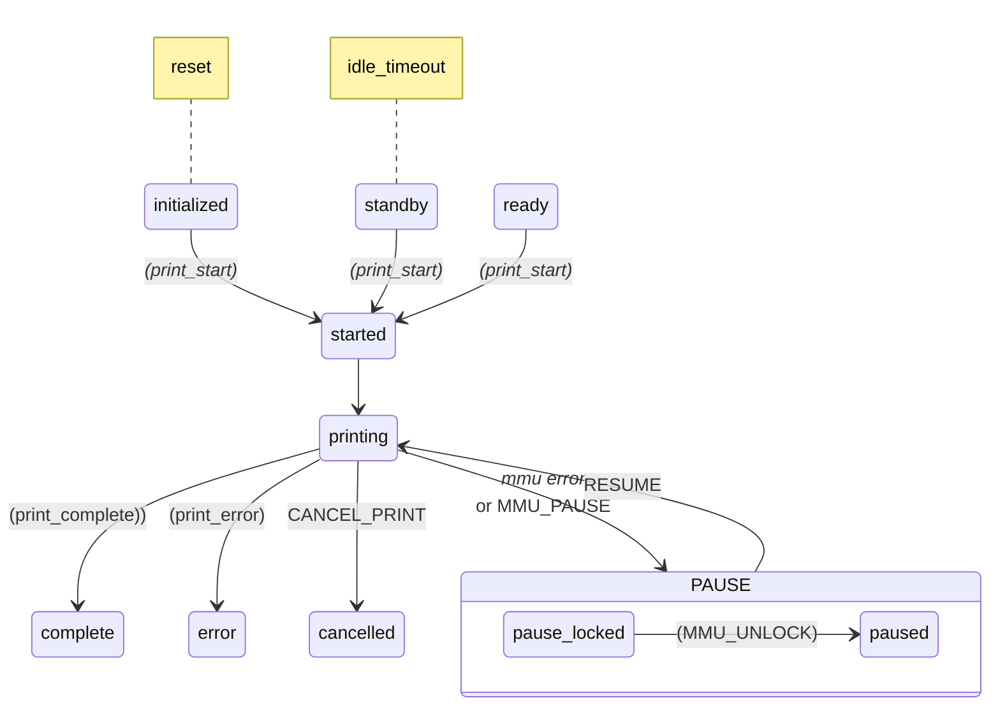
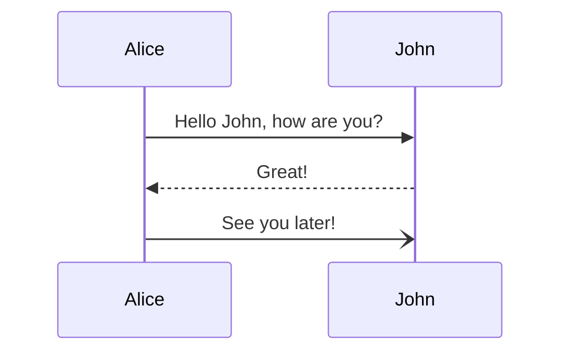
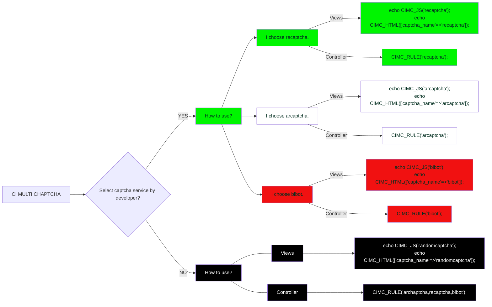

## Scratch pad TODO list
1. DONE - Rewrite automated bowden calibration
2. DONE - Finish homing measurement for non-homing extruder
3. DONE - Pass params to RESUME
4. Compression pin homing feedback for extruder (same as collision)
5. DONE - Record the gate homing point with calibration so dead space can be added/subtracted for quick change
6. DONE - Check that entry_to_extruder amount is added / subtracted too
7. Virtual selector
8. Switching drive gear
9. Virtual servo (force sync KMS case)
10. Prusa_servo mock class .. maybe make servo a separate class for this and #9
11. Inattention time instead of retry on fail. Remove ‘retry_change_on_error’
12. force_form_tip_standalone —> allow_slicer_form_tip or tip forming strategy form|slicer|cut
cut_mmu??
13. \_form_tip as separate “\_STEP”
14. Externalize ‘boot up tasks’ so users could add things like “check_gates”
15. DONE - Remove sd_card pause..
16. DONE - Disable gate runout during tool change -- maybe code encoder to disable that way too..?
17. DONE - Ensure z_hop is correct if gcode offset is specified. E.g.
     
     
18. Add 'filament_temp' to gate_map.  Also, pull from spoolman. Edit `mmu_gate_map` command
19. Centralize macro variables .. need to update mmu.my for MMU_TEST_FORM_TIP
20. DONE Deprecate printer.mmu.material .. Replaced with active_gate.material, active_gate.color, ...
21. TODO For advanced calculated purge volumes
```
Not sure where I'm going with this.  It could be a calculated matrix based on all the referenced tools
assuming they have a pigment percentage (defaulting to 50%). Need to add a PIGMENT=[0-100] param. Or this
could be an orthogonal purge matrix available for filaments on mmu_gate_map. Need to add pigment. Hmmm.
Every update of pigment to gate map would recalc matrix and present as printer variable
        nozzle_volume = gcmd.get_int('NOZZLE_VOLUME', -1, above=0)
        multiplier = gcmd.get_int('MULTIPLIER', 100, above=0)
        algorithm = gcmd.get('ALGORITHM', 'linear')
        algorithms = ['linear', 'quadratic', 'hyperbolic']
        if algorithm not in algorithms:
            raise gcmd.error("ALGORITHM is invalid. Options are: %s" % algorithms]
```
---

22. DONE - If EndlessSpool enabled and initial tool is empty, auto map to next gate
23. DONE - Check comments on tool_tip_macro.  Example:
```
variable_cooling_tube_position should have the comment: Measured from Nozzle to Top of Heater Block
variable_cooling_tube_length should have the comment: Measured from Top of Heater Block to Top of Heatsink
```
24. Ensure that start/end g-code macros are no-op if mmu is disabled. Others should probably be too..
25. Double check EndlessSpool is still working - claim of hang on `_M400...`
26. Merge `retract branch` .. after completing.  Note the change to "Cosmetic Options" in parameters .. need to update Wiki
27. Update "Installation/Upgrade" wiki to include moonraker update manager example and screenshot
28. Issue #292: don't wait for temp if in print and a new temp was set by slicer... (careful of corner cases and restart after cooled extruder..)
29. Initial toolchange often occurs very close to bed. Would be 0mm if (z_hop=0, I think?). Is this true? Should there be a min for x/y movement? Then x/y would always be at minimum height...?
30. Spaghetti Noodle problem... after load when printing without sync, there can be a lot of slack in filament that can cause clog detection issue.  Perhaps tighten the filament using gear motor once loaded...?
31. MMU_CALIBRATE_TOOLHEAD with no toolhead sensor idea...
             # IF NO TS (currently not supported, but some ideas here)
                # IF "extruder" sensor:
                    # Reverse home to "extruder" sensor with synced movement
                    # --> Movement is `toolhead_entry_to_extruder` + `toolhead_extruder_to_nozzle`
                    # Remember this
                    # Home to extruder entrance using collision (not important to be accurate)
                    # [Filament is now tight against extruder and under compression]
                    # Reverse home to extruder sensor
                    # Distance moved is approximately `toolhead_entry_to_extruder`
                    # --> `toolhead_extruder_to_nozzle` = Early recorded movement - ``toolhead_entry_to_extruder`
                    # NOTE: the above is flawed because filament cannot be retracted evenly -- it tends to spring and jerk
                    #       But it could be compared with calibrated length - "a homing move to the extruder sensor"
                # Else: # NO "extruder" sensor (or TS):
                    # Ideas:
                    # 1. to use gate as homing point .. almost certainly too far away to be accurate
                    # 2. Use stallguard on extruder stepper to sense the nozzle .. will work IF stallguard set well
                    #    Move 5-10mm synced to ensure clean transition into extruder
                    #    Move 100mm extruder only, "touch" homing move
                    #    Measured distance is `toolhead_entry_to_extruder`
32. DONE: Add `gate_autoload` param 0/1 to enable disable autoload feature. Default to 1.
33. Add `endless_spool_waste_gate` param.  -1 = current gate (default), 0-n = designated gate.  If a designated gate then pre-gate sensors are automatically excluded.  Implement the special waste gate unloading...

### Reference Markdown so I don't forget

> [!NOTE]  
> Highlights information that users should take into account, even when skimming.

> [!TIP]
> Optional information to help a user be more successful.

> [!IMPORTANT]  
> Crucial information necessary for users to succeed.

> [!WARNING]  
> Critical content demanding immediate user attention due to potential risks.

> [!CAUTION]
> Negative potential consequences of an action.







